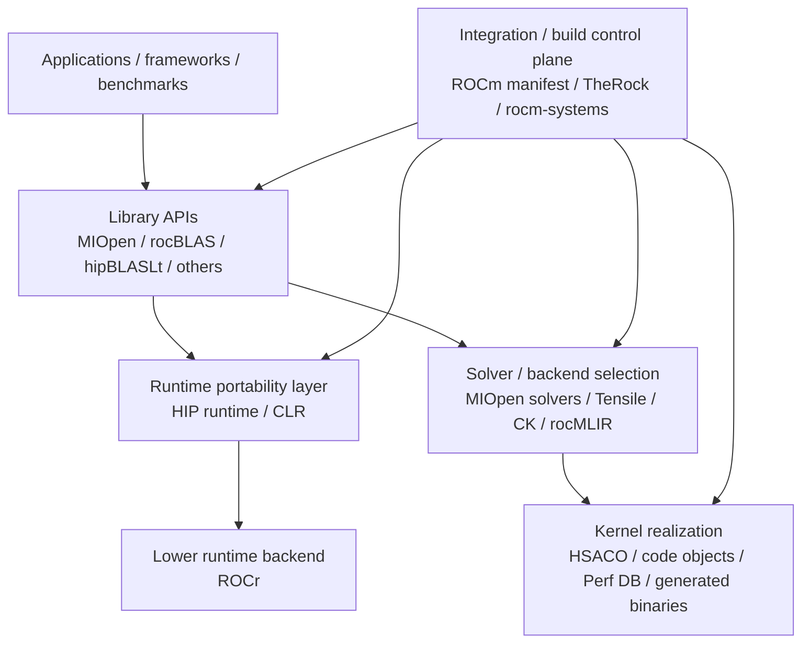

# ROCm abstraction layers

> This document organizes observations from publicly available sources and local repository clones only. It does not assert the contents of private issues or internal decision-making processes.

Updated: 2026-03-17
Related:

- `design_philosophy.md`
- `vega-rocm.md`
- `support_boundary.md`
- `provenance_map.md`

## 1. Purpose

This note translates the broader design reading into a layer map that is directly useful for the `gfx900` investigation.

It answers three narrower questions:

1. Which public ROCm components sit at which abstraction layer?
2. Where do target selection, solver selection, fallback, and kernel realization actually happen?
3. How does the investigation's 4-layer model map onto the public ROCm stack?

## 2. Stack view

## 3. Layer table

| Layer | Primary public repos / docs | Main responsibility | gfx900 relevance |
| --- | --- | --- | --- |
| Integration / build control | `ROCm`, `TheRock`, `rocm-systems` | Manifest management, source-of-truth definition, CI/build unification, target-family policy | Determines whether gfx900 remains globally known, selectively excluded, or buildable |
| Runtime portability | `HIP`, `CLR`, `ROCr` | Host-facing runtime APIs, backend abstraction, queue/context/runtime control | Mostly enables execution substrate; not the main site of solver survival |
| Library / selection | `MIOpen`, `rocBLAS`, `Tensile`, `CK`, `hipBLASLt` | Solver selection, applicability gating, fallback choice, high-level API stability | Main site where gfx900 is partially alive and partially gated |
| Compiler / codegen | `rocMLIR`, `llvm-project`, Tensile codegen | Generate or compile kernel binaries from higher-level representations | Main site where MLIR / xdlops / ISA constraints surface |
| Distribution / shipped artifacts | ROCm package contents, MIOpen Perf DB, rocBLAS code objects | Deliver tuned DBs, prebuilt kernels, runtime assets | Explains why gfx900 can still work in practice even when preferred paths retreat |

## 4. Public component responsibilities

### 4.1 Integration / build control plane

**Fact**

- `ROCm/README.md` still documents the multi-repo manifest model.
- `TheRock/README.md` defines a CMake super-project with group feature switches and centralized AMDGPU target selection.
- `rocm-systems/README.md` defines migration status and source-of-truth per systems component.

**Interpretation**

- This layer is where "what counts as part of ROCm" and "what gets built together" is increasingly normalized.
- It is also where support begins to be expressed as policy metadata rather than only as code inside a component.

### 4.2 Runtime portability layer

**Fact**

- HIP runtime docs state that HIP uses CLR.
- HIP docs further state that `rocclr` is a virtual device interface and that HIP can use ROCr as backend on Linux.
- ROCm docs list `CLR`, `HIP`, and `ROCR-Runtime` as distinct runtime components.

**Interpretation**

- ROCm exposes a high-level runtime boundary to users while hiding lower runtime/backend details.
- This matters for stack structure, but only indirectly for the current `gfx900` survival question.

### 4.3 Library / selection layer

**Fact**

- rocBLAS documents a thin API and explicitly delegates Level-3 GEMM work to Tensile and hipBLASLt.
- MIOpen documents `Find`, `GetSolution`, `CompileSolution`, and `Immediate` APIs as user-visible surfaces above internal solver handling.
- Existing investigation documents already show `IsApplicable`, solver registries, and fallback behavior in MIOpen and rocBLAS.

**Interpretation**

- This is the main layer where support becomes non-binary.
- A target can remain visible here through:
  - solver-specific allow/deny logic
  - fallback paths
  - older but still valid implementations
  - immediate / DB-backed solution retrieval

### 4.4 Compiler / codegen layer

**Fact**

- Existing investigation work shows MIOpen calling Miir C API wrappers in `mlir_build.cpp`.
- rocMLIR public code exposes `parseConvConfig`, `isApplicable`, `RockEnabled`, `genConvModule`, and `buildKernelPipeline`.
- Existing investigation work already fixed `gfx900` MLIR iGEMM exclusion and failure modes at this boundary.

**Interpretation**

- This layer is where abstract solver availability is converted into code-generation feasibility.
- For `gfx900`, this layer is a major retreat point for newer MLIR/xdlops-based paths.

### 4.5 Distribution / shipped-artifact layer

**Fact**

- Existing investigation work already fixed the presence of gfx900 Perf DB entries, rocBLAS precompiled artifacts, and firmware blobs.

**Interpretation**

- Even when preferred solver families retreat, shipped artifacts can preserve real operability.
- This is why build/distribution evidence must be kept separate from API- or solver-level evidence.

## 5. Mapping to the investigation's 4-layer model

The investigation has already been using the following model:

- Maintain
- Manage
- Supplement
- Ship

This maps onto the public ROCm stack as follows.

| Investigation layer | Main public stack location | Typical examples |
| --- | --- | --- |
| Maintain | Integration/build + component source | LLVM target definitions, solver source files, target family definitions |
| Manage | Library/selection + build policy | `IsApplicable`, `GPU_TARGETS`, `THEROCK_AMDGPU_TARGETS`, per-project exclusions |
| Supplement | Library fallback paths | GEMM fallback, Tensile fallback, naive/reference paths |
| Ship | Distribution/artifact layer | Perf DB, precompiled rocBLAS kernels, firmware, packaged runtime assets |

**Interpretation**

- The investigation's 4-layer model is not separate from ROCm's public stack description.
- It is a practical cross-section through it, focused on survivability of older targets.

## 6. Why this matters for gfx900

`gfx900` is not best understood as "supported" or "unsupported" in one step.
It is better understood as a target whose status differs by layer:

- Integration/build: still globally named and build-addressable in some public control planes
- Manage/selection: selectively gated out of newer paths in some components
- Supplement/fallback: still served by older or broader fallback paths
- Ship/distribution: still backed by shipped artifacts in important places

That layered reading is consistent with:

- MIOpen MLIR disable
- MIOpen older solver survival
- rocBLAS/Tensile fallback behavior
- TheRock target declaration plus per-project exclusions

## 7. Open Question / Limitation

- This layer map is intentionally structural. It does not claim that every listed layer contributes equally to `gfx900` survival.
- The runtime portability layer is included for completeness, but current evidence still suggests that the decisive `gfx900` observations live mainly in library/selection, compiler/codegen, and shipped-artifact layers.
- `rocm-libraries` is not used here as a primary source because the local worktree appears inconsistent in this environment.

## 8. Working conclusion

**Fact**

- Public ROCm materials expose multiple abstraction layers rather than one flat support surface.
- Build/integration policy, runtime abstraction, solver selection, codegen, and shipped artifacts can be observed separately.

**Interpretation**

- The `gfx900` state is a layer-crossing phenomenon.
- The most explanatory layers for this investigation are:
  - integration/build policy
  - library/selection logic
  - compiler/codegen constraints
  - shipped artifacts

**Open Question / Limitation**

- The exact future relationship among standalone math/ML repos, `TheRock`, and any future super-repo consolidation remains only partially fixed from the public materials used here.

## Non-claims

This document does not claim that:

- Internal decision-making processes are asserted or concluded.
- The content of private issues has been inferred or reconstructed.
- A single observed case is generalized into a universal rule.
- AMD's support policy as a whole is fully represented.
- Any specific organization is being criticized.
