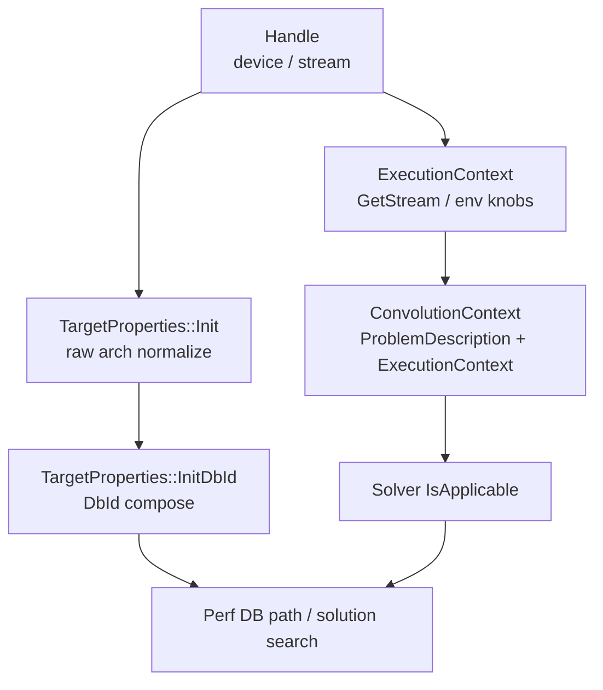

# device / capability flow in MIOpen convolution

作成日: 2026-03-17
関連文書: `class_map.md`, `solver_architecture_map.md`, `trace_map_static.md`, `gfx900_related_nodes.md`

> 本メモは、公開一次資料およびローカル clone から観測可能な範囲を整理したものであり、非公開 issue や社内意思決定の内容を断定するものではない。

---

## 目的

この文書は、MIOpen convolution 経路で
**device 情報がどのように正規化され、capability 判定に入り、solver gate に届くか**
を固定する。

`class_map.md` が「どのクラスがあるか」を示すのに対し、
ここでは **`Handle -> TargetProperties -> ExecutionContext -> ConvolutionContext -> IsApplicable`**
の情報の流れを扱う。

---

## 1. 全体フロー（Fact）

---

## 2. `Handle` と `TargetProperties`

### 2.1 device 名の取得

`Handle` は device / stream 側の入口であり、
`GetDeviceName()` と `GetTargetProperties()` を提供する。

さらに `GetDbBasename()` は、
`TargetProperties::DbId()` と CU 数から Perf DB basename を組み立てる。

### 2.2 `TargetProperties::Init`

`target_properties.cpp` の `TargetProperties::Init(const Handle*)` では、
少なくとも次が行われる。

1. `MIOPEN_DEVICE_ARCH` があればそれを優先
2. なければ `handle->GetDeviceNameImpl()` を使う
3. `GetDeviceNameFromMap(rawName)` で arch 名を正規化
4. `sramecc` / `sramecc_reported` / `xnack` を決める
5. `InitDbId()` で DB 用 id を作る

Interpretation:
device 情報は raw arch string のまま downstream へ渡るのではなく、
**正規化された target property** として一度まとめ直される。

### 2.3 gfx900 に固有の観測点

`TargetProperties::Init` では、
`WORKAROUND_ISSUE_1204` 有効時に `gfx900` の `sramecc_reported` を空にする分岐がある。

これは、

- raw driver report
- internal target property
- DB / COMGR 側で使う属性

が同一ではないことを示す。

---

## 3. `DbId` と Perf DB への接続

### 3.1 `InitDbId`

`TargetProperties::InitDbId()` は、

- base arch name
- `sramecc`
- `xnack`

から `dbId` を作る。

たとえば gfx906/gfx908 では legacy DB 互換のため `nosramecc` suffix の扱いが特別になっている。

### 3.2 `ExecutionContext::GetPerfDbPath*`

`execution_context.hpp` では、
Perf DB 探索時に `GetStream().GetTargetProperties().DbId()` と
`GetStream().GetMaxComputeUnits()` が使われる。

Interpretation:
device / capability 情報は solver gate に入るだけでなく、
**どの Perf DB を引くか** にも直接流れる。

このため、

- solver は通る
- しかし対応する tuning record がない

という状態が構造上起こりうる。

---

## 4. `ExecutionContext` と `ConvolutionContext`

### 4.1 `ExecutionContext`

`ExecutionContext` は、

- `Handle* stream`
- `do_search`
- `db_update`
- `disable_perfdb_access`
- `use_dynamic_solutions_only`

など、runtime / environment 側の状態を持つ。

重要なのは、
device 情報を `GetStream()` 経由で引けることである。

### 4.2 `ConvolutionContext`

`conv/context.hpp` のコメントどおり、
`ConvolutionContext` は
**`ProblemDescription` + `ExecutionContext` の legacy combined object**
である。

つまり solver 側から見ると、

- shape / dtype / layout
- runtime / stream / target property
- solver-specific state

が一つの context に畳み込まれている。

Interpretation:
この combined object により、各 solver は
**problem と hardware を同時に見て `IsApplicable()` を返せる**。

---

## 5. solver gate への到達

### 5.1 `SolverContainer`

`find_solution.hpp` の `SolverContainer` は、

- `SearchForAllSolutions(context, db, invoke_ctx, limit)`
- `SearchForSolutions(ctx, problem, limit)`

の両方で `IsApplicable(...)` を gate として使う。

### 5.2 gate の種類

`gfx900` で重要なのは、少なくとも次の型の gate が別々に存在することである。

| gate の型 | 例 | 層 |
|---|---|---|
| target normalize | `gfx900` + `WORKAROUND_ISSUE_1204` | target property |
| common capability | `IsXdlopsSupport()` | shared capability |
| solver-local arch gate | `StartsWith("gfx900") -> return false` | solver-local |
| tuning availability | Perf DB record の有無 | search / tuning |
| backend buildability | MIIR / HIP code object build 成否 | backend / compile |

Interpretation:
`gfx900` に関する制約は、
単一の「supported / unsupported」フラグではなく、
**複数段の capability / availability / buildability 判定**
として分散している。

---

## 6. gfx900 の典型的な流れ

### 6.1 通る側

1. `Handle` が `gfx900` を取得
2. `TargetProperties` が `gfx900` として正規化
3. `ConvolutionContext` が problem + execution を束ねる
4. ASM v4r1 / Winograd などの solver が `IsApplicable()` を通過
5. solution / invoker 生成へ進む

### 6.2 落ちる側

1. `Handle` / `TargetProperties` までは同じ
2. MLIR iGEMM は solver-local gate で `gfx900` を reject
3. XDLops 系は common capability 側で reject
4. 強制実行では compile / tuning 層まで進んだ後に失敗する場合もある

Interpretation:
同じ `gfx900` でも、
**どの層で止まるかは solver / backend ごとに異なる**。
これが、観測上の「半分生きて半分死んでいる」状態に対応する。

---

## 7. 調査上の含意

この flow を固定すると、少なくとも次が整理しやすくなる。

- `gfx900_related_nodes.md` の node がどの層に属するか
- `final_hypothesis.md` の「設計上の生存」と「実行時失敗」の違い
- `gfx900_int8_path_inventory.md` の各 failure がどの段で起きているか

特に重要なのは、
**target normalize / capability gate / tuning DB / backend build**
を別問題として扱うことができる点である。

---

## 本文書が主張しないこと

- 全 capability 判定関数を網羅したものではない
- gfx900 の全 failure mode をここだけで説明し切るものではない
- rocMLIR / CK / Tensile の内部 capability flow まで固定するものではない
- 特定 maintainer の意図を断定するものではない
