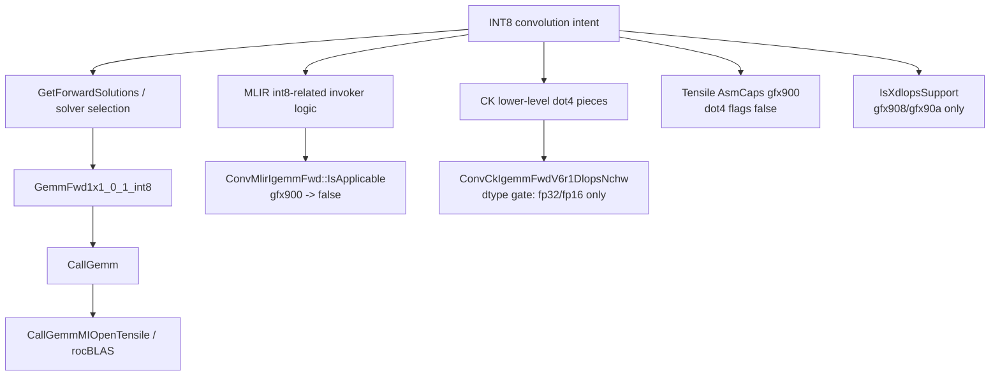

# dp4a alternative path notes

作成日: 2026-03-18
関連文書: `gfx900_int8_path_inventory.md`, `solver_selection_graph.md`, `device_capability_flow.md`, `fallback_chain_map.md`

> 本メモは、公開一次資料およびローカル clone から観測可能な範囲を整理したものであり、非公開 issue や社内意思決定の内容を断定するものではない。

---

## この文書の役割

この文書は、gfx900 における `dp4a` / `dot4` / INT8 alternative path という言い方で
**何が current public tree から実際に確認できるか**
を固定するための補助ノートである。

ここでの関心は、

- public tree に literal な `dp4a` path があるか
- INT8 alternative candidate がどの層にあるか
- それが物理制約か、solver-local / backend / catalog 制約か

であり、
「どれを修正すべきか」「実装価値が高いか」という workplan 判断は含めない。

---

## 一次根拠

- `/home/limonene/ROCm-project/WD-Black/ROCm-repos/MIOpen/src/solver/gemm.cpp`
- `/home/limonene/ROCm-project/WD-Black/ROCm-repos/MIOpen/src/gemm_v2.cpp`
- `/home/limonene/ROCm-project/WD-Black/ROCm-repos/MIOpen/src/include/miopen/solver.hpp`
- `/home/limonene/ROCm-project/WD-Black/ROCm-repos/MIOpen/src/include/miopen/solver/implicitgemm_util.hpp`
- `/home/limonene/ROCm-project/WD-Black/ROCm-repos/MIOpen/src/solver/conv_ck_igemm_fwd_v6r1_dlops_nchw.cpp`
- `/home/limonene/ROCm-project/WD-Black/ROCm-repos/MIOpen/src/include/miopen/solver/ck_utility_common.hpp`
- `/home/limonene/ROCm-project/WD-Black/ROCm-repos/MIOpen/src/composable_kernel/composable_kernel/include/utility/inner_product.hpp`
- `/home/limonene/ROCm-project/WD-Black/ROCm-repos/MIOpen/src/composable_kernel/composable_kernel/include/utility/amd_inline_asm.hpp`
- `/home/limonene/ROCm-project/WD-Black/ROCm-repos/MIOpen/src/conv/invokers/mlir_impl_gemm.cpp`
- `/home/limonene/ROCm-project/WD-Black/ROCm-repos/MIOpen/src/solver/conv_mlir_igemm_fwd.cpp`
- `/home/limonene/ROCm-project/WD-Black/ROCm-repos/Tensile/Tensile/AsmCaps.py`
- `/home/limonene/ROCm-project/WD-Black/ROCm-repos/MIOpen/include/miopen/miopen.h`

補助観測:

- `/home/limonene/ROCm-project/WD-Black/ROCm-Static_Analysis/MCP`
  - `query_ctags` で `GemmFwd1x1_0_1_int8`, `CallGemm`, `CallGemmMIOpenTensile`,
    `IsXdlopsSupport`, `is_ck_supported_hardware` の位置を確認した。

---

## 1. terminology boundary（Fact）

source search の範囲では、current `MIOpen` / `Tensile` public tree に
literal な `dp4a` symbol は確認できなかった。

一方で、近い語は少なくとも次の形で現れる。

| 語 | どこで現れるか | 含意 |
| --- | --- | --- |
| `miopenInt8`, `miopenInt8x4` | `miopen.h`, `gemm_v2.cpp`, `gemm.cpp` | MIOpen public API / backend は INT8 を datatype として扱う |
| `rocblas_gemm_flags_pack_int8x4` | `gemm_v2.cpp` | rocBLAS backend 側の INT8x4 packing |
| `v_dot4_i32_i8`, `v_dot4c_i32_i8` | `Tensile/AsmCaps.py`, vendored CK utility headers | lower-level assembly / intrinsic capability 表現 |
| `__builtin_amdgcn_sdot4` | vendored CK utility headers | compiler intrinsic 側の dot4 表現 |

Interpretation:

- current public tree では `dp4a` より、
  **`int8x4` / `dot4` / `sdot4`**
  の方が実際のコード表現に近い。
- したがって、この文書でいう `dp4a alternative path` は、
  public code 上では **INT8 / dot4-adjacent path**
  と読み替えるのが安全である。

---

## 2. current tree で見える alternative candidate

| candidate | 層 | current public tree で確認できること | gfx900 での位置づけ | 制約の主型 |
| --- | --- | --- | --- | --- |
| `GemmFwd1x1_0_1_int8` | solver | `IsApplicable()` が `1x1`, `pad=0`, `stride=1`, `group=1`, `wDesc.GetType()==miopenInt8`, `workspace>0` を要求する | **最も具体的な INT8 alternative candidate**。ただし形状条件が強い | solver / shape |
| `CallGemm` -> `CallGemmMIOpenTensile` / rocBLAS | backend | `miopenInt8` / `miopenInt8x4` を受け、`miopen_tensile_type_int8x4` や `rocblas_gemm_flags_pack_int8x4` を使う | **backend level の INT8 path は存在**。さらに rocBLAS / Tensile shipped artifact 側には `gfx900` INT8 fallback evidence がある | backend / catalog |
| MLIR int8 invoker logic | backend / invoker | `mlir_impl_gemm.cpp` は INT8 convolution 時に output cast を扱う | INT8 logic 自体はあるが、`ConvMlirIgemmFwd::IsApplicable()` は `gfx900` を reject するため **gfx900 alternative にはなっていない** | solver-local gate |
| CK lower-level dot4 pieces | lower-level codegen utility | vendored CK utility headersに `v_dot4_i32_i8` / `__builtin_amdgcn_sdot4` がある | lower-level capability pieces はあるが、そのまま current forward solver path を意味しない | lower-level / implementation |
| `ConvCkIgemmFwdV6r1DlopsNchw` | exposed solver | `is_ck_supported_hardware()` は `gfx900` を含むが、`IsApplicable()` は `ctx.IsFp32() or ctx.IsFp16()` を要求する | **current exposed forward CK solver は INT8 alternative ではない** | dtype gate |
| Tensile asm caps | shipped / build capability table | `AsmCaps.py` の `(9, 0, 0)` では `v_dot4_i32_i8=False`, `v_dot4c_i32_i8=False`, `VOP3v_dot4_i32_i8=False` | current public Tensile asm capability table からは **gfx900 dot4 route は読めない** | capability / artifact |
| Xdlops path | common capability | `IsXdlopsSupport()` は `gfx908` / `gfx90a` のみを true にする | **gfx900 alternative ではない** | physical / ISA |

---

## 3. coarse relation graph（Fact）

Fact:

- `GemmFwd1x1_0_1_int8` は current public tree で直接確認できる INT8 forward solver である。
- その下流の `CallGemm` は INT8 / INT8x4 を受け、MIOpenTensile / rocBLAS 側へ落ちる。
- MLIR invoker 側にも INT8 convolution 特有の output-cast 処理はあるが、forward MLIR solver は `gfx900` を reject する。
- CK vendored subtree には dot4 intrinsic があるが、current exposed forward CK solver は INT8 dtype を受けない。
- Tensile の gfx900 asm capability table は dot4 flags を false にしている。

Interpretation:

- current public tree から見る限り、
  **gfx900 の INT8 alternative path として最も具体的なのは GEMM backend 側**
  である。
- `dp4a` に近い lower-level pieces は vendored CK / Tensile 内部にはあるが、
  それだけで current exposed `gfx900` alternative path を構成しているとは言えない。

---

## 4. source-level note

### 4.1 `GemmFwd1x1_0_1_int8`

`GemmFwd1x1_0_1_int8::IsApplicable()` は、少なくとも次を要求する。

- `GemmFwdBase::IsApplicable(context, problem)` を通る
- weight spatial が全て `1`
- pad が全て `0`
- stride が全て `1`
- `wDesc.GetType() == miopenInt8`
- `group_count == 1`
- `GetWorkspaceSize(context, problem) > 0`

Interpretation:

- これは「任意の INT8 convolution を受ける alternative path」ではなく、
  **かなり狭い 1x1 GEMM-style path**
  である。

### 4.2 `CallGemm`

`CallGemm()` / `CallGemmMIOpenTensile()` では、
`miopenInt8` / `miopenInt8x4` に対して

- MIOpenTensile 側は `miopen_tensile_type_int8x4`
- rocBLAS 側は `rocblas_gemm_flags_pack_int8x4`

を使う。

Interpretation:

- backend level では INT8x4 packing を前提にした path が存在する。
- ただし、gfx900 でこれが practical route かどうかは、
  **solver applicability**, **catalog**, **shipped kernels**
  の確認が別に必要である。

### 4.3 CK path

`is_ck_supported_hardware()` は `gfx900` を含む。
一方、`ConvCkIgemmFwdV6r1DlopsNchw::IsApplicable()` は `ctx.IsFp32() or ctx.IsFp16()` を要求する。

Interpretation:

- CK subtree が gfx900 向けに完全に閉じているとは言えない。
- ただし、**current exposed forward CK solver をそのまま INT8 alternative と読むことはできない**。

### 4.4 MLIR path

`mlir_impl_gemm.cpp` には INT8 convolution 時の output cast 処理がある。
一方、`ConvMlirIgemmFwd::IsApplicable()` は current public tree で `StartsWith(device_name, "gfx900") -> return false` を持つ。

Interpretation:

- MLIR path には INT8-related code があるが、
  少なくとも current public forward solver では
  **gfx900 の alternative path にはなっていない**。

### 4.5 Tensile asm capability

`Tensile/Tensile/AsmCaps.py` の `(9, 0, 0)` entry では、

- `VOP3v_dot4_i32_i8 = False`
- `v_dot4_i32_i8 = False`
- `v_dot4c_i32_i8 = False`

となっている。

Interpretation:

- current public Tensile capability table からは、
  **gfx900 で dot4 asm route を積極的に使う構成**
  は読み取りにくい。

### 4.6 runtime follow-up on Vega64 (2026-03-18)

Vega64 実機で、`GemmFwd1x1_0_1_int8` の source-level candidate が
実際にどこまで通るかを追加確認した。

実行条件:

- `MIOpenDriver convint8 -n 32 -c 64 -H 56 -W 56 -k 64 -y 1 -x 1 -p 0 -q 0 -u 1 -v 1 -F 1 -t 1 -i 1`
- 同条件で `-s 1`
- 同条件で `-S GemmFwd1x1_0_1_int8`
- 同条件で `MIOPEN_DEBUG_FIND_ONLY_SOLVER=GemmFwd1x1_0_1_int8`
  `MIOPEN_FIND_ENFORCE=SEARCH_DB_UPDATE` を付けて `-s 1`

Fact:

- 自然選択では `Solution: 85/ConvDirectNaiveConvFwd` が選ばれ、
  `naive_conv_ab_nonpacked_fwd_nchw_int8_t_int32_t_int8_t` が実行された。
- `-s 1` を付けても同条件では `ConvDirectNaiveConvFwd` が選ばれた。
- `-S GemmFwd1x1_0_1_int8` では symbolic solution id は `89` に解決されるが、
  `The supplied solution id: GemmFwd1x1_0_1_int8 is not applicable to the current problem`
  で停止し、`rc = 0x3` を返した。
- `MIOPEN_DEBUG_FIND_ONLY_SOLVER=GemmFwd1x1_0_1_int8` 付き search では、
  `GetWorkspaceSizes` と `SearchForAllSolutions` の両方で
  `GemmFwd1x1_0_1_int8: Not applicable` が記録され、
  最後に `No suitable algorithm was found` で `rc = 0x7` を返した。

Interpretation:

- source-level には 1x1 INT8 GEMM candidate が存在するが、
  少なくとも current ROCm 7.2 / MIOpen 3.5.1 の Vega64 実機と
  今回の `NCHW + INT8 + 1x1 + group=1` 条件では、
  **practical route としては成立していない**。
- ここから少なくとも言えるのは、
  `GemmFwd1x1_0_1_int8` が current installed runtime で
  search / workspace-size / forced-solution のいずれでも通らなかったことである。
- ただし、どの追加条件が `Not applicable` の主因かは、
  current public tree と今回のログだけではまだ切り分けられない。

### 4.7 backend artifact follow-up

backend 側については、source と installed ROCm artifact の両方を追加確認した。

Fact:

- `CallGemm` / `CallGemmStridedBatched` の public interface は
  `GemmBackend_t::miopentensile` を default preferred backend にしている。
- `enforce_gemm_backend()` は、build option に応じて
  `miopentensile` または `rocblas` へ backend を正規化する。
  少なくとも `miopenInt8` / `miopenInt8x4` は
  `CallGemmMIOpenTensile()` と rocBLAS 側の両方で型分岐を持つ。
- `CallGemmMIOpenTensile()` は `miopenInt8` / `miopenInt8x4` を
  `miopen_tensile_type_int8x4` 入力、`miopen_tensile_type_int32` 出力として扱う。
- current installed ROCm の `/opt/rocm/lib/rocblas/library` には
  `TensileLibrary_lazy_gfx900.dat` が存在する。
- 同じ installed directory には
  `TensileLibrary_Type_I8I_HPA_Contraction_*_fallback_gfx900.hsaco`
  が複数存在する。
- current `rocBLAS/library/src/tensile_host.cpp` でも
  `getLazyLoadingArch()` は `gfx900` を `Tensile::LazyLoadingInit::gfx900`
  に写像している。
- standalone backend probe として、
  `rocblas-bench -f gemm_ex` の `i8_r/i32_r` case を Vega64/gfx900 で実行すると、
  少なくとも `128x128x128` と `64x100352x64` の 2 条件で成功し、
  `norm_error_1 = 0` を返した。

Interpretation:

- 少なくとも backend artifact / lazy-load catalog の層では、
  `gfx900` 向けの INT8-related shipped evidence が 0 とは言えない。
- さらに standalone rocBLAS GEMM probe により、
  **backend 単体の INT8 GEMM 実行自体は gfx900 で成立する**
  ことも確認できる。
- したがって、今回の `GemmFwd1x1_0_1_int8` runtime follow-up を
  「backend catalog が空だから失敗した」と単純化することはできない。
- 今回の tested case で観測された `Not applicable` は、
  少なくとも **successful backend dispatch が確認される前段**
  の境界として読むのが安全である。

---

## 5. 現時点で少なくとも言えること

Fact:

- current `MIOpen` / `Tensile` public tree に literal な `dp4a` path は確認できない。
- current tree で直接確認できる最も具体的な INT8 alternative candidate は、
  `GemmFwd1x1_0_1_int8` とその下流の `CallGemm` backend である。
- ただし、Vega64 実機の 1x1 INT8 条件では自然選択・`-s 1` ともに
  `ConvDirectNaiveConvFwd` に留まり、`GemmFwd1x1_0_1_int8` は
  forced-solution / only-solver search の両方で `Not applicable` を返した。
- current installed rocBLAS / Tensile artifact には
  `gfx900` 向け lazy library と `Type_I8I_HPA ... fallback_gfx900.hsaco`
  が存在する。
- standalone `rocblas-bench gemm_ex` の `i8_r/i32_r` probe も
  Vega64/gfx900 で成功している。
- `gfx900` を含む lower-level hardware list や dot4 intrinsic の存在だけでは、
  current exposed INT8 alternative path の成立を示したことにはならない。

Interpretation:

- `gfx900` の INT8 代替経路を考えるときは、
  **solver**, **backend**, **lower-level intrinsic**, **artifact/capability table**
  を混ぜずに読む必要がある。
- 「dot4 命令がどこかにある」ことと、
  「current public MIOpen で gfx900 INT8 route が practical に成立する」ことは別問題である。
- 今回の runtime follow-up は、その差を
  **source-level candidate はあるが、current runtime では通らない**
  という形で具体化した。
- さらに backend artifact follow-up により、
  `solver candidate が今回通らない` ことと
  `backend artifact が存在しない` ことも分けて扱う必要がある。
- そして standalone backend probe により、
  `MIOpen conv route が通らない` ことと
  `gfx900 で INT8 GEMM backend 自体が動かない` ことも同一ではないと確認できた。

---

## Open Question / Limitation

1. `GemmFwd1x1_0_1_int8` が今回の 1x1 INT8 条件で `Not applicable` になる主因は、shape 以外の追加条件を含めて未切り分けである
2. `GemmFwd1x1_0_1_int8` の current MIOpen convolution path が、どの条件なら backend まで到達するかは未確認である
3. CK については current exposed forward path を見た範囲であり、CK 全体の将来可能性を断定するものではない
4. `dp4a` という語は convenience label であり、public tree 側の canonical naming ではない

---

## 本文書が主張しないこと

- gfx900 の INT8 最適化が容易に復活できると断定するものではない
- dot4 intrinsic の存在だけで実用経路の存在を証明するものではない
- 特定 backend が特定 arch 維持のために意図されたと断定するものではない
- private issue や社内意思決定を推定するものではない
