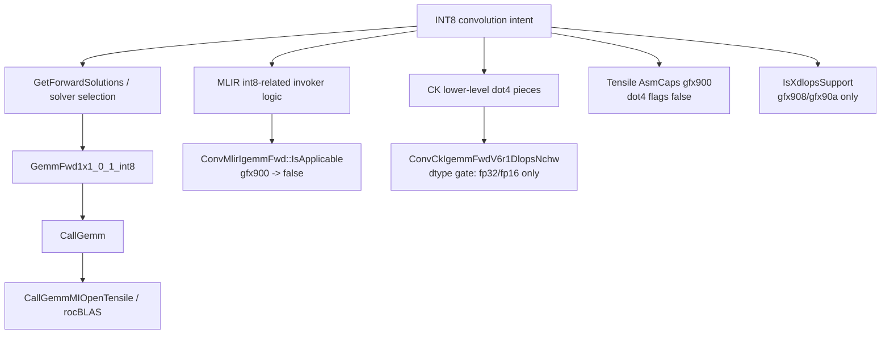

# dp4a alternative path notes

作成日: 2026-03-18
関連文書: `gfx900_int8_path_inventory.md`, `solver_selection_graph.md`, `device_capability_flow.md`, `fallback_chain_map.md`

> 本メモは、公開一次資料およびローカル clone から観測可能な範囲を整理したものであり、非公開 issue や社内意思決定の内容を断定するものではない。

---

## この文書の役割

この文書は、gfx900 における `dp4a` / `dot4` / INT8 alternative path という言い方で
**何が current public tree から実際に確認できるか**
を固定するための補助ノートである。

ここでの関心は、

- public tree に literal な `dp4a` path があるか
- INT8 alternative candidate がどの層にあるか
- それが物理制約か、solver-local / backend / catalog 制約か

であり、
「どれを修正すべきか」「実装価値が高いか」という workplan 判断は含めない。

---

## 一次根拠

- `/home/limonene/ROCm-project/WD-Black/ROCm-repos/MIOpen/src/solver/gemm.cpp`
- `/home/limonene/ROCm-project/WD-Black/ROCm-repos/MIOpen/src/gemm_v2.cpp`
- `/home/limonene/ROCm-project/WD-Black/ROCm-repos/MIOpen/src/include/miopen/solver.hpp`
- `/home/limonene/ROCm-project/WD-Black/ROCm-repos/MIOpen/src/include/miopen/solver/implicitgemm_util.hpp`
- `/home/limonene/ROCm-project/WD-Black/ROCm-repos/MIOpen/src/solver/conv_ck_igemm_fwd_v6r1_dlops_nchw.cpp`
- `/home/limonene/ROCm-project/WD-Black/ROCm-repos/MIOpen/src/include/miopen/solver/ck_utility_common.hpp`
- `/home/limonene/ROCm-project/WD-Black/ROCm-repos/MIOpen/src/composable_kernel/composable_kernel/include/utility/inner_product.hpp`
- `/home/limonene/ROCm-project/WD-Black/ROCm-repos/MIOpen/src/composable_kernel/composable_kernel/include/utility/amd_inline_asm.hpp`
- `/home/limonene/ROCm-project/WD-Black/ROCm-repos/MIOpen/src/conv/invokers/mlir_impl_gemm.cpp`
- `/home/limonene/ROCm-project/WD-Black/ROCm-repos/MIOpen/src/solver/conv_mlir_igemm_fwd.cpp`
- `/home/limonene/ROCm-project/WD-Black/ROCm-repos/Tensile/Tensile/AsmCaps.py`
- `/home/limonene/ROCm-project/WD-Black/ROCm-repos/MIOpen/include/miopen/miopen.h`

補助観測:

- `/home/limonene/ROCm-project/WD-Black/ROCm-Static_Analysis/MCP`
  - `query_ctags` で `GemmFwd1x1_0_1_int8`, `CallGemm`, `CallGemmMIOpenTensile`,
    `IsXdlopsSupport`, `is_ck_supported_hardware` の位置を確認した。

---

## 1. terminology boundary（Fact）

source search の範囲では、current `MIOpen` / `Tensile` public tree に
literal な `dp4a` symbol は確認できなかった。

一方で、近い語は少なくとも次の形で現れる。

| 語 | どこで現れるか | 含意 |
| --- | --- | --- |
| `miopenInt8`, `miopenInt8x4` | `miopen.h`, `gemm_v2.cpp`, `gemm.cpp` | MIOpen public API / backend は INT8 を datatype として扱う |
| `rocblas_gemm_flags_pack_int8x4` | `gemm_v2.cpp` | rocBLAS backend 側の INT8x4 packing |
| `v_dot4_i32_i8`, `v_dot4c_i32_i8` | `Tensile/AsmCaps.py`, vendored CK utility headers | lower-level assembly / intrinsic capability 表現 |
| `__builtin_amdgcn_sdot4` | vendored CK utility headers | compiler intrinsic 側の dot4 表現 |

Interpretation:

- current public tree では `dp4a` より、
  **`int8x4` / `dot4` / `sdot4`**
  の方が実際のコード表現に近い。
- したがって、この文書でいう `dp4a alternative path` は、
  public code 上では **INT8 / dot4-adjacent path**
  と読み替えるのが安全である。

---

## 2. current tree で見える alternative candidate

| candidate | 層 | current public tree で確認できること | gfx900 での位置づけ | 制約の主型 |
| --- | --- | --- | --- | --- |
| `GemmFwd1x1_0_1_int8` | solver | `IsApplicable()` が `1x1`, `pad=0`, `stride=1`, `group=1`, `wDesc.GetType()==miopenInt8`, `workspace>0` を要求する | **最も具体的な INT8 alternative candidate**。ただし形状条件が強い | solver / shape |
| `CallGemm` -> `CallGemmMIOpenTensile` / rocBLAS | backend | `miopenInt8` / `miopenInt8x4` を受け、`miopen_tensile_type_int8x4` や `rocblas_gemm_flags_pack_int8x4` を使う | **backend level の INT8 path は存在**。さらに rocBLAS / Tensile shipped artifact 側には `gfx900` INT8 fallback evidence がある | backend / catalog |
| MLIR int8 invoker logic | backend / invoker | `mlir_impl_gemm.cpp` は INT8 convolution 時に output cast を扱う | INT8 logic 自体はあるが、`ConvMlirIgemmFwd::IsApplicable()` は `gfx900` を reject するため **gfx900 alternative にはなっていない** | solver-local gate |
| CK lower-level dot4 pieces | lower-level codegen utility | vendored CK utility headersに `v_dot4_i32_i8` / `__builtin_amdgcn_sdot4` がある | lower-level capability pieces はあるが、そのまま current forward solver path を意味しない | lower-level / implementation |
| `ConvCkIgemmFwdV6r1DlopsNchw` | exposed solver | `is_ck_supported_hardware()` は `gfx900` を含むが、`IsApplicable()` は `ctx.IsFp32() or ctx.IsFp16()` を要求する | **current exposed forward CK solver は INT8 alternative ではない** | dtype gate |
| Tensile asm caps | shipped / build capability table | `AsmCaps.py` の `(9, 0, 0)` では `v_dot4_i32_i8=False`, `v_dot4c_i32_i8=False`, `VOP3v_dot4_i32_i8=False` | current public Tensile asm capability table からは **gfx900 dot4 route は読めない** | capability / artifact |
| Xdlops path | common capability | `IsXdlopsSupport()` は `gfx908` / `gfx90a` のみを true にする | **gfx900 alternative ではない** | physical / ISA |

---

## 3. coarse relation graph（Fact）

Fact:

- `GemmFwd1x1_0_1_int8` は current public tree で直接確認できる INT8 forward solver である。
- その下流の `CallGemm` は INT8 / INT8x4 を受け、MIOpenTensile / rocBLAS 側へ落ちる。
- MLIR invoker 側にも INT8 convolution 特有の output-cast 処理はあるが、forward MLIR solver は `gfx900` を reject する。
- CK vendored subtree には dot4 intrinsic があるが、current exposed forward CK solver は INT8 dtype を受けない。
- Tensile の gfx900 asm capability table は dot4 flags を false にしている。

Interpretation:

- current public tree から見る限り、
  **gfx900 の INT8 alternative path として最も具体的なのは GEMM backend 側**
  である。
- `dp4a` に近い lower-level pieces は vendored CK / Tensile 内部にはあるが、
  それだけで current exposed `gfx900` alternative path を構成しているとは言えない。

---

## 4. source-level note

### 4.1 `GemmFwd1x1_0_1_int8`

`GemmFwd1x1_0_1_int8::IsApplicable()` は、少なくとも次を要求する。

- `GemmFwdBase::IsApplicable(context, problem)` を通る
- weight spatial が全て `1`
- pad が全て `0`
- stride が全て `1`
- `wDesc.GetType() == miopenInt8`
- `group_count == 1`
- `GetWorkspaceSize(context, problem) > 0`

Interpretation:

- これは「任意の INT8 convolution を受ける alternative path」ではなく、
  **かなり狭い 1x1 GEMM-style path**
  である。

### 4.2 `CallGemm`

`CallGemm()` / `CallGemmMIOpenTensile()` では、
`miopenInt8` / `miopenInt8x4` に対して

- MIOpenTensile 側は `miopen_tensile_type_int8x4`
- rocBLAS 側は `rocblas_gemm_flags_pack_int8x4`

を使う。

Interpretation:

- backend level では INT8x4 packing を前提にした path が存在する。
- ただし、gfx900 でこれが practical route かどうかは、
  **solver applicability**, **catalog**, **shipped kernels**
  の確認が別に必要である。

### 4.3 CK path

`is_ck_supported_hardware()` は `gfx900` を含む。
一方、`ConvCkIgemmFwdV6r1DlopsNchw::IsApplicable()` は `ctx.IsFp32() or ctx.IsFp16()` を要求する。

Interpretation:

- CK subtree が gfx900 向けに完全に閉じているとは言えない。
- ただし、**current exposed forward CK solver をそのまま INT8 alternative と読むことはできない**。

### 4.4 MLIR path

`mlir_impl_gemm.cpp` には INT8 convolution 時の output cast 処理がある。
一方、`ConvMlirIgemmFwd::IsApplicable()` は current public tree で `StartsWith(device_name, "gfx900") -> return false` を持つ。

Interpretation:

- MLIR path には INT8-related code があるが、
  少なくとも current public forward solver では
  **gfx900 の alternative path にはなっていない**。

### 4.5 Tensile asm capability

`Tensile/Tensile/AsmCaps.py` の `(9, 0, 0)` entry では、

- `VOP3v_dot4_i32_i8 = False`
- `v_dot4_i32_i8 = False`
- `v_dot4c_i32_i8 = False`

となっている。

Interpretation:

- current public Tensile capability table からは、
  **gfx900 で dot4 asm route を積極的に使う構成**
  は読み取りにくい。

### 4.6 runtime follow-up on Vega64 (2026-03-18)

Vega64 実機で、`GemmFwd1x1_0_1_int8` の source-level candidate が
実際にどこまで通るかを追加確認した。

実行条件:

- `MIOpenDriver convint8 -n 32 -c 64 -H 56 -W 56 -k 64 -y 1 -x 1 -p 0 -q 0 -u 1 -v 1 -F 1 -t 1 -i 1`
- 同条件で `-s 1`
- 同条件で `-S GemmFwd1x1_0_1_int8`
- 同条件で `MIOPEN_DEBUG_FIND_ONLY_SOLVER=GemmFwd1x1_0_1_int8`
  `MIOPEN_FIND_ENFORCE=SEARCH_DB_UPDATE` を付けて `-s 1`

Fact:

- 自然選択では `Solution: 85/ConvDirectNaiveConvFwd` が選ばれ、
  `naive_conv_ab_nonpacked_fwd_nchw_int8_t_int32_t_int8_t` が実行された。
- `-s 1` を付けても同条件では `ConvDirectNaiveConvFwd` が選ばれた。
- `-S GemmFwd1x1_0_1_int8` では symbolic solution id は `89` に解決されるが、
  `The supplied solution id: GemmFwd1x1_0_1_int8 is not applicable to the current problem`
  で停止し、`rc = 0x3` を返した。
- `MIOPEN_DEBUG_FIND_ONLY_SOLVER=GemmFwd1x1_0_1_int8` 付き search では、
  `GetWorkspaceSizes` と `SearchForAllSolutions` の両方で
  `GemmFwd1x1_0_1_int8: Not applicable` が記録され、
  最後に `No suitable algorithm was found` で `rc = 0x7` を返した。

Interpretation:

- source-level には 1x1 INT8 GEMM candidate が存在するが、
  少なくとも current ROCm 7.2 / MIOpen 3.5.1 の Vega64 実機と
  今回の `NCHW + INT8 + 1x1 + group=1` 条件では、
  **practical route としては成立していない**。
- ここから少なくとも言えるのは、
  `GemmFwd1x1_0_1_int8` が current installed runtime で
  search / workspace-size / forced-solution のいずれでも通らなかったことである。
- ただし、どの追加条件が `Not applicable` の主因かは、
  current public tree と今回のログだけではまだ切り分けられない。

### 4.7 direct solution-query probe (`y=int8` vs `y=int32`)

`MIOpenDriver convint8` から一段切り離して、
descriptor を直接組む solution query probe も行った。

Fact:

- `x=int8`, `w=int8`, `y=int8` では、
  `miopenConvolutionForwardGetSolutionCount()` は `1` を返し、
  `GetSolution()` で見えるのは `id=85` (`ConvDirectNaiveConvFwd`) のみだった。
- 同条件で `miopenConvolutionForwardGetSolutionWorkspaceSize(..., 89)` は
  `miopenStatusBadParm (3)` を返した。
- `x=int8`, `w=int8`, `y=int32` では、
  `GetSolutionCount()` は `2` を返し、
  `GetSolution()` は `id=89` (`algo=0`, `ws=200704`) と
  `id=85` (`algo=1`, `ws=0`) を返した。
- 同条件で `GetSolutionWorkspaceSize(..., 89)` も成功し、
  `ws=200704` を返した。
- 既存の `MIOpenDriver convint8` runtime log では、
  output tensor descriptor が `dataType = 3` と記録されている。
- `miopenDataType_t` enum では `3 = miopenInt8`, `2 = miopenInt32` である。
- 一方、current public `driver/conv_driver.hpp` は
  INT8 / INT8x4 時の output tensor を `miopenInt32` に設定する実装である。

Interpretation:

- current installed library 上でも、
  **`y=int32` descriptor なら `GemmFwd1x1_0_1_int8` は visible solution になる**。
- したがって、今回の `convint8` tested case で見えた `Not applicable` は、
  少なくとも `gfx900 に INT8 GEMM solver/backend が存在しない` こととは同一ではない。
- 観測上は、`MIOpenDriver convint8` の output-type path と
  current public `conv_driver.hpp` の間に差があり、
  practical blockage は少なくともその差分に強く寄っている。
- ただし、installed driver/binary の差分理由そのものは
  current public tree と今回の probe だけでは断定できない。

### 4.8 direct immediate execution probe (`y=int32`)

query だけでなく、
`x=int8, w=int8, y=int32` の direct immediate path で
`solution_id = 89` が実行まで通るかも追加確認した。

Fact:

- direct immediate probe では
  `solution_count = 2`、`id=89` / `id=85` が返った。
- `workspace_size_89 = 200704`
- `miopenConvolutionForwardCompileSolution(..., 89)` は成功した。
- `miopenConvolutionForwardImmediate(..., 89)` も成功した。
- `x=1`, `w=1` 初期化条件で、
  先頭 64 要素は少なくとも `64` で一致した。

Interpretation:

- `GemmFwd1x1_0_1_int8` は、
  **same installed library 上の direct immediate path では実行可能**
  と確認できる。
- したがって、今回の閉塞点は
  `gfx900 では solver 89 が本質的に動かない`
  という意味ではなく、
  少なくとも `MIOpenDriver convint8` の tested route と
  direct immediate route の差に強く寄っている。

### 4.9 installed `MIOpenDriver` cast-flag follow-up

`MIOpenDriver convint8 --help` には
legacy-style の
`--in_cast_type` / `--wei_cast_type` / `--out_cast_type`
が見える。

このため、cast flag を使えば
direct `y=int32` path に寄せられるかも追加で確認した。

Fact:

- legacy
  `00_legacy-repos/MIOpen/driver/conv_driver.hpp`
  では、
  `valid_cast_types = {"fp32", "fp16", "bf16", "fp8", "bf8"}`
  と `DataTypeFromShortString()` の両方が
  `int32` を受理しない。
- 同じ legacy source では、
  output tensor は `data_type` のまま作られ、
  その後 `miopenSetTensorCastType(outputTensor, out_cast_type)` が任意で付く。
- current public standalone `MIOpen/driver/conv_driver.hpp` は
  cast flag 群を持たず、
  INT8 / INT8x4 時に output tensor の data type 自体を
  `miopenInt32` に設定する。
- installed `MIOpenDriver convint8` に
  `--out_cast_type int32` を与えると、
  `Invalid value for out_cast_type argument:int32`
  で parse 段階から失敗した。
- `--out_cast_type fp32` は受理されるが、
  runtime log 上の output tensor は
  `dataType = 3` のままで、
  `cast_type: Other` が付く形だった。
- 同じ `fp32` cast log では、
  problem / db key は
  `...NCHW-INT8-F_coFP32`
  に変わっていた。
- 同条件では、
  `GEMM not supported with casted tensors on this GPU architecture`
  が GEMM family に対して繰り返し記録され、
  `GemmFwd1x1_0_1_int8` も natural / search / forced の全てで
  practical route にはならなかった。

Interpretation:

- installed `MIOpenDriver` の legacy-style cast flag は、
  **direct `y=int32` descriptor path の代替ではない**。
- 少なくとも今回の installed binary では、
  `--out_cast_type fp32` は
  output tensor の data type を `int32` に変えるのではなく、
  `int8 tensor + cast metadata`
  の別 problem として扱っている。
- その結果、`...INT8-F_coFP32` という別 key になり、
  gfx900 では GEMM family が
  `casted tensors` 理由で落ちる。
- したがって、
  direct probe で通った `x=int8, w=int8, y=int32` path と、
  installed driver の cast-flag path は同一視できない。

### 4.10 standard Find/Forward probe (`y=int32`)

direct immediate だけでなく、
standard の higher-level C API

- `miopenFindConvolutionForwardAlgorithm()`
- `miopenConvolutionForward()`

でも同じ route が再現できるかを追加確認した。

Fact:

- `x=int8, w=int8, y=int32` descriptor で
  `miopenConvolutionForwardGetWorkSpaceSize()` は
  `workspace_size = 200704` を返した。
- 同条件の log では、
  problem key は
  `...NCHW-INT8INT8INT32-F`
  と記録された。
- same log の `GetSolutionsFallback` では、
  `ConvDirectNaiveConvFwd` と `GemmFwd1x1_0_1_int8`
  の両方が visible candidate として現れた。
- `miopenFindConvolutionForwardAlgorithm(..., exhaustiveSearch = 0)` は成功し、
  `returned_algo_count = 2`
  - `perf[0] algo=GEMM memory=200704`
  - `perf[1] algo=Direct memory=0`
  を返した。
- 同条件の log では、
  `FW Chosen Algorithm: GemmFwd1x1_0_1_int8`
  が記録された。
- `miopenConvolutionForward(algo=GEMM)` は成功した。
- `miopenConvolutionForward(algo=Direct)` も成功した。
- どちらも先頭出力は `64` で一致した。
- `miopenFindConvolutionForwardAlgorithm(..., exhaustiveSearch = 1)` も成功し、
  `returned_algo_count = 1`
  - `perf[0] algo=GEMM memory=200704`
  を返した。
- 同条件の `miopenConvolutionForward(algo=GEMM)` も成功し、
  出力は期待どおり `64` で一致した。

Interpretation:

- `y=int32` descriptor を明示できれば、
  **direct immediate だけでなく standard `Find/Forward` API でも**
  `GemmFwd1x1_0_1_int8` 側の route は再現できる。
- したがって、
  `y=int32` path の成立は immediate-only の特殊経路ではない。
- 現時点で閉じているのは、
  少なくとも `MIOpenDriver convint8` / driver-side descriptor assembly 側と読むのが自然である。

### 4.11 backend artifact follow-up

backend 側については、source と installed ROCm artifact の両方を追加確認した。

Fact:

- `CallGemm` / `CallGemmStridedBatched` の public interface は
  `GemmBackend_t::miopentensile` を default preferred backend にしている。
- `enforce_gemm_backend()` は、build option に応じて
  `miopentensile` または `rocblas` へ backend を正規化する。
  少なくとも `miopenInt8` / `miopenInt8x4` は
  `CallGemmMIOpenTensile()` と rocBLAS 側の両方で型分岐を持つ。
- `CallGemmMIOpenTensile()` は `miopenInt8` / `miopenInt8x4` を
  `miopen_tensile_type_int8x4` 入力、`miopen_tensile_type_int32` 出力として扱う。
- current installed ROCm の `/opt/rocm/lib/rocblas/library` には
  `TensileLibrary_lazy_gfx900.dat` が存在する。
- 同じ installed directory には
  `TensileLibrary_Type_I8I_HPA_Contraction_*_fallback_gfx900.hsaco`
  が複数存在する。
- current `rocBLAS/library/src/tensile_host.cpp` でも
  `getLazyLoadingArch()` は `gfx900` を `Tensile::LazyLoadingInit::gfx900`
  に写像している。
- standalone backend probe として、
  `rocblas-bench -f gemm_ex` の `i8_r/i32_r` case を Vega64/gfx900 で実行すると、
  少なくとも `128x128x128` と `64x100352x64` の 2 条件で成功し、
  `norm_error_1 = 0` を返した。

Interpretation:

- 少なくとも backend artifact / lazy-load catalog の層では、
  `gfx900` 向けの INT8-related shipped evidence が 0 とは言えない。
- さらに standalone rocBLAS GEMM probe により、
  **backend 単体の INT8 GEMM 実行自体は gfx900 で成立する**
  ことも確認できる。
- したがって、今回の `GemmFwd1x1_0_1_int8` runtime follow-up を
  「backend catalog が空だから失敗した」と単純化することはできない。
- 今回の tested case で観測された `Not applicable` は、
  少なくとも **successful backend dispatch が確認される前段**
  の境界として読むのが安全である。

### 4.12 source-level descriptor split

current source と legacy source を並べると、
`direct y=int32` route と
`INT8 + cast metadata` route は
もともと別 problem として実装されていることが読み取れる。

Fact:

- current public standalone
  `MIOpen/driver/conv_driver.hpp`
  は、
  `data_type == miopenInt8 || data_type == miopenInt8x4`
  のとき output tensor の `data_type` 自体を
  `miopenInt32`
  に切り替える。
- current public standalone
  `src/ocl/convolutionocl.cpp`
  の forward validation も、
  `x=int8` なら `y=int32 || float`,
  `x=int8x4` なら `y=int32`
  を要求する。
- current public standalone
  `src/include/miopen/conv/problem_description.hpp`
  の `ProblemDescription::IsInt8()`
  は、
  `GetOutDataType() == miopenInt32 || miopenFloat`
  を INT8 problem として扱う。
- current public standalone
  `src/conv/problem_description.cpp`
  の key 生成は、
  `GetInDataType()`, `GetWeightsDataType()`, `GetOutDataType()`
  だけを使う。
- legacy
  `00_legacy-repos/MIOpen/driver/conv_driver.hpp`
  では、
  output tensor は `data_type` のまま作られ、
  `miopenSetTensorCastType(outputTensor, out_cast_type)`
  が任意で後付けされる。
- legacy
  `00_legacy-repos/MIOpen/src/include/miopen/conv/problem_description.hpp`
  の `ProblemDescription::IsInt8()`
  は
  `GetOutDataType() == miopenInt32 || miopenInt8 || miopenFloat`
  を許し、
  `IsTensorsCasted()`
  を別フラグで持つ。
- legacy
  `00_legacy-repos/MIOpen/src/solver/conv/gemm.cpp`
  では、
  `problem.IsTensorsCasted()`
  が立つと
  FP8-supported arch 以外では
  `GEMM not supported with casted tensors on this GPU architecture`
  で落ちる。

Interpretation:

- source 上は、
  `...INT8INT8INT32-F`
  と
  `...INT8-F_coFP32`
  が
  **同じ route の別表記ではなく、別 problem**
  として扱われている。
- current standalone source は
  direct query / direct immediate / standard Find/Forward probe と整合する。
- 一方 installed `MIOpenDriver convint8` の cast-flag 振る舞いは、
  legacy cast-aware path と整合する。
- したがって、
  現時点での practical blockage は
  solver/backend 不在ではなく、
  **installed driver 側の descriptor assembly / path provenance**
  に強く寄っていると読むのが安全である。

### 4.13 local debug build provenance follow-up

2026-03-18 まで、
current public standalone
`ROCm-repos/MIOpen/driver/conv_driver.hpp`
と
local debug `MIOpenDriver`
の挙動が食い違って見える点が残っていた。

Fact:

- local debug build tree
  `/home/limonene/ROCm-project/WD-Black/rocm-builds/miopen-debug-build-20260314_135541/CMakeCache.txt`
  の `MIOpen_SOURCE_DIR` は
  `/home/limonene/ROCm-project/WD-Black/miopen-src`
  を指している。
- 同 build から生成された
  `.../miopen-debug-prefix-20260314_135541/bin/MIOpenDriver`
  には、
  `out_cast_type`, `in_cast_type`, `wei_cast_type`
  と
  `/home/limonene/ROCm-project/WD-Black/miopen-src/driver/dm_convint8.cpp`
  の文字列が残っている。
- `miopen-src/driver/conv_driver.hpp`
  には
  `valid_cast_types`
  と
  `miopenSetTensorCastType(outputTensor, out_cast_type)`
  が残り、
  output tensor は `data_type` のまま作られる。
- 一方 current public standalone
  `ROCm-repos/MIOpen/driver/conv_driver.hpp`
  では、
  INT8 / INT8x4 の output tensor は
  `y_type = miopenInt32`
  に切り替えられる。

Interpretation:

- local debug `MIOpenDriver` が legacy-style cast flag を出し続けたのは、
  少なくとも
  **その binary が current public standalone clone ではなく、
  別 checkout (`miopen-src@f842c61d`) からビルドされていた**
  ことで説明できる。
- したがって、
  local debug build と current public standalone source の食い違いを、
  source 読解の失敗だけに還元する必要はない。
- ただし、
  ここから直ちに installed `/opt/rocm/bin/MIOpenDriver`
  の provenance を断定することはできない。

### 4.14 installed package provenance follow-up

2026-03-20 に、
普段使っている installed
`/opt/rocm/bin/MIOpenDriver`
そのものの provenance も追加確認した。

Fact:

- この host では
  `pacman -Qo /opt/rocm/bin/MIOpenDriver`
  が
  `miopen-hip 7.2.0-1`
  を返す。
- `pacman -Qi miopen-hip`
  には
  build date `2026-01-30`
  と
  packager `Torsten Keßler`
  が記録されている。
- installed binary / library の `strings`
  には
  `/usr/src/debug/miopen-hip/rocm-libraries/projects/miopen/...`
  という path が残っている。
- `/opt/rocm/include/miopen/version.h`
  と
  `/opt/rocm/lib/libMIOpen.so`
  は
  `MIOpen 3.5.1.5b515cf1bca-dirty`
  を示す。
- current public standalone
  `ROCm-repos/MIOpen`
  は
  `rocm_setup_version(VERSION 2.18.0)`
  かつ
  `out_cast_type` path を持たない。
- 一方 local `rocm-libraries` git object の
  `projects/miopen/driver/conv_driver.hpp`
  と
  `miopen-src/driver/conv_driver.hpp`
  は
  cast-aware `out_cast_type`
  path を保持している。

Interpretation:

- 少なくともこの host の installed `MIOpenDriver` は、
  **current public standalone `ROCm-repos/MIOpen`
  の直接 build ではない**
  と読むのが自然である。
- embedded path と surface behavior は
  `rocm-libraries/projects/miopen`
  family に寄る。
- 一方で configured version `3.5.1.*`
  は local `miopen-src`
  に近く、
  local `rocm-libraries` HEAD (`3.4.0`) とは一致しない。
- したがって、
  現時点で最も安全なのは、
  **installed binary は `rocm-libraries/projects/miopen` 系の
  cast-aware driver family に寄るが、
  exact source commit は未確定**
  と書くことである。
- また、
  この観測は Arch package `miopen-hip 7.2.0-1`
  上の host-specific provenance であり、
  直ちに AMD 公式 binary 一般へ拡張すべきではない。

### 4.15 `convint8` CLI option-surface follow-up

2026-03-20 に、
`convint8` CLI が current standalone source の
direct `y=int32` route を
どこまで visible にしているかも追加確認した。

Fact:

- current standalone
  `MIOpen/driver/main.cpp`
  でも、
  local `miopen-src/driver/dm_convint8.cpp`
  でも、
  `convint8` entrypoint 自体は
  `new ConvDriver<int8_t, int32_t>()`
  を返す。
- したがって、
  `convint8` entrypoint の template instantiation そのものは
  current / packaged-cast-aware family で共通している。
- ただし current standalone
  `MIOpen/driver/conv_driver.hpp`
  では、
  INT8 / INT8x4 時に
  `y_type = miopenInt32`
  を計算して
  `SetTensorNd(outputTensor, ..., y_type)`
  を呼ぶ。
- 一方 `miopen-src/driver/conv_driver.hpp`
  と local `rocm-libraries` git object の
  `projects/miopen/driver/conv_driver.hpp`
  では、
  output tensor は `data_type` のまま作られ、
  その後
  `miopenSetTensorCastType(outputTensor, out_cast_type)`
  が任意で付く。
- installed
  `MIOpenDriver convint8 --help`
  には
  `--in_cast_type`, `--out_cast_type`, `--wei_cast_type`
  は出るが、
  direct output dtype を切り替える obvious option
  (`--out_data_type` など)
  は見えない。
- 実際、
  `MIOpenDriver convint8 --out_data_type int32 ...`
  は
  `Long Name: out_data_type Not Found !`
  で落ちた。
- `MIOpenDriver convint8 --out_cast_type int32 ...`
  も
  `Invalid value for out_cast_type argument:int32`
  で parse 段階から失敗した。

Interpretation:

- `ConvDriver<int8_t, int32_t>` という entrypoint 共有だけでは、
  direct `y=int32` route が CLI 上で expose されることまでは意味しない。
- current standalone source の direct route は
  `output descriptor data type = miopenInt32`
  という表現であり、
  installed CLI surface に見えている cast flag family とは別層である。
- 少なくとも tested installed `/opt/rocm/bin/MIOpenDriver` では、
  current standalone source の direct `y=int32` route を
  表す obvious CLI syntax は観測されない。
- したがって current host で practical route が閉じて見える理由は、
  少なくとも
  **solver/backend absence ではなく、
  installed `convint8` CLI の option surface / descriptor assembly**
  にさらに寄ると読める。

---

## 5. 現時点で少なくとも言えること

Fact:

- current `MIOpen` / `Tensile` public tree に literal な `dp4a` path は確認できない。
- current tree で直接確認できる最も具体的な INT8 alternative candidate は、
  `GemmFwd1x1_0_1_int8` とその下流の `CallGemm` backend である。
- ただし、Vega64 実機の 1x1 INT8 条件では自然選択・`-s 1` ともに
  `ConvDirectNaiveConvFwd` に留まり、`GemmFwd1x1_0_1_int8` は
  forced-solution / only-solver search の両方で `Not applicable` を返した。
- current installed rocBLAS / Tensile artifact には
  `gfx900` 向け lazy library と `Type_I8I_HPA ... fallback_gfx900.hsaco`
  が存在する。
- standalone `rocblas-bench gemm_ex` の `i8_r/i32_r` probe も
  Vega64/gfx900 で成功している。
- `gfx900` を含む lower-level hardware list や dot4 intrinsic の存在だけでは、
  current exposed INT8 alternative path の成立を示したことにはならない。

Interpretation:

- `gfx900` の INT8 代替経路を考えるときは、
  **solver**, **backend**, **lower-level intrinsic**, **artifact/capability table**
  を混ぜずに読む必要がある。
- 「dot4 命令がどこかにある」ことと、
  「current public MIOpen で gfx900 INT8 route が practical に成立する」ことは別問題である。
- 今回の runtime follow-up は、その差を
  **source-level candidate はあるが、current runtime では通らない**
  という形で具体化した。
- さらに backend artifact follow-up により、
  `solver candidate が今回通らない` ことと
  `backend artifact が存在しない` ことも分けて扱う必要がある。
- そして standalone backend probe により、
  `MIOpen conv route が通らない` ことと
  `gfx900 で INT8 GEMM backend 自体が動かない` ことも同一ではないと確認できた。
- direct solution-query probe により、
  `GemmFwd1x1_0_1_int8` が current installed library に存在しないわけではなく、
  少なくとも `y=int32` descriptor では露出することも確認できた。
- direct immediate probe により、
  `y=int32` descriptor 条件では `CompileSolution` / `ForwardImmediate` まで通ることも確認できた。
- cast-flag follow-up により、
  direct `y=int32` path と
  installed `MIOpenDriver` の `out_cast_type` path も別問題だと確認できた。
- standard Find/Forward probe により、
  direct `y=int32` path は immediate-only ではなく、
  standard C API からも再現できると確認できた。
- source-level descriptor split を current / legacy tree で比較すると、
  direct `y=int32` path と
  `INT8 + cast metadata` path は
  同じ route の別名ではなく、
  実装上も別 problem として扱われている。
- さらに local debug build provenance follow-up により、
  current public standalone source と local debug `MIOpenDriver` の不一致は、
  少なくとも build provenance の差でも説明できると分かった。
- 加えて installed package provenance follow-up により、
  この host の installed `/opt/rocm/bin/MIOpenDriver`
  も current public standalone clone そのものではなく、
  `rocm-libraries/projects/miopen`
  系の cast-aware driver family に寄ると読めるようになった。

---

## Open Question / Limitation

1. installed `/opt/rocm/bin/MIOpenDriver` は host 上で `miopen-hip 7.2.0-1` に属し、embedded path も `rocm-libraries/projects/miopen` を示すが、exact source commit / exact packaging tree は未確定である
2. direct immediate で通る `y=int32` path は standard `Find/Forward` API からは再現できた。installed `MIOpenDriver convint8` では少なくとも obvious な `out_data_type` knob は見えず、`out_cast_type=int32` も reject されるため、同 route をどう表現するかはなお未確認である
3. CK については current exposed forward path を見た範囲であり、CK 全体の将来可能性を断定するものではない
4. `dp4a` という語は convenience label であり、public tree 側の canonical naming ではない

---

## 本文書が主張しないこと

- gfx900 の INT8 最適化が容易に復活できると断定するものではない
- dot4 intrinsic の存在だけで実用経路の存在を証明するものではない
- 特定 backend が特定 arch 維持のために意図されたと断定するものではない
- private issue や社内意思決定を推定するものではない
