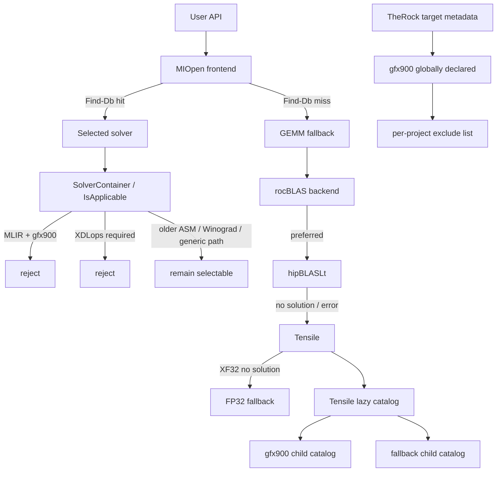

# fallback / gating chain map

> 本メモは、公開一次資料およびローカル clone から観測可能な範囲を整理したものであり、非公開 issue や社内意思決定の内容を断定するものではない。

Updated: 2026-03-17

Primary sources:

- `/home/limonene/ROCm-project/WD-Black/ROCm-repos/MIOpen/doc/src/find_and_immediate.md`
- `/home/limonene/ROCm-project/WD-Black/ROCm-repos/MIOpen/src/include/miopen/find_solution.hpp`
- `/home/limonene/ROCm-project/WD-Black/ROCm-repos/MIOpen/src/include/miopen/convolution.hpp`
- `/home/limonene/ROCm-project/WD-Black/ROCm-repos/MIOpen/src/include/miopen/solver/implicitgemm_util.hpp`
- `/home/limonene/ROCm-project/WD-Black/ROCm-repos/MIOpen/src/include/miopen/solver/ck_utility_common.hpp`
- `/home/limonene/ROCm-project/WD-Black/ROCm-repos/MIOpen/src/solver/conv_mlir_igemm_fwd.cpp`
- `/home/limonene/ROCm-project/WD-Black/ROCm-repos/MIOpen/src/solver/conv_mlir_igemm_bwd.cpp`
- `/home/limonene/ROCm-project/WD-Black/ROCm-repos/MIOpen/src/solver/conv_mlir_igemm_wrw.cpp`
- `/home/limonene/ROCm-project/WD-Black/ROCm-repos/MIOpen/src/solver/conv_ck_igemm_fwd_v6r1_dlops_nchw.cpp`
- `/home/limonene/ROCm-project/WD-Black/ROCm-repos/MIOpen/src/solver/conv_asm_implicit_gemm_v4r1_dynamic.cpp`
- `/home/limonene/ROCm-project/WD-Black/ROCm-repos/rocBLAS/docs/conceptual/rocblas-design-notes.rst`
- `/home/limonene/ROCm-project/WD-Black/ROCm-repos/rocBLAS/library/src/tensile_host.cpp`
- `/home/limonene/ROCm-project/WD-Black/ROCm-repos/Tensile/docs/src/conceptual/solution-selection-catalogs.rst`
- `/home/limonene/ROCm-project/WD-Black/ROCm-repos/TheRock/cmake/therock_amdgpu_targets.cmake`

Related local notes:

- `trace_map_static.md`
- `support_boundary.md`
- `class_map.md`

## 1. 目的

`gfx900` が ROCm 上で継続動作する経路を、
単一の「fallback path」としてではなく、
複数コンポーネントに分散した **fallback / gating / selective exclude** の組として固定する。

ここで見たいのは次の3点である。

1. `fallback` が実際にはどの層で起きているか
2. `gfx900` で止まる箇所と残る箇所が、どの機構で分かれているか
3. その分岐が MIOpen 単体ではなく、rocBLAS / Tensile / TheRock にまたがっているか

## 2. 概観

## 3. Fact

### 3.1 MIOpen では少なくとも 3 種類の fallback / gate が見える

| 種類 | 観測内容 | 主なソース |
|---|---|---|
| database fallback | `find_and_immediate.md` は、Immediate mode が Find-Db miss 時に GEMM algorithm へ fallback すると明記している | `MIOpen/doc/src/find_and_immediate.md` |
| backend fallback | 同文書は HIP backend の fallback が `rocBLAS`、OpenCL backend の fallback が `MIOpenGEMM` であると書いている | `MIOpen/doc/src/find_and_immediate.md` |
| solver gate | `SolverContainer::SearchForAllSolutions()` は solver 全件を走査し、`IsApplicable()` に失敗した solver を落とす | `MIOpen/src/include/miopen/find_solution.hpp` |

補足:

- `ConvolutionDescriptor` には `GetSolutionsFallback()` / `GetSolutionCountFallback()` が定義されており、API surface 上も fallback が独立概念として残っている。
- `FAST` / `HYBRID` / `DYNAMIC_HYBRID` の説明からも、Find-Db miss 後の遷移先が mode によって分かれていることが確認できる。

### 3.2 `gfx900` は MIOpen 内で一括 disable ではなく solver ごとに分岐する

| ノード | `gfx900` に対する挙動 | 主なソース |
|---|---|---|
| `ConvMlirIgemmFwd/Bwd/Wrw::IsApplicable()` | `StartsWith(device_name, "gfx900")` で `false` を返す | `conv_mlir_igemm_fwd.cpp`, `conv_mlir_igemm_bwd.cpp`, `conv_mlir_igemm_wrw.cpp` |
| `IsXdlopsSupport()` | `gfx908` / `gfx90a` のみ true。`gfx900` は false | `implicitgemm_util.hpp` |
| `IsComposableKernelSupportedHardware()` | `gfx900` は対象に含まれる | `implicitgemm_util.hpp` |
| `ck_utility::is_ck_supported_hardware()` | `gfx900` は対象に含まれる | `ck_utility_common.hpp` |
| `ConvAsmImplicitGemmV4R1DynamicFwd` | `gfx900` または `gfx906` を明示許可 | `conv_asm_implicit_gemm_v4r1_dynamic.cpp` |

少なくとも公開コード上では、
`gfx900` は「MLIR では落ちるが、別 solver では残りうる」という分解状態にある。

### 3.3 rocBLAS では backend fallback と numeric fallback が別に存在する

| 種類 | 観測内容 | 主なソース |
|---|---|---|
| backend fallback | `ROCBLAS_USE_HIPBLASLT=1` のとき、hipBLASLt が解を持たないか error 時に Tensile へ fallback すると明記 | `rocBLAS/docs/conceptual/rocblas-design-notes.rst` |
| lazy-loading arch node | `getLazyLoadingArch()` は `gfx900` を `Tensile::LazyLoadingInit::gfx900` に写像 | `rocBLAS/library/src/tensile_host.cpp` |
| numeric fallback | `fallbackTensileProblem()` は `XF32` で Tensile solution がない場合に `FP32` へ落とす | `rocBLAS/library/src/tensile_host.cpp` |
| catalog load path | `TensileLibrary_lazy_<processor>.yaml/.dat` を arch ごとに開く | `rocBLAS/library/src/tensile_host.cpp` |

ここでの fallback は MIOpen の solver gate とは別種であり、
GEMM backend の切替と、Tensile 内の numeric mode 低下が分離している。

### 3.4 Tensile では fallback が build artifact として明示される

`solution-selection-catalogs.rst` では次が確認できる。

- solution selection catalog は Hardware -> Operation -> Problem -> Exact solution の階層を持つ
- lazy loading build では `TensileLibrary_lazy_gfx900.yaml` のような parent catalog が architecture ごとに生成される
- 同じ build output 例に `TensileLibrary_Type_..._fallback_gfx900.hsaco` と `TensileLibrary_Type_..._fallback.yaml` が現れる
- gfx900 child catalog は `.hsaco` と `.co` の両方を参照しうる

したがって、Tensile における `fallback` は
「runtime error 時の場当たり的退避」だけではなく、
生成物としてあらかじめ組み込まれた catalog 構造としても観測される。

### 3.5 TheRock では build layer の selective exclude が公開されている

`therock_amdgpu_targets.cmake` では:

- `gfx900` 自体は `therock_add_amdgpu_target(gfx900, ...)` でグローバル target として定義される
- その一方で `hipBLASLt`, `hipSPARSELt`, `composable_kernel`, `rocWMMA`, `rocprofiler-compute` は `EXCLUDE_TARGET_PROJECTS` に入る

これは runtime fallback ではないが、
「target は残すが project ごとに後退させる」という build layer の構造として重要である。

## 4. 機構別の見取り図

| 機構 | 層 | trigger | 次に起きること | `gfx900` への含意 |
|---|---|---|---|---|
| Find-Db miss fallback | MIOpen API / selection | DB miss | GEMM fallback へ | tuned solver がなくても generic path が残る |
| `IsApplicable()` gate | MIOpen solver selection | arch / dtype / layout / capability 不一致 | solver 候補から除外 | MLIR や XDLops 系は落ちやすい |
| backend fallback | rocBLAS backend dispatch | hipBLASLt no solution / error | Tensile へ | 新 backend 非依存で GEMM 実行余地が残る |
| numeric fallback | rocBLAS + Tensile | XF32 no solution | FP32 問題へ再試行 | 最適モードがなくても lower mode が残る |
| fallback child catalog | Tensile artifact / selection | tuned catalog の外側 | fallback catalog 参照 | arch ごとの fallback kernel が build されうる |
| selective exclude | TheRock build policy | project bringup / target policy | 一部 project からのみ除外 | `gfx900` は global target と project exclusion が両立する |

## 5. Interpretation

- `fallback` は ROCm 全体で単一の一本線ではなく、少なくとも `database fallback`, `solver gate`, `backend fallback`, `numeric fallback`, `catalog fallback`, `build exclusion` に分かれて見える。
- `gfx900` では新しい高性能 lane が早い段で落ちても、古い lane や generic lane が別層で残る構造が公開コードから読める。
- したがって `gfx900` の継続動作は「全面 support」でも「全面削除」でもなく、component ごとに異なる fallback / gating の重なりとして記述する方が整合的である。
- TheRock の `EXCLUDE_TARGET_PROJECTS` は、この layered な後退が runtime だけでなく build policy にも存在することを示唆する。

## 6. Open Question / Limitation

- 本メモは cross-component の機構整理を目的としており、MIOpen の GEMM fallback が各実ケースでどの rocBLAS routine に着地するかまでは追っていない。
- Tensile の fallback catalog が存在することと、特定 workload で必ずそこが選ばれることは同義ではない。
- TheRock は preview 段階の super-project であり、ここに見える exclusion が ROCm 全 release policy を完全に代表するとは限らない。

## Non-claims

この文書が主張しないこと:

- 社内意思決定過程を断定するものではない
- 非公開 issue の本文を推定で補完するものではない
- 単一事例から一般法則を断定するものではない
- AMD の support policy 全体を完全に代表するものではない
- 特定組織への批判を目的とするものではない
