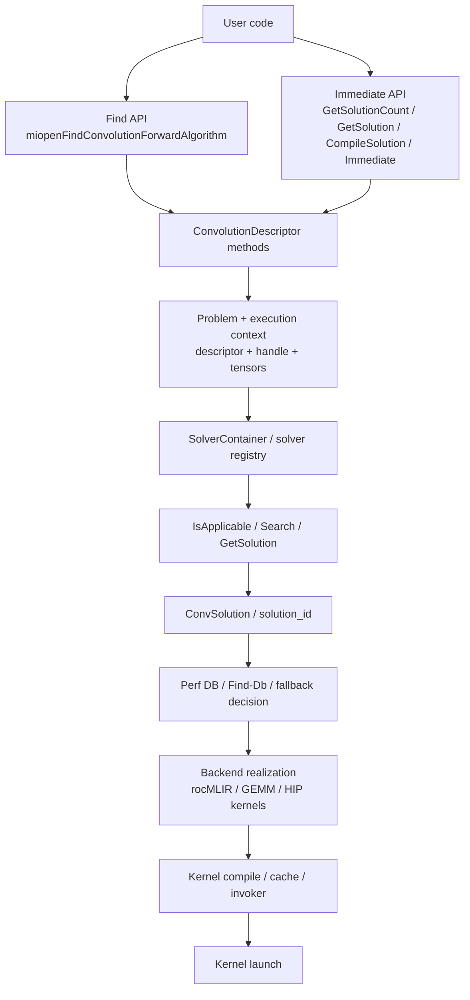

# MIOpen frontend to kernel map

作成日: 2026-03-18
関連文書: `solver_architecture_map.md`, `device_capability_flow.md`, `class_map.md`, `trace_map_static.md`

> 本メモは、公開一次資料およびローカル clone から観測可能な範囲を整理したものであり、非公開 issue や社内意思決定の内容を断定するものではない。

---

## 目的

この文書は、MIOpen の user-facing convolution API から、

- solver 選択
- backend 選択
- kernel compile / cache
- immediate 実行

までの流れを、**ユーザー視点から見た隠蔽境界** を含めて整理する。

`solver_architecture_map.md` が内部構造寄りの図であるのに対し、
ここでは
**「ユーザーは何を呼び、内部では何が隠れて起きるか」**
を正面から固定する。

---

## 一次根拠

- `/home/limonene/ROCm-project/WD-Black/ROCm-repos/MIOpen/doc/src/find_and_immediate.md`
- `/home/limonene/ROCm-project/WD-Black/ROCm-repos/MIOpen/include/miopen/miopen.h`
- `/home/limonene/ROCm-project/WD-Black/ROCm-repos/MIOpen/src/convolution_api.cpp`
- `/home/limonene/ROCm-project/WD-Black/ROCm-repos/MIOpen/src/include/miopen/find_solution.hpp`
- `/home/limonene/ROCm-project/WD-Black/ROCm-repos/MIOpen/src/include/miopen/solver.hpp`
- `/home/limonene/ROCm-project/WD-Black/ROCm-repos/MIOpen/src/mlir_build.cpp`
- `/home/limonene/ROCm-project/WD-Black/ROCm-repos/MIOpen/src/gemm_v2.cpp`

---

## 1. user-visible な 2 つの入口（Fact）

MIOpen の convolution frontend には、少なくとも次の 2 つの入口がある。

| mode | 主 API | user が直接扱うもの |
|---|---|---|
| legacy Find | `miopenFindConvolutionForwardAlgorithm` | algorithm enum, perf result, workspace |
| Immediate / Solution | `GetSolutionCount`, `GetSolution`, `CompileSolution`, `Immediate` | `solution_id`, workspace, optional precompile |

`find_and_immediate.md` では、

- Find API は expensive で benchmark を伴う
- Immediate mode は `Find-Db` に支えられ、`solution_id` ベースで低コストに使う
- Immediate mode は最初の `Immediate` 呼び出しで compile が起きうるため、必要なら `CompileSolution` を先に呼べる

と説明されている。

Interpretation:
MIOpen frontend は、
**「アルゴリズムを都度探して benchmark する入口」と、
「解を ID として扱う入口」**
を分けている。

---

## 2. 全体フロー（Fact）

---

## 3. legacy Find path

### 3.1 user が見るもの

Find API では user は主に次を扱う。

- tensor descriptors
- convolution descriptor
- workspace
- `miopenConvAlgoPerf_t`
- 速い algorithm の選択

`find_and_immediate.md` は、
Find が applicable algorithm を compile / benchmark して perf 順に返すと説明している。

### 3.2 内部で隠れているもの

Find path の裏では少なくとも次が隠れている。

1. device / arch 正規化
2. solver 全件列挙
3. `IsApplicable()` によるフィルタ
4. search と tuning
5. compile / benchmark
6. perf result の整列

Interpretation:
user が受け取る `algorithm` は単なる enum だが、
その背後では solver 単位の applicability と tuning がすでに走っている。

---

## 4. Immediate / Solution path

### 4.1 user が見るもの

Immediate path の user-visible workflow は次である。

1. `miopenConvolution*GetSolutionCount`
2. `miopenConvolution*GetSolution`
3. 必要なら `miopenConvolution*GetSolutionWorkspaceSize`
4. 必要なら `miopenConvolution*CompileSolution`
5. `miopenConvolution*Immediate`

`miopen.h` の API comment でも、

- `GetSolution` は performance 順に sorted solution を返す
- `CompileSolution` は optional
- `Immediate` は selected `solution_id` を実行する

ことが明示されている。

### 4.2 内部で隠れているもの

user からは見えないが、Immediate path の背後には少なくとも次がある。

| hidden layer | 何が起きるか |
|---|---|
| target normalization | `Handle` / `TargetProperties` が raw device string を正規化する |
| problem construction | descriptor 群が `ProblemDescription` / `ConvolutionContext` に畳み込まれる |
| solver applicability | `SolverContainer` が solver を列挙し `IsApplicable()` でふるいにかける |
| ranking | solution 群が performance 順に返される |
| tuning data lookup | Perf DB / Find-Db を参照する |
| backend resolution | MLIR / GEMM / HIP kernel build のどこへ降りるかが内部で決まる |
| compile / cache | kernel cache 未命中時は compile が起こる |

Interpretation:
`solution_id` は user-facing には単なる ID だが、
内部では
**target / problem / solver / tuning / backend**
の複数層をまとめて代表するハンドルとして振る舞う。

---

## 5. user に隠されている主要な判断点

### 5.1 target / capability 判定

user は `gfx900` や `IsXdlopsSupport()` を直接扱わない。
しかし内部では、

- `TargetProperties`
- `ConvolutionContext`
- solver ごとの `IsApplicable()`

を通じて、arch / dtype / layout / shape / capability が判定される。

### 5.2 solver-local gate

user は「この solver がなぜ候補に入らなかったか」を API から直接は見ない。
内部では、

- MLIR iGEMM の `gfx900` 明示除外
- XDLops 系の capability gate
- 観測した CK path の `not applicable`

のような solver-local gate が働く。

### 5.3 Perf DB / Find-Db

Immediate mode の public doc では、
system Find-Db が underlay になっていること、
database miss 時には GEMM fallback が使われうることが説明されている。

Interpretation:
user は `GetSolution` の戻り値だけを見るが、
内部では
**tuning record の存在 / 不在**
が solution の質や fallback 選択に影響する。

### 5.4 backend の違い

`find_and_immediate.md` は、
Immediate fallback の backend が backend ごとに異なることを述べている。

- OpenCL backend では current release の fallback は fp32 制約つき
- HIP backend では rocBLAS fallback を使う

既存のコード調査では、さらに

- MLIR path は `mlir_build.cpp`
- GEMM path は `gemm_v2.cpp`
- HIP kernel path は `HIPOCProgram`

という局所化された接続点が確認できる。

Interpretation:
user-visible API は一つでも、
**backend realization は一つではない**。
どの backend に降りたかは内部実装に強く依存する。

---

## 6. gfx900 調査への接続

`gfx900` 調査でこの map が重要なのは、
failure / survival が user API 層ではなく、
その後段の hidden layer で分岐しているからである。

| hidden layer | gfx900 での観測 |
|---|---|
| solver-local gate | MLIR iGEMM が `IsApplicable()` で落ちる |
| capability gate | XDLops 系が capability 不成立で落ちる |
| tuning data | MLIR 強制時に gfx900 tuning 行不在が顕在化する |
| backend build | 強制 path では compile / code object build 段で失敗することがある |
| broad fallback | ASM v4r1 / Winograd / naive / Tensile fallback は残りうる |

Interpretation:
user から見えるのは「solution が返る / 返らない」「実行できる / 失敗する」だけだが、
`gfx900` の実態は
**frontend の下にある複数の hidden layer の非対称性**
として説明される。

---

## 7. 最小結論

### Fact

- MIOpen は Find path と Immediate path を別 API surface として公開している
- Immediate path では `solution_id` が user-visible な中心単位である
- public docs / code から、Perf DB / Find-Db / GEMM fallback / kernel cache / backend-specific realization が確認できる

### Interpretation

- MIOpen frontend は hardware-specific 実装詳細をかなり深い位置まで隠蔽している
- そのため、support の実態は frontend API だけでは読めず、
  solver gate / tuning / backend build の各層を見る必要がある

---

## 本文書が主張しないこと

- 全 API の完全な call graph を網羅するものではない
- `solution_id` の内部表現を完全に再構成するものではない
- backend ごとの全 fallback 条件をここだけで固定するものではない
- 特定 maintainer の意図を断定するものではない
