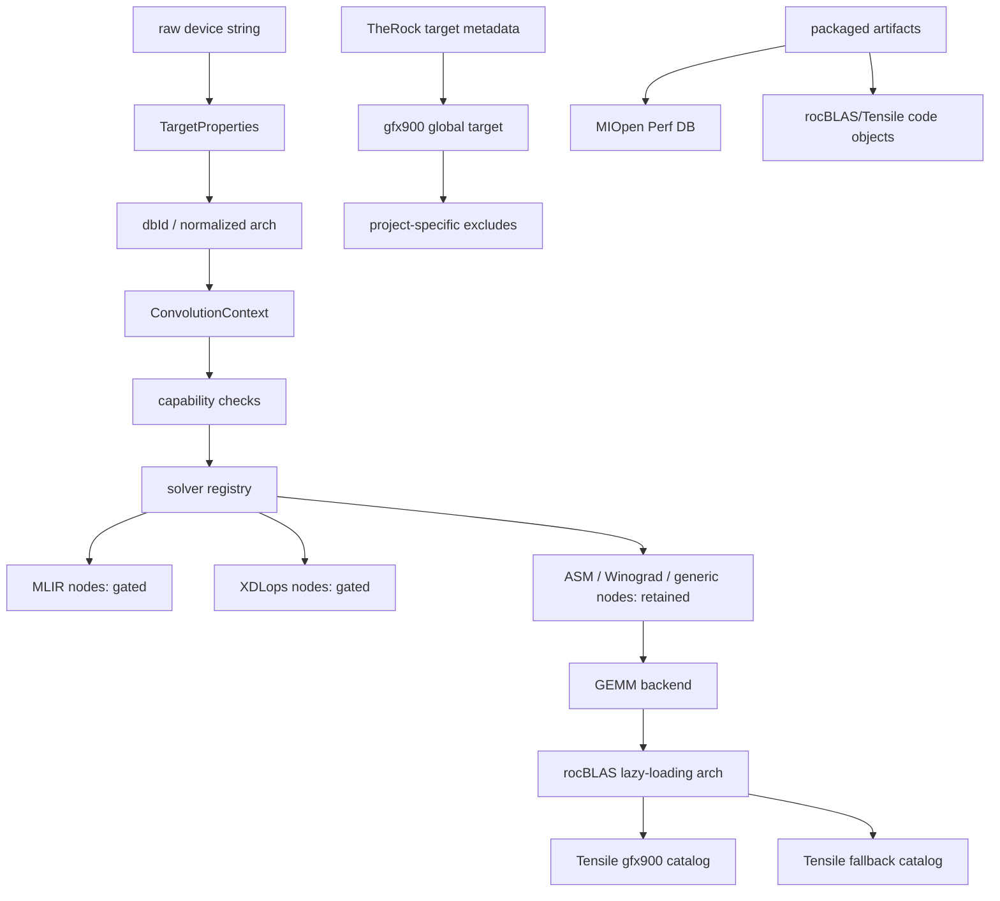

# gfx900 related nodes

> 本メモは、公開一次資料およびローカル clone から観測可能な範囲を整理したものであり、非公開 issue や社内意思決定の内容を断定するものではない。

Updated: 2026-03-17

Primary sources:

- `/home/limonene/ROCm-project/WD-Black/ROCm-repos/MIOpen/src/target_properties.cpp`
- `/home/limonene/ROCm-project/WD-Black/ROCm-repos/MIOpen/src/include/miopen/conv/context.hpp`
- `/home/limonene/ROCm-project/WD-Black/ROCm-repos/MIOpen/src/include/miopen/find_solution.hpp`
- `/home/limonene/ROCm-project/WD-Black/ROCm-repos/MIOpen/src/include/miopen/solver/implicitgemm_util.hpp`
- `/home/limonene/ROCm-project/WD-Black/ROCm-repos/MIOpen/src/include/miopen/solver/ck_utility_common.hpp`
- `/home/limonene/ROCm-project/WD-Black/ROCm-repos/MIOpen/src/solver/conv_mlir_igemm_fwd.cpp`
- `/home/limonene/ROCm-project/WD-Black/ROCm-repos/MIOpen/src/solver/conv_mlir_igemm_bwd.cpp`
- `/home/limonene/ROCm-project/WD-Black/ROCm-repos/MIOpen/src/solver/conv_mlir_igemm_wrw.cpp`
- `/home/limonene/ROCm-project/WD-Black/ROCm-repos/MIOpen/src/solver/conv_asm_implicit_gemm_v4r1_dynamic.cpp`
- `/home/limonene/ROCm-project/WD-Black/ROCm-repos/rocBLAS/rmake.py`
- `/home/limonene/ROCm-project/WD-Black/ROCm-repos/rocBLAS/library/src/tensile_host.cpp`
- `/home/limonene/ROCm-project/WD-Black/ROCm-repos/Tensile/docs/src/conceptual/solution-selection-catalogs.rst`
- `/home/limonene/ROCm-project/WD-Black/ROCm-repos/Tensile/tuning/configuration/boiler/library_logic_vega10_only.yml`
- `/home/limonene/ROCm-project/WD-Black/ROCm-repos/TheRock/cmake/therock_amdgpu_targets.cmake`

Related local notes:

- `class_map.md`
- `trace_map_static.md`
- `support_boundary.md`

## 1. 目的

`gfx900` が ROCm stack のどこで名前として残り、
どこで capability として判定され、
どこで solver 候補から落ち、
どこで build / artifact として保持されるかを、
層別のノード表として固定する。

この文書は網羅的な grep 結果ではない。
`final_hypothesis.md` や `support_boundary.md` が参照できる
主要ノードだけを揃えることを目的とする。

## 2. 概観

## 3. ノード一覧

| 層 | ノード | 役割 | `gfx900` との関係 | 主なソース |
|---|---|---|---|---|
| integration/build | `therock_add_amdgpu_target(gfx900, ...)` | global target 定義 | `gfx900` は target として残る | `TheRock/cmake/therock_amdgpu_targets.cmake` |
| integration/build | `EXCLUDE_TARGET_PROJECTS` | project ごとの除外 | `hipBLASLt`, `hipSPARSELt`, `composable_kernel`, `rocWMMA`, `rocprofiler-compute` からは除外 | `TheRock/cmake/therock_amdgpu_targets.cmake` |
| integration/build | `-DGPU_TARGETS="<archs>"` | rocBLAS build 時の arch 注入 | `gfx900` を build input として明示できる | `rocBLAS/rmake.py` |
| device identity | `GetDeviceNameFromMap()` | marketing name / alias 正規化 | `Vega10` / `gfx901` を `gfx900` へ写像 | `MIOpen/src/target_properties.cpp` |
| device identity | `WORKAROUND_ISSUE_1204` | `sramecc` 報告補正 | `gfx900` では `sramecc_reported` を空にする分岐がある | `MIOpen/src/target_properties.cpp` |
| device identity | `InitDbId()` | DB key 生成 | `gfx900` は `dbId` の起点として残る | `MIOpen/src/target_properties.cpp` |
| problem/context | `ConvolutionContext` | problem + execution context 合成 | 後段 solver 判定が参照する中心ノード | `MIOpen/src/include/miopen/conv/context.hpp` |
| solver selection | `SolverContainer::SearchForAllSolutions()` | solver 全件列挙と `IsApplicable()` 実行 | `gfx900` の経路はここで solver ごとに残留 / 除外が分かれる | `MIOpen/src/include/miopen/find_solution.hpp` |
| capability gate | `IsXdlopsSupport()` | XDLops availability 判定 | `gfx908` / `gfx90a` のみ true。`gfx900` は false | `MIOpen/src/include/miopen/solver/implicitgemm_util.hpp` |
| capability gate | `IsComposableKernelSupportedHardware()` | CK/implicit-gemm 系 hardware 範囲 | `gfx900` は対象に含まれる | `MIOpen/src/include/miopen/solver/implicitgemm_util.hpp` |
| capability gate | `ck_utility::is_ck_supported_hardware()` | CK solver の hardware 範囲 | `gfx900` は対象に含まれる | `MIOpen/src/include/miopen/solver/ck_utility_common.hpp` |
| solver gate | `ConvMlirIgemmFwd/Bwd/Wrw::IsApplicable()` | MLIR non-xdlops path | `StartsWith(device_name, "gfx900")` で reject | `conv_mlir_igemm_fwd.cpp`, `conv_mlir_igemm_bwd.cpp`, `conv_mlir_igemm_wrw.cpp` |
| solver retain | `ConvAsmImplicitGemmV4R1DynamicFwd` | legacy ASM path | `gfx900` / `gfx906` を明示許可 | `conv_asm_implicit_gemm_v4r1_dynamic.cpp` |
| backend/catalog | `getLazyLoadingArch()` | device -> Tensile lazy-loading arch | `gfx900` を `LazyLoadingInit::gfx900` に写像 | `rocBLAS/library/src/tensile_host.cpp` |
| backend/catalog | `TensileLibrary_lazy_gfx900.*` | arch parent catalog | `gfx900` ごとの parent catalog を読む | `rocBLAS/library/src/tensile_host.cpp`, `Tensile/docs/src/conceptual/solution-selection-catalogs.rst` |
| backend/catalog | `fallback_gfx900.hsaco` / `fallback.yaml` | fallback child catalog | `gfx900` 向け fallback artifact が build output 例に現れる | `Tensile/docs/src/conceptual/solution-selection-catalogs.rst` |
| backend/catalog | `library_logic_vega10_only.yml` | tuning / library logic boilerplate | `ArchitectureName: "gfx900"` を持つ | `Tensile/tuning/configuration/boiler/library_logic_vega10_only.yml` |
| shipped artifact | MIOpen Perf DB | tuned DB | ローカル観測では `gfx900_56` / `gfx900_64` 系 DB が `/opt/rocm` に存在 | `support_boundary.md` |
| shipped artifact | rocBLAS/Tensile code objects | prebuilt code objects | ローカル観測では `gfx900` 名を含む code objects が `/opt/rocm/lib/rocblas/library/` に存在 | `support_boundary.md` |

## 4. ノードの読み方

### 4.1 `gfx900` はまず名前として正規化される

`TargetProperties` は marketing name や alias を `gfx900` に寄せる。
ここでの役割は support policy の決定ではなく、
後段が参照する共通の arch label を作ることにある。

### 4.2 capability 判定は binary support ではなく feature gate で行われる

公開コード上で重要なのは、
`gfx900` が単純に blacklist されるのではなく、
`XDLops`, `CK-supported hardware`, `MLIR solver-specific gate` のような
別ノードで別々に判定される点である。

結果として:

- `gfx900` は CK / implicit-gemm 系 hardware 範囲には残る
- しかし XDLops 系 capability では落ちる
- さらに MLIR non-xdlops 系でも solver 側の明示 gate で落ちる

### 4.3 backend 側では `gfx900` が catalog key として残る

rocBLAS の `getLazyLoadingArch()` と
Tensile の `TensileLibrary_lazy_gfx900.*` は、
`gfx900` が solver backend 側でも architecture node として維持されていることを示す。

この層では `gfx900` は「最適 solver で常に勝つ arch」ではなくても、
catalog / artifact の lookup key としては残っている。

### 4.4 build layer と shipped artifact layer は別に見る必要がある

TheRock では `gfx900` が global target として定義されつつ、
一部 project から除外される。
一方、ローカル `/opt/rocm` 観測では `gfx900` 向け Perf DB や code object が存在する。

したがって、少なくとも公開側からは:

- build integration では selective exclude がある
- distribution artifact では `gfx900` 名の成果物が依然観測される

という 2 つの層を分けて扱う必要がある。

## 5. Working conclusion

**Fact**:

- `gfx900` は ROCm stack 内の複数層で、依然として名前付きノードとして観測できる。
- ただし各ノードの役割は同じではなく、`normalize`, `gate`, `select`, `catalog`, `exclude`, `ship` に分かれる。

**Interpretation**:

- `gfx900` の状態は「supported / unsupported」の二値よりも、
  どのノードで retain され、どのノードで gate されるかの集合として読む方が整合的である。
- `final_hypothesis.md` では、このノード集合を前提に
  「なぜ一部経路だけ残るのか」を説明するのが自然である。

**Open Question / Limitation**:

- 本文書は主要ノードに絞っており、`gfx900` を参照する全ファイルを exhaust したものではない。
- distribution artifact の記述はローカル `/opt/rocm` 観測に依存し、全配布形態を代表するとは限らない。

## Non-claims

この文書が主張しないこと:

- 社内意思決定過程を断定するものではない
- 非公開 issue の本文を推定で補完するものではない
- 単一事例から一般法則を断定するものではない
- AMD の support policy 全体を完全に代表するものではない
- 特定組織への批判を目的とするものではない
