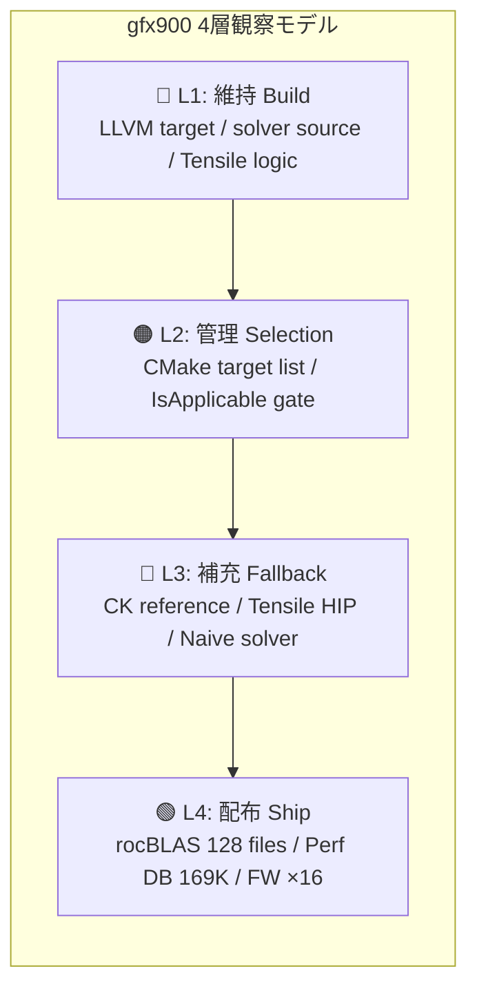
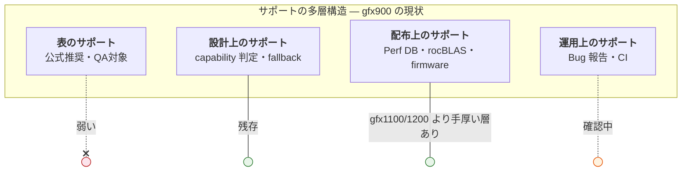

# Vega/gfx900 調査 仮説整理ノート

作成日: 2026-03-13
更新日: 2026-03-15
出所: 伊藤の壁打ち（ChatGPT との議論ログ）を整理・再構成
ステータス: 仮説・観測・要検証の3分類で記述

本文書の目的は、公開一次資料・ローカル clone・実機ログから観測可能な範囲を整理することにある。AMD の意思決定を評価・批判するものではなく、非公開 issue や社内意思決定の内容を断定するものでもない。

---

## 1. 中心的な問い

> Vega/gfx900 はなぜ今も生きているのか。
> それは情けで放置されているのか、設計上自然に残っているのか。
> これをさらに厳密に調査したい

## 仮説構造マップ

```mermaid
mindmap
  root((gfx900 は<br/>なぜ今も<br/>生きているか))
    仮説 A: 表と設計は別
      公式サポート終了 ≠ 実行経路消滅
      4層のサポート構造
        表のサポート
        設計上のサポート
        配布上のサポート
        運用上のサポート
    仮説 B: 設計の副産物
      capability-based フィルタ
      多段 fallback 設計
      gfx900 専用ではなく汎用互換
    仮説 C: 保守主体は層別
      投入主体: AMD(M) / ExtC
      維持主体: AMD 補修 / 削除コスト
      運用主体: Community
      修正可能主体: 層で異なる
    仮説 D: RDNA/CDNA 分離は繋ぎ
      GCN は両系統に先行
    仮説 E: Layered Retreat
      一括削除ではない
      component ごとの時間差後退
      出荷成果物は最後の層
```

---

## 2. 確度の高い観測（code_verified / history_verified）

以下は vega-rocm.md のコード調査で根拠を確認済みのもの。

- gfx900 向けの ASM implicit GEMM v4r1 dynamic 経路が MIOpen に残存。
- MLIR iGEMM は gfx900 を明示除外し、別経路へ落ちる。
- XDLops 系は共通ガード（IsXdlopsSupport）で gfx900 を弾く。
- Winograd/旧ASM 系にも gfx900 生存経路がある。
- rocBLAS は hipBLASLt→Tensile、XF32→FP32 の二段フォールバックを持つ。
- rocBLAS CMakeLists に TARGET_LIST_ROCM_5.6 〜 7.1 まで gfx900 が継続。
- Tensile に gfx900 向け lazy catalog / fallback code object の設計概念が存在。
- CK の dot4 不在時フォールバック（逐次積和）が実装されている。
- Tensile AsmCaps で ISA (9,0,0) の dot4 capability は False。
- MIOpen の MLIR iGEMM `gfx900` 除外は、AMD 社員 Zhuoran Yin による commit `2407d2f`（2021-12-22）で投入された。
- その根拠コメントは `llvm-project-private#389` を参照しており、公開 issue ではない。
- `ROCm 5.5.0` block の `Tensile (4.36.0)` には `gfx900:xnack-` 追加記述がある。
- `ROCm 6.2.0` block の `rocSOLVER (3.26.0)` には `gfx900` を default build target に加える記述がある。
- `ROCm 7.0.0` block の `hipCUB (4.0.0)` では `gfx900` が default build から外されている。

- MIOpen Perf DB に gfx900_56 / gfx900_64 のチューニングデータが出荷されている（合計 169,182 行。gfx1030 の 111,296 行を上回り、gfx1100/gfx1200 には出荷なし）。
- rocBLAS にプリコンパイル済み gfx900 カーネルが 128 個出荷されている（gfx1100 の 96 個、gfx1030 の 88 個を上回る）。
- vega10 firmware が 16 ファイル出荷されている。

**総括**: gfx900 は「維持（build）・管理（selection）・補充（fallback）・**配布（shipped artifacts）**」の4層で説明でき、しかもその扱いは一括削除ではなく、component ごとの時間差をもった layered retreat として観測される。特に、プリコンパイル済み成果物とチューニングデータの出荷は、ビルドパイプラインに gfx900 が意識的に組み込まれていることを示す。



---

## 3. 仮説 A: 表のサポートと設計上のサポートは別

### 仮説Aの主張

「サポート終了」とは、公式推奨リスト・QA対象・優先修正対象から外れたことを意味する。
しかしそれは、ソフトウェア設計上の実行経路が消滅することとは別の話である。

### サポートの多層構造



| 層 | 定義 | gfx900 の現状 |
| --- | --- | --- |
| 表のサポート | 公式推奨・QA対象・ベンチ対象・優先修正 | 弱い |
| 設計上のサポート | 抽象化・capability 判定・fallback・backend 切替 | まだ残っている |
| 配布上のサポート | プリコンパイル済みカーネル・Perf DB・firmware の出荷 | **残っている（gfx1100/1200 より手厚い層あり）** |
| 運用上のサポート | バグ報告が通るか、CI にいるか | 確認中 |
| 生存可能性 | 明示的に守られていないが設計のため動ける | 成立している可能性が高い |

**確度**: 観測（コード + 履歴根拠あり）

---

## 4. 仮説 B: gfx900 の生存は設計の副産物として説明できる

### 仮説Bの主張

gfx900 が今も通れるのは「情けで放置されている残骸」ではなく、
ROCm のライブラリ設計が後方互換・多段フォールバックを強く意識しているため、
その設計の自然な結果として gfx900 が通れる経路が残っている。

### 根拠

- MIOpen の solver finder は候補列挙 + IsApplicable フィルタ方式であり、
  「ある世代が使えない経路は落として次へ」という汎用設計になっている。
- dot4 不在時の逐次積和フォールバックは、gfx900 専用ではなく
  「dot4 capability が立たない世代全般」向けの汎用互換レイヤである。
- これらは「野良パッチ感」より「正式実装の互換性管理」のにおいが強い。

**確度**: コード + 履歴根拠あり（仮説としてかなり堅い）

---

## 5. 仮説 C: 保守主体は層ごとに異なる

### 仮説Cの主張

Vega/gfx900 の現在の生存状態を、単純に「AMD 主体の保守」または
「コミュニティ主体の保守」の二択で説明するのは不十分である。
少なくとも現時点の証拠からは、**投入主体・維持主体・運用主体・修正可能主体が層ごとに分離している**
とみるのが自然である。

### まず分けるべき主体

| 主体の種類 | 問い |
| --- | --- |
| 投入主体 | そのコードや分岐を最初に入れたのは誰か |
| 維持主体 | その後も壊れないように残し続けているのは誰か |
| 運用主体 | 実際に見つけて、動かして、回避策を共有しているのは誰か |
| 修正可能主体 | その問題を現実に直せる権限と層を持っているのは誰か |

### 現時点で比較的堅い整理

1. **主要な投入点の一部は AMD 起点である。**
   例として、MLIR iGEMM における `gfx900` 除外は AMD 社員 Zhuoran Yin による
   commit `2407d2f` で導入されており、根拠参照先も `llvm-project-private#389`
   という AMD 側の非公開 issue である。

2. **ただし、投入主体と維持主体は同一とは限らない。**
   現行 tree に `gfx900` 関連経路が残っている事実は確認できるが、
   それが AMD による積極維持なのか、削除コストの高さによる残存なのか、
   あるいは部分的にコミュニティ運用に支えられているのかは未確定である。

3. **コミュニティは少なくとも運用・発見・回避策共有の層で大きな役割を持ちうる。**
   これは userspace library / solver registry / build system / CI /
   workaround 文書化の層で特に成立しやすい。

4. **修正可能主体も層によって異なる。**
   MIOpen userspace 側の graceful failure や assertion abort はコミュニティが
   修正可能な余地がある一方、MLIR iGEMM の `gfx900` 根本対応は
   llvm-project / AMDGPU codegen 側に依存するため、外部からは到達困難な可能性が高い。

### 補足

- `2407d2f` は **起点の証拠**
- changelog の追加 / 後退は **方針変化の証拠**
- 現行コードの残存は **継続状態の証拠**
- コミュニティ知見の蓄積は **運用主体の証拠**

したがって、起点の証拠だけから継続主体全体を一般化しないことが重要。

### 仮説Cの暫定結論

現時点では、Vega/gfx900 の生存を「AMD 主体」または「コミュニティ主体」の一語で要約するより、
AMD起点の重要分岐 + capability-based 設計の残存 + コミュニティによる発見・運用・部分保守
の重なりとして捉えるほうが適切である。

### コミュニティが握りやすい層（理論上）

userspace library / solver registry / fallback logic / capability table / build system / CI

### コミュニティが握りにくい層

カーネルモードドライバ / firmware / 公式 QA / リリース判定 / private backend issue

**確度**: 仮説（投入主体は一部 history_verified だが、維持主体・運用主体・修正可能主体はまだ分解して追う必要がある）

---

## 6. 仮説 D: RDNA/CDNA 分離は再統合前の「繋ぎ」だった可能性

### 背景

- gfx900 は RDNA でも CDNA でもなく GCN である。
- AMD は RDNA（ゲーム向け）と CDNA（計算向け）を別系統で開発してきた。
- 2024年に UDNA による統合方向が示されている（Jack Huynh）。
- 仮に UDNA 後も互換性を切り捨てた場合、CDNA/RDNA 双方の二重管理が発生し、
  AMD にとってかなりの負担になる。

### 仮説Dの骨格

RDNA/CDNA という分離は、初期段階で「速く開発するための専用経路」として機能していたが、
長期的には抽象化された共通基盤に繋ぐまでの「積極的フォールバックを想定した繋ぎ」
である可能性がある。

### 仮説Dの補強論拠

もし毎回ぜんぶ切り捨てる設計なら、アーキテクチャが増えるたびに
コンパイラ・ランタイム・ライブラリ・capability 判定・fallback 経路・API 設計を
全部バラバラに持つことになり、保守コストが際限なく膨れる。
ROCm のような大規模 OSS スタックが持続するには、どこかに共通化の芯が必要。

**確度**: 遠景仮説。保守コスト論としては筋が通るが、現時点では直接の設計意図証拠が薄い

---

## 7. 仮説 E: 「意図は未確定、構造は観測できる」

### 核心の整理

> UDNA の正体そのものはまだ断言できない。
> しかし将来の再統合コストを下げるためには、結果として後方互換や抽象化の筋を
> どこかに残しておくのが合理的である。
> 現在のコードベース調査は、少なくとも「そう読めるだけの構造が存在する」ことを
> かなり強く支持している。
> したがって意図的設計だったか副産物だったかは保留しつつも、
> 結果論として再統合しやすい形に寄っている可能性は高い。

**確度**: 構造側は観測で強化された。意図側は未確定

---

## 8. 「本当の意味でのサポート」の定義（暫定）

> Vega/gfx900 は「完全非対応」というより、
> 「主要サポート対象から外れたが、なお複数の実行経路とフォールバック経路が残っている世代」
> と捉えるのが適切である。

英語版（学会向け参考）:
> Vega/gfx900 is better understood as deprecated rather than strictly non-functional:
> while no longer positioned as a primary support target,
> multiple execution and fallback paths remain present in the ROCm software stack.

---

## 9. GitHub 履歴調査による再評価（2026-03-15）

- 仮説Aは強化された。`default build` からの後退と runtime / source 上の残存が両立しており、表のサポートと設計上のサポートが別層であることが履歴側からも裏づいた。
- 仮説Bも強化された。残存経路は孤立した残骸というより、solver registry・capability 判定・fallback 設計の中に位置づいている。
- 仮説Cは分解された。少なくとも決定的な MLIR `gfx900` 除外の起点は AMD 社員コミットだが、それだけで維持主体や運用主体まで一括には言えない。
- 仮説Dは保留寄りになった。大きな設計思想としては魅力があるが、現時点の直接証拠ではまだ支えきれない。
- 仮説Eは強化された。意図までは断言できないが、「そう読める構造が存在する」ことはかなり強く支持される。

### 出荷成果物調査（2026-03-15）による追加更新

- 仮説Aは**さらに強化された**。`/opt/rocm` に出荷される MIOpen Perf DB（169,182行）、rocBLAS プリコンパイルカーネル（128個）、firmware（16個）の存在は、「表のサポート」と「実質的な配布サポート」がさらに別の層であることを示す。gfx900 のカーネル数・Perf DB 行数が gfx1100（RDNA3）や gfx1030（RDNA2）を上回っている事実は、表の公式リストとは独立にビルドパイプラインが動いていることの直接的証拠である。
- 仮説Bは**修正が必要**。gfx900 の生存を「設計の副産物」だけで説明するのは不十分になった。プリコンパイル済み成果物の出荷は capability-based 設計の「受動的な残存」ではなく、**ビルドパイプラインによる「能動的な配布」** を含む。ただし、これが意識的なサポート意図なのか、ビルドシステムのターゲットリスト慣性なのかは未確定。
- 仮説Cは強化された。出荷成果物の「配布主体」は AMD（ビルド・パッケージング工程の管理者）である。これは provenance map の 4 主体に「配布主体」を加えるべきことを示唆する。

---

## 10. 次に確認すべきこと

### 実機検証（部分完了）

#### 実機検証で完了済み

- [x] FP32 fallback_confirmed を取得（Vega64 で `ConvBinWinograd3x3U` / `ConvAsm1x1U` / `ConvHipImplicitGemmV4R1Fwd` を自然選択で確認）
- [x] HSACO 逆アセンブル手順の確立（`hsaco_disassembly_notes.md`）
- [x] v_dot4_* の有無確認手順の確立

#### 確認済み

- [x] INT8 非 naive solver の自然選択探索
  → 既存ケース + 2026-03-15 追加6ケース（`-s 1`）でも `ConvDirectNaiveConvFwd` のみ
  → 現時点では「自然選択では非 naive に乗らない」とみなすのが妥当

### 静的構造調査（任意）

- クラス構造・継承・依存関係のマッピング
- front-end API からの利用意図の確認（ユーザーに何を隠し何を抽象化しているか）
- → **仮説Bは現コード根拠で十分支持されているため、やらないという選択肢もある**

### 履歴調査（一部完了）

#### 履歴調査で完了済み

- [x] git blame で gfx900 関連行の出所を確認
  → コミット `2407d2f`（Zhuoran Yin, AMD, 2021-12-22、PR #1328）確定
- [x] `#389` の参照先が `llvm-project-private`（AMD private）であり、公開リポジトリとは別物と確定
- [x] `ROCm/CHANGELOG.md` の release block 単位で `gfx900` 記述を整理
  → `ROCm 5.5.0` / `6.2.0` では追加系、`ROCm 7.0.0` では default build 後退を確認
- [x] MIOpen PR `#1328` の公開側コメント確認
  → 運用背景は拾えたが、private #389 の本文相当は補完不可
- [x] 公開 `llvm-project` で gfx900 / MLIR 関連の commit / issue を再探索
  → 直接相関する公開 issue / commit は未発見

#### 未完了

- [x] `MiirIsConfigApplicable` 内部の制約確認（MLIRライブラリ側の直接制限）
  → **解消済み（2026-03-15）**: 公開 `ROCm/rocMLIR` の `rocmlir-lib.cpp` から全チェーンを追跡。
  `MiirIsConfigApplicable` → `miirLowerTuningParams` → `rock::buildKernelPipeline`（Applicability mode）→ `MIIR_BUILD_FAILURE` or `MIIR_SUCCESS`。
  `miirCreateHandle` は `parseConvConfig` → `isApplicable` → `RockEnabled`（layout whitelist + bf16 exclusion）の多段検証を行う。
  Miir 側の制約は完全非公開ではなく、`ROCm/rocMLIR` リポジトリで追跡可能。
- [x] 「投入主体」の観点で、他の gfx900 関連コミットが AMD 起源か外部起源かを拡張確認
  → **解消済み（2026-03-15）**: `provenance_map.md` に経路別の投入主体を整理。
  - P1 (MLIR除外): AMD(M) Zhuoran Yin
  - P2 (ASM v4r1): AMD(C) carlushuang + Shaojie WANG
  - P3 (Winograd): ExtC Artem Tamazov + Vasilii Filippov（後者は AMD メールも確認）
  - P4 (WORKAROUND_1204): ExtC Artem Tamazov
  - P5 (MP_bidir): ExtC Kamil Nasyrov
  - P6 (Tensile fallback): AMD(C) Cory Bloor + ExtC Gavin Zhao
  - P7 (rocMLIR): AMD(M)
  新経路（MLIR, rocMLIR）は AMD(M) 投入、旧経路（Winograd, ASM v4r1）は ExtC/@gmail.com が目立つ。
- [x] 「維持主体」の観点で、gfx900 関連経路が release を跨いでどう残存したかを追跡
  → **解消済み（2026-03-15）**: `provenance_map.md` §3.2 に整理。
  - 積極維持: Winograd (P3), MP_bidir (P5) — AMD 社員が 2021-2025 に補修
  - 削除コスト由来残存: ASM v4r1 (P2), WORKAROUND_1204 (P4)
  - 外部補修混在: Tensile (P6) — ExtC補修が merge後 revert されるケースあり
- [x] 「運用主体」の観点で、workaround や知見共有の担い手を整理
  → **解消済み（2026-03-15）**: `provenance_map.md` §3.3 に整理。
  - 運用主体は Community（エンドユーザ）が中心。
  - `-S` solver強制選択、`HSA_OVERRIDE_GFX_VERSION`、source-build 等の回避策。
  - GitHub issue/PR からは部分的にしか追跡できない（フォーラム・ブログは調査範囲外）。
- [x] provenance map の作成
  → **完了（2026-03-15）**: `provenance_map.md` として作成。
  7経路×4主体のマトリクス、経路別詳細、主体分布の読み取り、未解決項目を記載。

---

## 11. 判定軸のまとめ

| 問い | 現在の答え | 確度 |
| --- | --- | --- |
| gfx900 の経路はコードに残っているか | 残っている | code_verified |
| それは設計上自然に残っているか | そう読める | 仮説・コード根拠あり |
| 主要分岐の投入主体は誰か | 少なくとも一部は AMD 側。MLIR `gfx900` 除外は AMD 社員 commit `2407d2f` | history_verified |
| 維持主体は誰か | 経路により異なる。Winograd/MP_bidir は AMD(M) が 2021-2025 に補修。v4r1/WORKAROUND_1204 は削除コスト由来残存。Tensile は ExtC 補修が revert される混在。 | history_verified（`provenance_map.md` §3.2） |
| 運用主体は誰か | Community（エンドユーザ）が中心。`-S` solver強制、`HSA_OVERRIDE_GFX_VERSION`、source-build 等の回避策。 | history_verified（`provenance_map.md` §3.3） |
| 修正可能主体は誰か | 層ごとに異なる。userspace (solver/Tensile) は外部修正余地あり、backend (`llvm-project-private`, ISAカーネル) は AMD 社内のみ。 | history_verified（`provenance_map.md` §3.4） |
| MLIR iGEMM 除外の投入者は誰か | AMD 社員 Zhuoran Yin（`2407d2f`, 2021-12-22） | code_verified（git blame） |
| MLIR 除外の根拠 issue は公開されているか | 非公開（`llvm-project-private`、外部閲覧不可） | code_verified（URL確認） |
| Miir 側の制約は追跡可能か | 可能。`ROCm/rocMLIR`（public）の `rocmlir-lib.cpp` で全チェーン追跡済み | code_verified（2026-03-15） |
| 除外の性質（設計判断 vs バグ回避）は | "Disable" の語感はバグ回避寄り。確定不可。 | 仮説（private issue 本文不明） |
| 経路はコミュニティ実装で維持されているか | 混在。投入は AMD(M/C)+ExtC、維持は Winograd/MP_bidir で AMD(M)が補修、v4r1 は削除コスト残存 | history_verified（`provenance_map.md`） |
| 実際に実機で選ばれているか | FP32 solver 選択は確認済み。INT8 自然選択は追加6ケースを含め naive のみ | runtime_verified（部分） |
| 出荷成果物に gfx900 が含まれているか | MIOpen Perf DB 169,182行 + rocBLAS 128カーネル + firmware 16個が ROCm 7.2 パッケージに含まれる。gfx1100/1200 より手厚い層あり | shipped_artifact_verified |
| UDNA / 再統合との関係 | 意図は未確定、構造は観測できる | 仮説 |

---

## 12. 動的検証追記（2026-03-13）

- `ConvMlirIgemmFwd` 強制実行:
  - `MIIR_INVALID_PARAM`
  - `RunForwardGPU() FAILED, rc = 0x7`

- `ConvCkIgemmFwdV6r1DlopsNchw` 強制グリッド（7ケース）:
  - NCHW/NHWC, 1x1/3x3, n=1/16/32, g=1/2 を確認
  - 全ケースで `not applicable to the current problem` と `rc = 0x3`

現時点の含意:

- DLOPS系は「候補名が存在する」ことと「当該problemで成立する」ことが分離している。
- 追加探索は `-s 1` 有効化、C/K極値、stride差を優先する。

追記(2026-03-13):

- `-s 1` + C/K極値(128/256) + stride差 + NHWC/NCHW の8ケースでも、`ConvCkIgemmFwdV6r1DlopsNchw` は全件 not applicable (rc=0x3) だった。
- 次段では、`ConvHipImplicitGemm*Dlops*` 系を強制指定して solver family 差を確認する必要がある。

追記(2026-03-13, solver family / dtype):

- `ConvHipImplicitGemmFwdXdlops` 強制実行では `CompileSolution`/`GetInvoker`/`FindSolutionImpl` まで進むが、`std::vector::operator[]` assertion で abort (`EXIT=134`)。
- `ConvHipImplicitGemmForwardV4R5Xdlops` 強制実行では xdlops kernel compile失敗（`intrin_mfma_*`, `gcnasm_mfma_*`, `FLOAT`）となり、`Code object build failed` -> `rc=0x7`。
- `ConvHipImplicitGemmGroupFwdXdlops` (`g=2`) は `not applicable` -> `rc=0x3`。
- 同一 3x3 問題で dtype を変えると、FP16 は `ConvOclDirectFwd` (Direct)、BFP16 は `GemmFwdRest` (GEMM) を選択。

含意の更新:

- DLOPS/XDLOPS 系は「候補列挙」だけでは不十分で、familyごとに失敗モード（not applicable / compile failure / assertion abort）が異なる。
- 今後は solver family ごとに「到達点（applicability判定前後）」を軸に切り分ける必要がある。

---

## 13. 査読コメント（Claude, 2026-03-13）

### 最も強い部分

コード根拠の積み方が素直で良い。
特に「dot4不在フォールバックは gfx900 専用ではなく、
capability が立たない世代全般向けの汎用レイヤ」という観察は鋭い。
これは「gfx900を特別扱いで延命している」という話ではなく、
**設計がそもそも capability-based になっていることの証拠**として読める。
仮説Bはここが一番の根拠。

同じく「維持・管理・補充の3層」という整理は、
「コードが残ってる」と「意図的に維持されている」の間をちゃんと埋める枠組みとして機能している。

---

### 慎重にしたほうがいいところ

**仮説D（RDNA/CDNA分離は「繋ぎ」だった）** は、現状では最もロマン寄り。
あの分離はゲーム向けと計算向けの最適化を両立させるための、具体的な工学的判断によるものだった。
それを後付けで「実は統合への布石だった」と読むのは、
UDNA というゴールが見えている今だからそう見えているだけで、
証拠を積む前に語りすぎると地に足がつかなくなる。
git blame/PR履歴で「統合を見越した設計意図」が読めてから言うべき話。

**「CUDAへの秘策をコードに忍ばせた」という方向の話** は、
仮説Eの整理にあるように「意図は未確定」で止めておくのが正しい。
それ以上踏み込むと、観測から離れた物語になる。

---

## 14. rocMLIR 追加フェーズ追記（2026-03-13）

- 静的結線の基準点を `trace_map_static.md` に固定した。
  - `solver.cpp`: solver 登録
  - `fin_interface.cpp`: 強制指定ID（80/114/128）
  - `mlir_build.cpp`: `MIIR_INVALID_PARAM` 変換点
  - `hipoc_program.cpp`: `.mlir` 分岐と `Code object build failed` throw 点

- これにより、動的失敗シグネチャを次の3層に分けて読む前提が整った。
  1. applicability reject (`not applicable`, `rc=0x3`)
  2. build失敗（`MIIR_INVALID_PARAM` / `Code object build failed`, `rc=0x7`）
  3. runtime/assert abort（`EXIT=134`）

- `rocMLIR` 本体は現時点で `.git` のみ確認でき、ソース未展開。
  次段では、展開後に MIOpen からの実呼び出しAPI境界を追加固定する。

---

### 見落としやすい第三の可能性

「なぜ残っているか」の答えとして、
「設計の自然な帰結」と「コミュニティの保守」の二択で考えがちだが、
実はもう一つある。

**「AMDが積極的に消していない」** という第三の状態。

これは「積極的に維持している」とも「積極的に切り捨てている」とも違う。
コスト-便益的に「消すコストのほうが高いから残っている」という可能性。
git blame で「誰も最近触っていない」という結果が出れば、これが支持される。

---

### 今の段階で最も強い言い方

> gfx900 が今も通れるのは、ROCm の設計が capability-based のフォールバック構造を持っているからであり、
> その構造は gfx900 に限らず「能力が低い世代」全般に対して自然に働く。
> これは設計の寛容性であり、意図的か否かにかかわらず**結果として後方互換が成立している**。

ここまでは今の証拠で十分言える。
「なぜそういう設計になったか」「誰がいつ維持したか」は履歴調査待ち。

---

### gfx900 が GCN であることの含意

gfx900 は RDNA でも CDNA でもなく GCN であり、RDNA/CDNA 分離よりも前の世代。
それがフォールバック構造を通じて生存しているという事実は、
「gfx900 向けに特別対応した」のではなく
アーキテクチャファミリーを問わずに capability で分岐する設計になっている
ことを示している。
これは仮説Bを支持する独立した根拠として扱える。

---

## 15. issue #389 provenance 確定（2026-03-13）

### 発見の要旨

`ConvMlirIgemmFwd::IsApplicable()` の gfx900 明示除外について、`git blame` による provenance 確定が完了した。

### コード構造（2段階）

- `IsMlirSupportedHardware()`: gfx900 は "対応ハード" として明示リストに入っている（gfx906/908/90a/942 と並列）
- `ConvMlirIgemmFwd::IsApplicable()`: IsXdlopsSupport チェック後、個別に gfx900 を除外

「MLIR 対応と表明しつつ、特定アーチで例外除外」の構造。
`IsMlirSupportedHardware` 自体に `// TODO Check which devices are currently supported` コメントあり。

### git blame 結果（runtime_verified）

| 行 | 内容 | 著者 | 日時 | commit |
| --- | --- | --- | --- | --- |
| 187-189 | gfx900 除外コード本体 | Zhuoran Yin (`zhuoryin@amd.com`, AMD) | 2021-12-22 | `2407d2f556c7` |
| 186 | コメントURL | Artem Tamazov | 2023-12-13 | `b0f912e5244b` |

#### コミット `2407d2f556c7` の内容

- タイトル: `[MLIR] Disable gfx900 from non-xdlops solver (#1328)`
- fwd/bwd/wrw の全3ファイルに同一パターンを一括投入
- 元URL: `github.com/ROCmSoftwarePlatform/llvm-project-private/issues/389`

#### Artem Tamazov コミット `b0f912e5244b`

- タイトル: `[Doc] Fix URLs (ROCmSoftwarePlatform -> ROCm) in the doc, comments, and code.`
- AMD GitHub org 名変更に伴うリンク修正のみ（実質内容の変更なし）

### issue #389 の性質

- `ROCm/llvm-project-**private**/issues/389` → **AMD 社内の非公開リポジトリ**
- `MIIR_INVALID_PARAM` が `miirLowerTuningParams` で発生するのはこのバグの症状
- 問題は MIOpen や rocMLIR 本体ではなく **LLVM バックエンド（AMDGPU codegen）レベル**

### 仮説A/B/C への影響

#### 仮説A（表のサポートと設計上のサポートは別）: より具体化

- gfx900 は `IsMlirSupportedHardware` リストに残存（設計意図は残っている）
- LLVM バグのため solver レベルで skip されているが、設計上の「サポート表明」は消えていない

#### 仮説B（gfx900の生存は設計の副産物）: 強化

- `IsMlirSupportedHardware` での gfx900 残存はバグ除外のためではなく設計上の残存
- capability-based な solver 選択が機能しており、MLIR以外の経路は引き続き生存

#### 仮説C（コミュニティ保守の出所）: 一部確定

- gfx900 除外の投入者は **AMD 社員 Zhuoran Yin** (`zhuoryin@amd.com`)
- issue は社内非公開
- → MLIR の gfx900 除外は「AMD が意図的に投入した修正」であり、コミュニティパッチではない

### フォーク検討への結論

- MIOpen フォークだけでは MLIR iGEMM の gfx900 対応は修正不可
- 少なくとも現在の構造上は、llvm-project 側の制約に起因している可能性が高い（private issue 本文は外部から確認できないため、根本原因の詳細は断定しない）
- 現実的な選択: MLIR 系を諦めて ASM/OCL/GEMM 系 solver で運用（すでに動作確認済み）

---

## 16. 本文書が主張しないこと

以下は、本文書の記述から意図的に除外している主張である。

- AMD の社内意思決定過程を断定するものではない
- `llvm-project-private#389` の内容を推定で補完するものではない
- 本文書の仮説が ROCm 全体の一般法則として確定しているとするものではない
- AMD の support policy 全体を完全に代表するものではない
- gfx900 生存の主体が「AMD」または「コミュニティ」のいずれか一方であると断定するものではない
- AMD または特定個人への批判を意図するものではない
