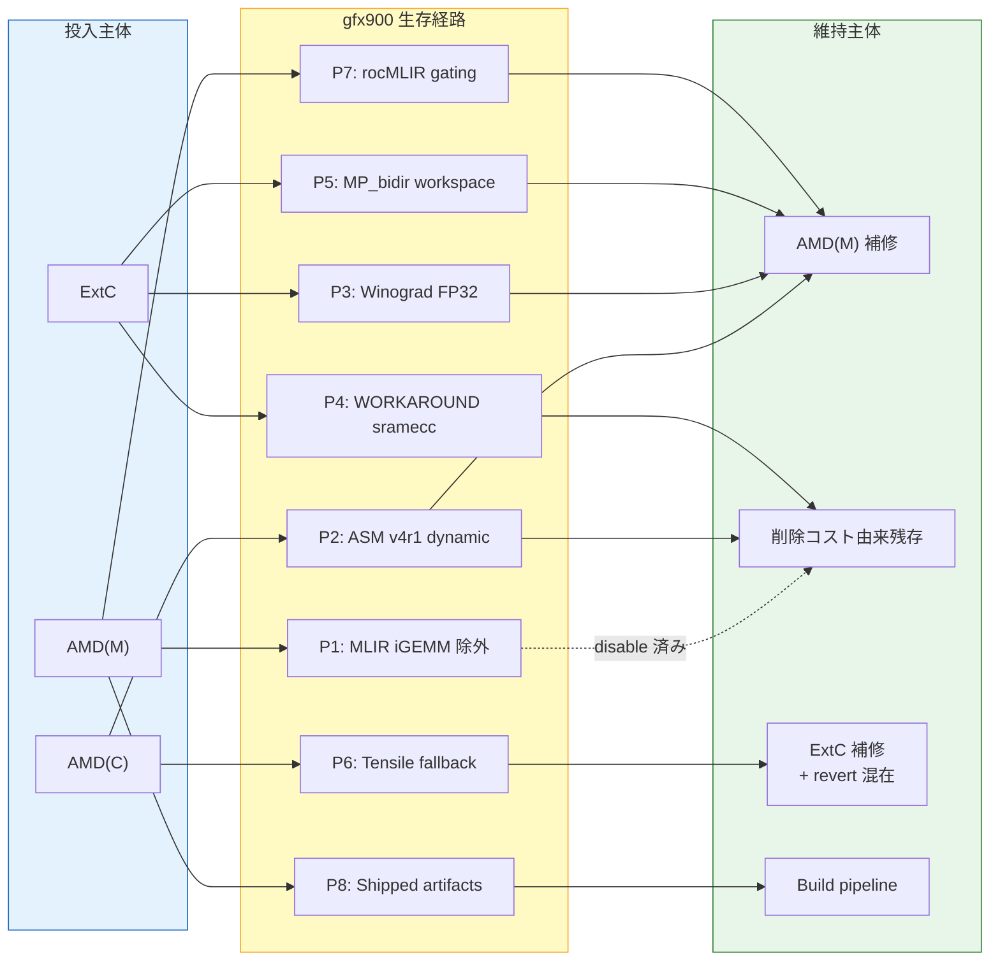
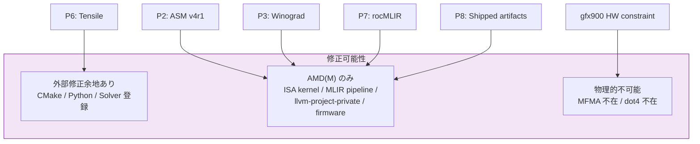

# gfx900 生存経路 Provenance Map

> 本メモは、公開一次資料およびローカル clone から観測可能な範囲を整理したものであり、非公開 issue や社内意思決定の内容を断定するものではない。

---

## 目的

gfx900 (Vega) が現行 ROCm スタック上で「公式非サポートだが部分的に動作する」状態を形成している各コードパスについて、
**投入主体・維持主体・運用主体・修正可能主体** を経路ごとに整理する。

AGENTS.md §1.5 に基づき、「AMD がやった」「コミュニティが支えている」のような単線化を避け、
経路ごとに主体を分離して記述する。

---

## 凡例

| ラベル | 意味 |
| --- | --- |
| **投入主体** | そのコードや分岐を最初に入れたのは誰か |
| **維持主体** | 壊れないように残し続けている（あるいは削除コストにより残存している）のは誰か |
| **運用主体** | 実際に発見し、動かし、回避策を共有しているのは誰か |
| **修正可能主体** | その経路の問題を現実に直せる権限と層を持っているのは誰か |
| **AMD(M)** | GitHub 上の org member / @amd.com メール |
| **AMD(C)** | @amd.com メールだが contributor ラベル、または外部メール + AMD 所属が確認できるもの |
| **ExtC** | 外部 contributor（非 @amd.com ドメイン、AMD 所属を示す根拠なし） |
| **Community** | エンドユーザ・ディストリビューション maintainer・フォーラム寄稿者等 |
| **確度** | code_verified / history_verified / 仮説 / 未確定 |

---

## 1. Provenance 総括表

### 投入・維持・運用の主体フロー

### 経路と修正可能性のマトリクス

| # | 経路 | 投入主体 | 維持主体 | 運用主体 | 修正可能主体 | 確度 |
| --- | --- | --- | --- | --- | --- | --- |
| P1 | MIOpen MLIR iGEMM non-xdlops **除外** | AMD(M) | — (disable 済み) | — | AMD(M) | code_verified |
| P2 | MIOpen ASM v4r1 dynamic (`gfx900/gfx906` 専用) | AMD(C) | 削除コスト由来残存 + AMD(M) 補修 | Community | AMD(M) | history_verified |
| P3 | MIOpen Winograd (FP32) | AMD(C) + ExtC | AMD(C/M) 近年補修 | Community | AMD(M) | history_verified |
| P4 | MIOpen WORKAROUND_ISSUE_1204 (sramecc 誤報吸収) | ExtC | 削除コスト由来残存 | Community | AMD(M) | code_verified |
| P5 | MIOpen MP_bidirectional_winograd (gfx900 workspace limit) | ExtC | AMD(M) 近年補修 | Community | AMD(M) | history_verified |
| P6 | Tensile fallback / arch parsing | AMD(C) + ExtC | ExtC 補修 + revert 混在 | Community (source-build) | AMD(M) / ExtC | history_verified |
| P7 | rocMLIR (Miir C API gating) | AMD(M) | AMD(M) | — (gating は自動) | AMD(M) | code_verified |
| P8 | Shipped artifacts (ROCm 7.2 パッケージ) | AMD(M) (build pipeline) | AMD(M) (build pipeline) | Community | AMD(M) | shipped_artifact_verified |

---

## 2. 経路別詳細

### P1: MIOpen MLIR iGEMM non-xdlops 除外

#### P1 の投入主体

- **Zhuoran Yin** (`zhuoryin@amd.com`, AMD 社員)
- コミット `d1a42ea69e` (legacy) / `2407d2f556c7` (main squash), 2021-12-22
- PR: `ROCm/MIOpen#1328` "[MLIR] Disable gfx900 from non-xdlops solver"
- 対象: `conv_mlir_igemm_{fwd,bwd,wrw}.cpp` — `if(StartsWith(device_name, "gfx900")) return false;`
- 根拠 issue: `llvm-project-private#389`（非公開。公開側からは参照関係と gating の痕跡のみ確認可能）

#### P1 の維持主体

- disable 分岐であるため「維持」は不要。コード自体は retired branch にも残存。

#### P1 の運用主体

- gfx900 ユーザにとっては「使えない経路」であり、回避対象。
- `-S ConvMlirIgemmFwd` 強制実行時に MIIR_INVALID_PARAM が出る根因はこの分岐。

#### P1 の修正可能主体

- `llvm-project-private#389` の解消は AMD 社内のみ。公開側からの修正余地はない。

---

### P2: MIOpen ASM v4r1 dynamic

#### P2 の投入主体

- **carlushuang** (`carlus.huang@amd.com`, AMD 社員)
- PR `#166` (2020-06-09): v4r1 dynamic FWD kernel + solver 初回投入（コミット `947ae38e98`）
- PR `#272` (2020-07-28): BWD 拡張（コミット `dce9c70d4`, carlushuang, AMD）
- **Shaojie WANG** (`wsjmessi@163.com` → 後に `shaojie.wang@amd.com` で活動)
- PR `#317` (2020-08-06): WRW 初回投入（コミット `f094f46c3`）
- PR `#1001` (2021-06-22): Vega WRW kernel selection bug fix（`shaojie.wang@amd.com` で投稿）
- Note: Shaojie WANG は初期コミットでは個人メール (`163.com`) を使用し、後のコミットで AMD メールに切り替えている。

#### P2 の維持主体

- **Chao Liu** (`chao.liu2@amd.com`, AMD): `b5c4a2da0a` env var blacklist 追加 (#553, 2020-12-06)
- **Artem Tamazov** (`artem.tamazov@gmail.com`, ExtC): `367cf6b596` ASM/HIP kernel on/off controls (#538, 2020-10-29)
- **Shaojie WANG** (`shaojie.wang@amd.com`, AMD): `bed612951` Vega WRW kernel selection bug fix (#1001, 2021-06-22)
- 現行 main ブランチでは squash 後の `e5c6ce1` (Jehandad Khan) が表面上の author だが、実質は上記の積層。
- **重要**: 明示的に `gfx900/gfx906` に限定したホワイトリスト分岐（`if(!(StartsWith(..., "gfx900") || StartsWith(..., "gfx906"))) return false;`）は、carlushuang による初期投入時点で存在。

#### P2 の運用主体

- Vega ユーザが FP32 convolution で利用する主要な ASM fallback 経路。
- `-S ConvAsmImplicitGemmV4R1DynamicFwd` 等で強制選択可能。

#### P2 の修正可能主体

- AMD(M): solver 登録変更権限を持つ。
- 外部からは MIOpen ソースビルド + solver 修正で到達可能だが、CI/CD 経路には乗らない。

---

### P3: MIOpen Winograd (FP32 側)

#### P3 の投入主体（経路ごとに異なる）

| ファイル | 初期 gfx900 allow | author | 日付 | メール |
| --- | --- | --- | --- | --- |
| `conv_bin_wino3x3U.cpp` | `24ea513af2` (初期, 2017-11-10) → `4508c92f85` (gfx908追加, 2019-10-11) | Artem Tamazov | 2017-11 → 2019-10 | `artem.tamazov@gmail.com` (ExtC) |
| （前身 `conv_bin_wino3x3F.cpp`） | `765f409f2e` (clang-format, 2017-06-08) | Vasilii Filippov | 2017-06 | `vasja.filippov94@outlook.com` → 別コミットで `vasilii.filippov@amd.com` も確認 |
| `conv_bin_winoRxS.cpp` (FP32 BWD) | `0601629a99` → `4508c92f85` | Artem Tamazov | 2019-03 → 2019-10 | 同上 |
| `conv_bin_winoRxS.cpp` (FP16) | `283b12aad0` | Artem Tamazov | 2019-02-26 | 同上（`gfx906+` のみ） |
| `conv_MP_bidirectional_winograd.cpp` | `412284ab4` | Kamil (Nasyrov) | 2020-08-21 | `shurale.nkn@gmail.com` (ExtC) |

- **Artem Tamazov**: `@gmail.com` ドメイン。MIOpen の Winograd 系 solver を広く実装した主要 contributor。
  - Interpretation: 公開メールのみから AMD 所属を断定できない。ただし、MIOpen への大量の Winograd 投入は、少なくとも AMD の Winograd カーネル開発プロジェクトとの関連性を示唆する。
  - Limitation: 雇用関係・契約関係について公開情報からは確認できない。

#### P3 の維持主体

- **Gleb Larochkin** (`glarochk@amd.com`, AMD): `d64de4ca93` wino3x3U 補修 (2021-09-10), `#1968` Vega20 Winograd 性能低下 workaround (2023-02-06)
- **Evgenii Averin** (`averinevg@`, noreply): `85f92d0bd4` wino3x3U リファクタ (2022-09-22), `c3468b057d` MP_bidir gfx9 命令制限コメント追記 (2025-03-11)
- **Artur Wojcik** (`artur.wojcik@amd.com`, AMD): `1851ae7f49` env var 整備 (2024-06-12)
- Winograd は **近年も AMD 側から補修が入っている**生きた経路。

#### P3 の運用主体

- FP32 convolution の主戦場。Vega ユーザにとって最も広く利用可能な高速パス。

#### P3 の修正可能主体

- AMD(M): solver / kernel 両方の修正権限。
- カーネルが ASM であるため、外部から修正するには ISA レベルの知識が必要。

---

### P4: WORKAROUND_ISSUE_1204 (sramecc 誤報吸収)

#### P4 の投入主体

- **Artem Tamazov** (`artem.tamazov@gmail.com`, ExtC)
- コミット `8498875aef`, 2021-10-21, PR `#1231`
- `target_properties.cpp` に `WORKAROUND_ISSUE_1204` を導入
- 根拠: `SWDEV-303062` + public `ROCm/MIOpen#1204`
- gfx900 で ROCm が `sramecc-` を誤報する問題の defensive workaround

#### P4 の維持主体

- 削除コスト由来の残存。gfx900 がコードベースに存在する限り、この workaround を外すと sramecc 判定が壊れる。
- retired branch でも残存を確認。

#### P4 の運用主体

- gfx900 ユーザにとっては透過的に機能する（意識せず恩恵を受ける）。

#### P4 の修正可能主体

- AMD(M): ROCm runtime 側で正しく sramecc を報告するよう修正すれば不要になる。
- MIOpen 側では workaround を外すだけ。

---

### P5: MP_bidirectional_winograd (gfx900 workspace limit)

#### P5 の投入主体

- **Kamil (Nasyrov)** (`shurale.nkn@gmail.com`, ExtC)
- コミット `412284ab4`, 2020-08-21, PR `#358`
- `WORKAROUND_SWDEV_203031`: gfx900 / gfx906(CU≤60) 時に workspace 上限 ~1.862 GiB

#### P5 の維持主体

- **Evgenii Averin**: `923a7176f2` gfx906 CU 条件追加 (2022-11-03), `c3468b057d` gfx9 命令制限コメント + テスト (#3552, 2025-03-11)
- **2025-03-11 の更新は注目に値する**: gfx900/gfx906/gfx908 のみに限定する明示的制約 (`if(!(name == "gfx900" || name == "gfx906" || name == "gfx908"))`) が、gfx90a/gfx942 等の CDNAアーキで存在しない命令を使うことへの注記として 2025年3月に追加された。

#### P5 の運用主体

- Vega ユーザの FP32 畳み込みにおいて自動選択される。

#### P5 の修正可能主体

- AMD(M): kernel / solver 両方。

---

### P6: Tensile fallback / arch parsing

#### P6 の投入主体

- **Cory Bloor** (`Cordell.Bloor@amd.com`, AMD(C))
- PR `#1595` (2022-09-17): `gfx900:xnack-` を `Common.py` の arch 一覧に追加
- source-build 時に gfx900 が認識されるための前提条件。

#### P6 の維持主体（外部補修 + revert の混在）

- **Gavin Zhao** (`gavinzhaojw@protonmail.com`, ExtC, Gentoo maintainer)
- PR `#1862` (2024-01-24): optimized logic 不在 arch に対する fallback library 生成
- → **Revert**: `#1879` (2024-02-06) Koji Nakajima (`nakajee@`, AMD 関連) により revert
- Interpretation: 外部 contributor の fallback 拡張が一度は merge されたが、AMD 関連 contributor により revert された。revert の詳細な判断理由は PR discussion での推定にとどまり、社内決定の裏付けは確認できない（§4 Open Question 4 参照）。
  source-build ユーザにとっては fallback が残る形で利用可能だが、公式パスには乗らなかった。

#### P6 の運用主体

- source-build ユーザ（Gentoo, Arch Linux 等のディストリビューション）。
- 公式バイナリ配布では gfx900 向け Tensile logic は含まれない。

#### P6 の修正可能主体

- AMD(M): Tensile logic 追加・削除。
- ExtC: source-build 時の Python レベルでの workaround。

---

### P7: rocMLIR (Miir C API gating)

#### P7 の投入主体

- AMD(M): rocMLIR は ROCm/rocMLIR リポジトリで公開開発されている。
- `rocmlir-lib.cpp` の `miirCreateHandle` → `parseConvConfig` → `isApplicable` → `RockEnabled` チェーンは AMD 側の実装。
- 現行 clone の blame では `Djordje Antic` (AMD) が表面上の author（shallow clone 由来の制約）。

#### P7 の維持主体

- AMD(M): rocMLIR は AMD の MLIR コンパイラチームが保守。
- `RockEnabled` のレイアウトホワイトリスト（`ngchw/gkcyx/ngkhw` 等）および bf16 除外は AMD 側で管理。

#### P7 の運用主体

- gating は自動的に機能し、ユーザが直接操作する経路ではない。
- MIOpen の `MiirIsConfigApplicable` が `miirLowerTuningParams` を呼び、その内部で `rock::buildKernelPipeline` (ApplicabilityMode) が走る。
- 失敗時は `MIIR_BUILD_FAILURE` → `false` → solver は自動的にスキップされる。

#### P7 の修正可能主体

- AMD(M): パイプライン、レイアウトホワイトリスト、bf16 制約すべて。
- 外部からは rocMLIR ソースビルドで理論上は可能だが、MIOpen との統合ビルドが前提。

---

### P8: Shipped Artifacts (ROCm 7.2 パッケージ)

#### P8 の投入主体

- AMD(M): ROCm のビルドパイプラインが、gfx900 向けのプリコンパイル済みカーネル・チューニング済み Perf DB ・ firmware を生成し、パッケージに収録している。
- MIOpen Perf DB: `gfx900_56` (108,129行) + `gfx900_64` (61,053行) = 合計 169,182行
- rocBLAS: 128 個のプリコンパイル済みファイル（71 `.hsaco` + 28 `.co` + 29 `.dat`）
- amdgpu firmware: 16× vega10 blob (`/lib/firmware/amdgpu/`)

#### P8 の維持主体

- AMD(M): ビルドパイプラインがリリースごとに成果物を再生成する限り、維持され続ける。

#### P8 の運用主体

- Community: 出荷された Perf DB ・ rocBLAS カーネルは、gfx900 ユーザが MIOpen / rocBLAS を利用する際に透過的に思恵を受ける。

#### P8 の修正可能主体

- AMD(M): Perf DB チューニング、rocBLAS ビルドターゲット、firmware 収録のすべて。

#### 比較データ（2026-03-15 実測）

| 指標 | gfx900 | gfx1030 (RDNA2) | gfx1100 (RDNA3) | gfx942 (CDNA3) |
| --- | --- | --- | --- | --- |
| MIOpen Perf DB 行数 | 169,182 | 111,296 | **なし** | 470,080 |
| rocBLAS ファイル数 | 128 | 88 | 96 | 242 |

**Fact**: gfx900 の MIOpen Perf DB 行数は gfx1030 (RDNA2) を上回り、gfx1100 (RDNA3) / gfx1200 (RDNA4) には Perf DB 自体が存在しない。rocBLAS ファイル数でも gfx900 は gfx1100・gfx1030 を上回る。

**Interpretation**: これは「コードがソースツリーに残存している」レベルではなく、AMD のビルド・チューニング・パッケージングのパイプラインに gfx900 が含まれていることを示唆する。

**Open Question**: gfx1100/gfx1200 に MIOpen Perf DB が存在しない理由は未確定。MIOpen がそれらのアーキテクチャに対して異なるチューニング方式を採用している可能性、または統合が未完了の可能性がある。

---

## 3. 主体分布の読み取り

### 3.1 投入主体の傾向

| 層 | 傾向 |
| --- | --- |
| MLIR iGEMM 除外 (P1) | AMD 社員による明示的 disable |
| ASM v4r1 (P2) | AMD 社員による gfx900/gfx906 専用パスの投入 |
| Winograd (P3) | ExtC（Artem Tamazov）による広範な実装＋AMD 社員の補修 |
| defensive workaround (P4) | ExtC（Artem Tamazov）による sramecc 誤報対策 |
| MP_bidir workspace limit (P5) | ExtC（Kamil）による初期実装 |
| Tensile fallback (P6) | AMD(C) による arch 追加 + ExtC による fallback 拡張 |
| rocMLIR gating (P7) | AMD(M) |

**Fact**: 投入主体は経路の性質によって分かれる。新経路（MLIR, rocMLIR）は AMD(M) が投入し、旧経路（Winograd, ASM v4r1）は @gmail.com 等の外部ドメインからの contributor が目立つ。

**Interpretation**: これは「AMD が新世代アーキ向け経路を投入し、旧世代パスは当時の contributor の実装が残存している」構造と読める。ただし、外部ドメインの contributor が AMD と無関係であるとは限らない（契約・プロジェクト委託等の可能性は公開情報から排除できない）。

### 3.2 維持主体の傾向

| 層 | 傾向 |
| --- | --- |
| 積極維持 | Winograd (P3): AMD 社員 Gleb Larochkin, Evgenii Averin, Artur Wojcik が 2021-2025 にかけて補修 |
| 積極維持 | MP_bidir (P5): Evgenii Averin が 2025-03 に gfx9 命令制限の明示化を追加 |
| 削除コスト由来残存 | ASM v4r1 (P2), WORKAROUND_ISSUE_1204 (P4): 明示的な補修は乏しいが、削除コストが残存理由と読める |
| 外部補修混在 | Tensile fallback (P6): 外部 contributor が補修を試みるも AMD 側が revert する場合がある |

**Fact**: 2025年3月時点でも、gfx900 を含むパス（P5: MP_bidir）に対して AMD 社員がコミットしている。

**Interpretation**: 「gfx900 が残っているのは放置されているから」とは言い切れない。少なくとも Winograd / MP_bidir 経路では、gfx9 固有の命令制約を認識した上での maintainer の作業が観測される。一方で、それが「gfx900 のサポート継続」を意味するのか「gfx908 までの既存パス整理」の副産物なのかは、公開情報からは区別できない。

### 3.3 運用主体の傾向

**Fact**: gfx900 の実動作を確認し、workaround を共有しているのは Community（エンドユーザ側）である。

#### 観測される運用パターン

- Vega ユーザが `-S` オプションで solver を強制選択し、動作する経路を特定
- `HSA_OVERRIDE_GFX_VERSION` 等の環境変数による runtime 層の gating 回避
- source-build 時の Tensile / MIOpen オプション調整
- フォーラム（Reddit, GitHub Discussions, Arch Wiki 等）での知見共有

**Limitation**: コミュニティの運用実態は、GitHub issue / PR / commit からは部分的にしか追跡できない。フォーラム投稿やブログ記事は本調査の範囲外。

### 3.4 修正可能主体

| 層 | 修正可能性 |
| --- | --- |
| MIOpen solver 登録 | AMD(M): solver の enable/disable は MIOpen 側の権限 |
| MIOpen ASM カーネル | AMD(M): ISA レベルの修正が必要 |
| rocMLIR パイプライン | AMD(M): MLIR コンパイラチームの管轄 |
| llvm-project-private | AMD(M): 非公開リポジトリ、外部からは到達不能 |
| ビルドパイプライン / 配布 (P8) | AMD(M): Perf DB 生成・rocBLAS ターゲット・firmware 収録 |
| Tensile fallback logic | AMD(M) + ExtC: Python レベルは外部修正余地あり |
| Runtime (HSA, KFD) | AMD(M): カーネルモジュール / ROCr 層 |
| Source-build 設定 | ExtC / Community: CMake / Python レベル |

**Interpretation**: 問題の層ごとに修正可能主体が異なる。userspace（solver 選択、Tensile logic、環境変数）は外部から修正余地があるが、backend 根本対応（`llvm-project-private#389`、ISA カーネル）は AMD 社内にしか到達できない。

---

## 4. 未解決 / Open Question

1. **Artem Tamazov の所属**: 大量の Winograd 系コミットを投入した主要 contributor だが、`@gmail.com` ドメインのみ。AMD との雇用・契約関係は公開情報から確認できない。
2. **Evgenii Averin の所属**: `@users.noreply.github.com` のみ。2025年3月にも gfx900 関連コミットがあるが、所属は公開情報から確認できない。
3. **Kamil Nasyrov の所属**: `@gmail.com` ドメイン。MP_bidir / multipass Winograd の実装者。
4. **Tensile #1862 revert**: 外部 contributor の fallback 拡張が merge 後に revert された判断の詳細は、PR discussion から推定可能だが、社内判断の裏付けは確認できない。
5. **「削除コスト由来残存」vs「意図的維持」の境界**: v4r1 / WORKAROUND_ISSUE_1204 が残存しているのは、積極的に維持されているからか、単に削除する動機がないからか。公開情報からはこの区別が困難。
6. **gfx1100/gfx1200 に MIOpen Perf DB が存在しない理由**: MIOpen が異なるチューニング方式を採用している可能性、または統合が未完了の可能性。これにより gfx900 と RDNA 世代の Perf DB 比較には留保が必要。

---

## 本文書が主張しないこと

- 社内意思決定過程を断定するものではない
- 非公開 issue の本文を推定で補完するものではない
- contributor の雇用関係・契約関係を断定するものではない
- 単一事例から一般法則を断定するものではない
- 特定組織への批判を目的とするものではない

---

## 変更履歴

- 2026-03-15: 初版作成（骨組み + git blame 結果による空欄埋め）
- 2026-03-15: P8 (Shipped Artifacts) 追加、§3.4 に配布パイプライン行追加、Open Question 6 追加
