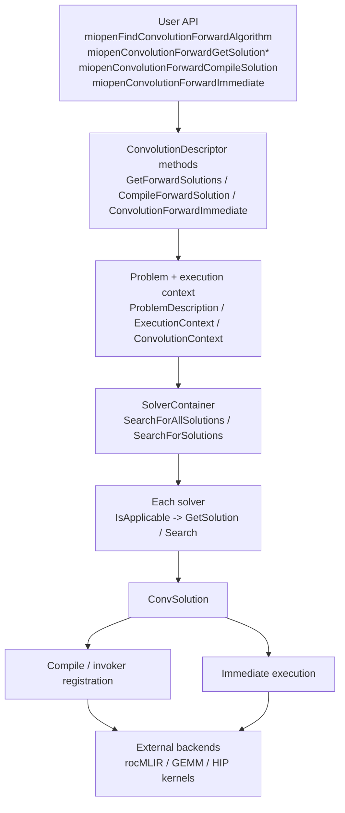

# MIOpen solver architecture map

作成日: 2026-03-17
関連文書: `class_map.md`, `device_capability_flow.md`, `trace_map_static.md`, `final_hypothesis.md`

> 本メモは、公開一次資料およびローカル clone から観測可能な範囲を整理したものであり、非公開 issue や社内意思決定の内容を断定するものではない。

---

## 目的

`class_map.md` が主要クラスの責務を一行で固定したのに対し、
この文書は **frontend API から solver search / compile / immediate 実行までの構造**
を、MIOpen convolution 経路に限定して固定する。

対象は exhaustive な class archaeology ではなく、次の最小スコープである。

- user-facing API がどこに入るか
- solver search がどこで起きるか
- `ConvSolution` がどこで compile / immediate 実行へ渡るか
- rocMLIR / GEMM / HIP backend がどこで接続するか

---

## 1. 観測できる全体フロー（Fact）

---

## 2. frontend API と内部入口

### 2.1 public API の入口

`convolution_api.cpp` では、forward path の user-facing API として少なくとも次が確認できる。

| API | 役割 | 内部委譲先 |
|---|---|---|
| `miopenFindConvolutionForwardAlgorithm` | legacy find path | `ConvolutionDescriptor` 側の forward path |
| `miopenConvolutionForwardGetSolutionCount` | solution 数の取得 | `GetForwardSolutionCount()` |
| `miopenConvolutionForwardGetSolution` | solution 列挙 | `GetForwardSolutions()` |
| `miopenConvolutionForwardGetSolutionWorkspaceSize` | workspace 取得 | `GetForwardSolutionWorkspaceSize()` |
| `miopenConvolutionForwardCompileSolution` | solution compile | `CompileForwardSolution()` |
| `miopenConvolutionForwardImmediate` | solution id 指定で即時実行 | `ConvolutionForwardImmediate()` |

Interpretation:
MIOpen の convolution API は、
**search と execution を明示的に分けた solution-oriented API** を持つ。
この構造が、「候補列挙だけ行う」「compile だけ先に行う」「solution id を固定して実行する」
という分離を可能にしている。

### 2.2 descriptor 側の責務

`convolution_api.cpp` から見える範囲では、
public API は `ConvolutionDescriptor` の forward/backward 系メソッドへ委譲される。

ここでの責務は、

- `Handle`
- `TensorDescriptor`
- `ConvolutionDescriptor`
- `solution_id`

を internal problem / execution path に橋渡しすることにある。

---

## 3. solver search の中心構造

### 3.1 `SolverContainer`

`find_solution.hpp` の `SolverContainer` では、少なくとも 2 つの search path が確認できる。

| 関数 | 入力 | 使いどころ |
|---|---|---|
| `SearchForAllSolutions` | `Context`, `Db`, `AnyInvokeParams` | tunable solver を含む通常 search |
| `SearchForSolutions` | `ExecutionContext`, `Problem` | execution/problem を分けた search |

どちらも共通して、

1. solver を列挙
2. `IsDynamic()` を必要に応じて確認
3. `IsApplicable(...)` を確認
4. `FindSolution(...)` または `GetSolution(...)`
5. `Succeeded()` した solution だけ残す

という流れをとる。

### 3.2 `SolverBase` / `SolverMixin`

`solver.hpp` では、solver 共通インタフェースが `SolverBase` に集約されている。

主要な責務は次のとおり。

| API | 役割 |
|---|---|
| `SolverDbId()` | Perf DB / logging 上の solver id |
| `IsApplicable(...)` | この problem / HW / runtime で通せるか |
| `IsDynamic()` | dynamic solution か |
| `GetWti(...)` | 見込み性能指標 |
| `GetWorkspaceSize(...)` | workspace 見積もり |

`SolverMixin<Context>` は typed context を `boost::any` 経由の共通 interface に載せる adapter として機能する。
convolution solver は `using ConvSolver = SolverMixin<ConvolutionContext>` で定義される。

### 3.3 tunable solver

`ConvTunableSolverBase` / `ConvTunableSolver<PerformanceConfig>` は、

- `GetDefaultPerformanceConfig`
- `IsValidPerformanceConfig`
- `Search`
- `GetSolution(context, config)`

を加える。

Interpretation:
MIOpen では、
**「通るかどうか」と「どうチューニングするか」が分離** されている。
そのため、Perf DB 不在や search failure が起きても、
構造上は `IsApplicable()` 自体とは別問題として扱える。

---

## 4. `ConvSolution` 以後の流れ

### 4.1 solution の役割

`find_solution.hpp` では、search 成功時に `ConvSolution` が返され、
`solver_id` がそこに付与される。

`ConvSolution` は少なくとも、

- kernel 情報
- workspace 情報
- invoker 構築に必要な情報

の carrier として機能する。

### 4.2 compile path

`miopenConvolutionForwardCompileSolution` は `CompileForwardSolution()` へ委譲される。
この段階の役割は、
**選ばれた solution を事前に build / register しておくこと**
であり、first-run penalty を減らすための optional step と読める。

### 4.3 immediate path

`miopenConvolutionForwardImmediate` は `solution_id` を受け取り、
`ConvolutionForwardImmediate()` へ委譲される。

Interpretation:
MIOpen の immediate path は、
「今ここで solver を再探索する」より、
**すでに固定した solution を実行する path**
として位置づけられている。

---

## 5. 外部 backend との接続点

### 5.1 rocMLIR

`mlir_build.cpp` には、

- `miirCreateHandle`
- `MiirIsConfigApplicable`
- `miirLowerTuningParams`

が見える。

これは `ConvSolution` 以後の build / lowering 層で、
MLIR 系 solution が rocMLIR / MIIR C API に降りる接続点である。

### 5.2 GEMM backend

`class_map.md` で整理したとおり、`gemm_v2.cpp` は
hipBLASLt / rocBLAS / Tensile 系の GEMM backend 接続点である。

### 5.3 HIP kernel build

`HIPOCProgram` は HIP kernel の compile / load を担う。
したがって compile failure は、
solver search より後段の **kernel build / code object 層** で起きる。

---

## 6. gfx900 の観測点

`gfx900` に関して、この architecture map 上で重要なのは次の 3 点である。

| 位置 | 観測点 | 含意 |
|---|---|---|
| `IsApplicable()` | MLIR iGEMM / XDLops / 観測した CK path が落ちる | solver 単位の selective gate |
| `FindSolution()` / Perf DB | MLIR 強制時に gfx900 tuning 行不在が顕在化 | applicability と tuning availability は別層 |
| compile / immediate | `CompileSolution -> ConvolutionForwardImmediate` まで進んで失敗するケースがある | 実行不能の原因は search より後段にもある |

Interpretation:
`gfx900` の「半分生きて半分死んでいる」状態は、
単一の gate ではなく、
**solver gate / tuning data / code object build / runtime execution**
が別層に分かれていることで説明しやすい。

---

## 本文書が主張しないこと

- MIOpen 全体の全クラス構造を網羅したものではない
- 全 solver の call graph を完全に展開したものではない
- rocMLIR / Tensile / CK の内部構造までここで固定するものではない
- 特定設計が特定 arch を維持するために意図されたと断定するものではない
