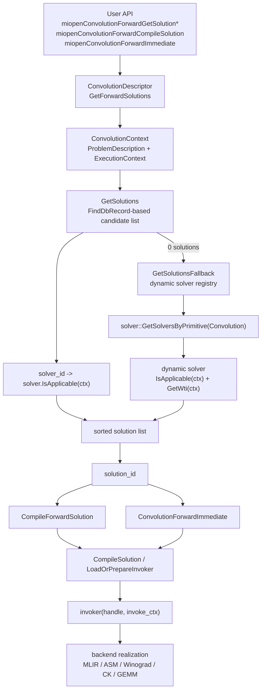

# MIOpen solver selection graph

作成日: 2026-03-18
関連文書: `solver_architecture_map.md`, `device_capability_flow.md`, `frontend_to_kernel_map.md`, `class_map.md`

> 本メモは、公開一次資料およびローカル clone から観測可能な範囲を整理したものであり、非公開 issue や社内意思決定の内容を断定するものではない。

---

## 目的

この文書は、MIOpen convolution の solver selection が

- どの入口から始まり
- どこで candidate を作り
- どこで `IsApplicable()` による分岐が起き
- どこで `solution_id` / invoker / backend に接続するか

を、**forward path 中心の coarse graph** として固定する。

full call graph を起こすことが目的ではない。
ここで扱うのは、
`gfx900` 調査に直接効く branch point と hidden layer の位置である。

---

## 一次根拠

- `/home/limonene/ROCm-project/WD-Black/ROCm-repos/MIOpen/include/miopen/miopen.h`
- `/home/limonene/ROCm-project/WD-Black/ROCm-repos/MIOpen/doc/src/find_and_immediate.md`
- `/home/limonene/ROCm-project/WD-Black/ROCm-repos/MIOpen/src/include/miopen/convolution.hpp`
- `/home/limonene/ROCm-project/WD-Black/ROCm-repos/MIOpen/src/ocl/convolutionocl.cpp`
- `/home/limonene/ROCm-project/WD-Black/ROCm-repos/MIOpen/src/include/miopen/find_solution.hpp`
- `/home/limonene/ROCm-project/WD-Black/ROCm-repos/MIOpen/src/mlo_dir_conv.cpp`
- `/home/limonene/ROCm-project/WD-Black/ROCm-repos/MIOpen/src/include/miopen/conv/context.hpp`
- `/home/limonene/ROCm-project/WD-Black/ROCm-repos/MIOpen/src/include/miopen/target_properties.hpp`
- `/home/limonene/ROCm-project/WD-Black/ROCm-repos/MIOpen/src/gemm_v2.cpp`

補助観測:

- `/home/limonene/ROCm-project/WD-Black/ROCm-Static_Analysis/MCP`
  - `query_ctags` で `GetForwardSolutions`, `CompileForwardSolution`, `ConvolutionForwardImmediate`,
    `ConvolutionContext`, `TargetProperties`, `CallGemm`, `SearchForAllSolutions` の定義位置を確認した。
  - `FindCore` と `CallHipBlas` は current `MIOpen` root では canonical symbol としては確認できなかった。

---

## 1. coarse graph（Fact）



Fact:

- `miopenConvolutionForwardGetSolution` は `ConvolutionDescriptor::GetForwardSolutions()` に委譲される。
- `GetForwardSolutions()` は `ConvolutionContext` を構築し、まず `GetSolutions()` を呼ぶ。
- `GetSolutions()` は `FindDbRecord` を読み、各 `solver_id` について `solver.IsApplicable(ctx)` を確認した上で `miopenConvSolution_t` を並べる。
- `GetForwardSolutions()` で候補数が 0 の場合、`GetSolutionsFallback()` が呼ばれる。
- `GetSolutionsFallback()` は `solver::GetSolversByPrimitive(solver::Primitive::Convolution)` を走査し、dynamic solver だけを対象に `IsApplicable(ctx)` と `GetWti(ctx)` を使って候補を作る。
- `miopenConvolutionForwardCompileSolution` は `CompileForwardSolution()` に委譲され、内部で `CompileSolution()` / `LoadOrPrepareInvoker()` に入る。
- `miopenConvolutionForwardImmediate` は `ConvolutionForwardImmediate()` に委譲され、`LoadOrPrepareInvoker()` 経由で invoker を取得し `invoker(handle, invoke_ctx)` を実行する。

Interpretation:

- current public tree の solver selection は、単一の monolithic selector より、
  **FindDb-based selection**, **fallback registry scan**, **invoker/backend realization**
  の分散構造として読む方が自然である。

---

## 2. family-level branch（Fact）

`mlo_dir_conv.cpp` では、solver family ごとに `SearchForAllSolutions()` を呼ぶ helper が分かれている。

| family | helper | structural role | current tree で確認できる例 |
| --- | --- | --- | --- |
| Direct | `FindAllDirectSolutions` | direct / legacy kernel 群 | `conv_direct_naive_conv_fwd.cpp`, `conv_ocl_dir2Dfwd.cpp` |
| Implicit GEMM | `FindAllImplicitGemmSolutions` | implicit-gemm 系群 | `conv_mlir_igemm_fwd.cpp`, `conv_asm_implicit_gemm_v4r1_dynamic.cpp`, `conv_ck_igemm_fwd_v6r1_dlops_nchw.cpp` |
| Winograd | `FindAllWinogradSolutions` | Winograd 系群 | `conv_bin_wino3x3U.cpp`, `conv_winoRxS.cpp` |
| FFT | `FindAllFFTSolutions` | FFT 系群 | `fft.cpp` |
| GEMM | `FindAllGemmSolutions` | GEMM backend 群 | `gemm.cpp`, `gemm_v2.cpp` |

Fact:

- `FindAllDirectSolutions`, `FindAllImplicitGemmSolutions`, `FindAllWinogradSolutions`,
  `FindAllFFTSolutions`, `FindAllGemmSolutions` はいずれも `SolverContainer::SearchForAllSolutions()` に落ちる。
- `SearchForAllSolutions()` は `use_dynamic_solutions_only`, `IsDynamic()`, `IsApplicable()`,
  `FindSolution(...)`, `Succeeded()` を順に確認する。
- `CallGemm()` は `gemm_v2.cpp` に存在し、内部で build option / env に応じて
  `MIOpenTensile` と `rocBLAS` 側へ分かれる。

Interpretation:

- coarse graph の「backend realization」は一つの直線ではなく、
  少なくとも **Direct / Implicit GEMM / Winograd / FFT / GEMM backend**
  という family bucket を持つ。
- `gfx900` 調査で重要だった MLIR / ASM v4r1 / CK / Winograd / GEMM fallback は、
  この family-level branch 上の別々のノードとして置く方が整理しやすい。

---

## 3. branch point の意味

### 3.1 `ConvolutionContext`

`ConvolutionContext` は `ProblemDescription + ExecutionContext` の combined object であり、
`GetForwardSolutions()`, `CompileForwardSolution()`, `ConvolutionForwardImmediate()` のいずれでも作られる。

Interpretation:

- shape / dtype / layout と runtime / stream / target property が、
  solver 側からは一つの context として見える。
- したがって分岐の多くは API 層ではなく、
  **context を受けた solver-local `IsApplicable()`**
  に押し込まれている。

### 3.2 `IsApplicable()`

`SearchForAllSolutions()` / `GetSolutions()` / `GetSolutionsFallback()` のいずれでも、
候補採用前に `IsApplicable()` が gate になる。

Interpretation:

- `gfx900` で観測された MLIR iGEMM 除外、XDLops capability 不成立、
  観測した CK path の `not applicable` は、
  いずれもこの gate の異なる変種として置ける。

### 3.3 `FindDbRecord` と fallback

`GetSolutions()` は `FindDbRecord` が空なら 0 solutions を返し、
`GetForwardSolutions()` 側で fallback へ落ちる。

Interpretation:

- solution selection は「solver が通るか」だけではなく、
  **catalog / tuning record があるか**
  にも依存する。
- そのため、
  「solver-local gate ではなく catalog 側で候補が消える」
  という別種の failure を分けて扱える。

### 3.4 `solution_id` 以後

`CompileSolution()` と `ConvolutionForwardImmediate()` は、
`solver_id.GetSolver()` と `LoadOrPrepareInvoker()` を通じて compile / invoker 層へ入る。

Interpretation:

- candidate selection と actual runability は同じ段ではない。
- したがって、
  `solution_id` までは出るが compile / immediate で止まるケースを、
  solver selection failure と混同しない方がよい。

---

## 4. current tree で見えた symbol の位置（Fact）

MCP の `query_ctags` で current `MIOpen` root に対して確認した位置は次のとおり。

| symbol | file | line |
| --- | --- | --- |
| `SearchForAllSolutions` | `src/include/miopen/find_solution.hpp` | 142 |
| `GetForwardSolutions` | `src/ocl/convolutionocl.cpp` | 897 |
| `CompileForwardSolution` | `src/ocl/convolutionocl.cpp` | 1035 |
| `ConvolutionForwardImmediate` | `src/ocl/convolutionocl.cpp` | 1050 |
| `ConvolutionContext` | `src/include/miopen/conv/context.hpp` | 96 |
| `TargetProperties` | `src/include/miopen/target_properties.hpp` | 36 |
| `CallGemm` | `src/gemm_v2.cpp` | 475 |

補足:

- `FindCore` は current `MIOpen` root の canonical symbol としては確認できなかった。
- `CallHipBlas` も current tree では見つからず、GEMM backend 接続点としては `CallGemm` の方が直接確認できた。

Interpretation:

- これは、過去のメモや期待される抽象名より、
  **current public tree に現れている symbol** を中心に graph を組んだ方がよいことを示している。

---

## 5. `gfx900` 調査への接続

この graph を `gfx900` に重ねると、少なくとも次の 3 種の stop point を分けられる。

| stop point | 代表例 | 層 |
| --- | --- | --- |
| applicability stop | MLIR iGEMM の `gfx900` gate, XDLops capability gate, 観測した CK path の `not applicable` | solver gate |
| catalog stop | `FindDbRecord` / tuning record 不在 | selection / catalog |
| compile or run stop | `solution_id` はあるが compile / immediate で失敗 | invoker / backend |

Interpretation:

- `gfx900` の「半分生きて半分死んでいる」状態は、
  API 層ではなく **selection / catalog / backend** の分離で説明しやすい。

---

---

## 6. gfx900 IsApplicable() Gate 詳細 — 静的解析結果 (code_verified)

> §5 の「applicability stop」を solver 単位に展開する。
> 以下は MIOpen ローカル clone を MCP (find_symbols / query_ctags / grep_code) で解析して得た結果。

### 6.1 PASS — gfx900 で IsApplicable() が通る

| Solver | IsApplicable 定義位置 | gfx900 判定根拠 | 備考 |
|---|---|---|---|
| `ConvDirectNaiveConvFwd` | `conv_direct_naive_conv_fwd.cpp:37` | arch 制限条件なし（ユニバーサル） | INT8 対応。最終 fallback として機能 |
| `ConvAsmImplicitGemmV4R1DynamicFwd` | `conv_asm_implicit_gemm_v4r1_dynamic.cpp:275` | `:281` で `gfx900`, `gfx906` を明示列挙 | gfx900 専用の ASM iGEMM 経路 |
| `ConvBinWinograd3x3U` | `conv_bin_wino3x3U.cpp:45` | `:61` で `gfx803/gfx900/gfx906/gfx908` を許可 | Winograd。INT8 の扱いは未確認 |
| GEMM 系 (hipBLASLt / Tensile) | `mlo_dir_conv.cpp:93` 経由 | IsApplicable 自体に arch 制限なしと推定 | 実行時成否はここでは固定しない |

### 6.2 FAIL — IsApplicable() で gfx900 が落ちる

| Solver | IsApplicable 定義位置 | Gate 位置 | 除外理由 |
|---|---|---|---|
| `ConvMlirIgemmFwd` | `conv_mlir_igemm_fwd.cpp:155` | `:173` | gfx900 を明示除外（private #389 関連） |
| XDLops 系全般 | 各 cpp 内 | `solver/implicitgemm_util.hpp:206` (`IsXdlopsSupport`) | gfx908 / gfx90a のみ許可。MFMA 命令前提 |
| CK 系 | 各 cpp 内 | CK capability check 内部 | MFMA / dot4 不在による実装制約 |

### 6.3 IsXdlopsSupport の構造

XDLops 系 solver の IsApplicable は `implicitgemm_util.hpp:206` の `IsXdlopsSupport` を内部で呼ぶ。

```cpp
// 観測パターン (implicitgemm_util.hpp:206-217):
inline bool IsXdlopsSupport(const ProblemDescription& problem) {
  const auto name = problem.GetStream().GetDeviceName();
  return name == "gfx908" || name == "gfx90a";
}
```

gfx900 はこの条件に含まれないため、IsApplicable の段階で除外が確定する。

### 6.4 gfx900 alias の解決

`target_properties.cpp:53-54` で `Vega10` / `gfx901` などの alias が `gfx900` に解決される。
device name string としては `"gfx900"` が IsApplicable 内部の比較に使われる。

### 6.5 INT8 との交差

| Solver | INT8 対応 | 根拠 |
|---|---|---|
| `ConvDirectNaiveConvFwd` | ✓ 対応 | `conv_direct_naive_conv_fwd.cpp:37` — dtype 制限なし |
| `ConvAsmImplicitGemmV4R1DynamicFwd` | △ 未確認（runtime failure 観測あり） | gfx900+INT8 で GPU fault を確認済み (trace_map) |
| `ConvBinWinograd3x3U` | △ 未確認 | FP32 想定設計と推定、INT8 明示確認なし |

### 6.6 code_verified 引用一覧

| 項目 | ファイル:行 |
|---|---|
| SolverContainer 定義 | `src/include/miopen/find_solution.hpp:137` |
| SearchForAllSolutions | `find_solution.hpp:142` |
| SolverBase::IsApplicable | `src/include/miopen/solver.hpp:92` |
| ConvSolver typedef | `src/include/miopen/solver.hpp:162` |
| IsXdlopsSupport | `src/include/miopen/solver/implicitgemm_util.hpp:206` |
| Invoker 定義 | `src/include/miopen/invoker.hpp:39` |
| ConvDirectNaiveConvFwd::IsApplicable | `src/solver/conv_direct_naive_conv_fwd.cpp:37` |
| ConvMlirIgemmFwd::IsApplicable | `src/solver/conv_mlir_igemm_fwd.cpp:155` |
| ConvMlirIgemmFwd gfx900 gate | `src/solver/conv_mlir_igemm_fwd.cpp:173` |
| ConvAsmImplicitGemmV4R1DynamicFwd::IsApplicable | `src/solver/conv_asm_implicit_gemm_v4r1_dynamic.cpp:275` |
| ConvAsmImplicitGemmV4R1DynamicFwd gfx900 許可 | `src/solver/conv_asm_implicit_gemm_v4r1_dynamic.cpp:281` |
| ConvBinWinograd3x3U::IsApplicable | `src/solver/conv_bin_wino3x3U.cpp:45` |
| ConvBinWinograd3x3U gfx900 許可 | `src/solver/conv_bin_wino3x3U.cpp:61` |
| SolverContainer grouping | `src/mlo_dir_conv.cpp:93-222` |
| gfx900 alias | `src/target_properties.cpp:53-54` |

---

## Open Question / Limitation

- この文書は forward path 中心であり、backward-data / wrw の差分は展開していない。
- helper family と実行時の最終 dispatch を 1:1 対応として断定するものではない。
- `ast_dump` や `cscope` を使った caller/callee 精密化はまだ行っていない。
- 非公開 issue や maintainer の意図を、この graph から断定するものではない。

---

## 本文書が主張しないこと

- MIOpen 全体の完全 call graph を与えるものではない
- 各 solver family の優先順位を一般法則として断定するものではない
- `gfx900` の support 意味をこの図だけで完結させるものではない
- 特定 backend が特定 arch 維持のために意図されたと断定するものではない
