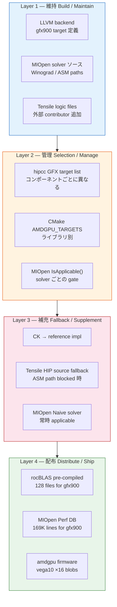
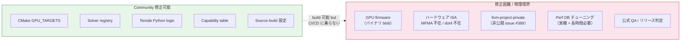
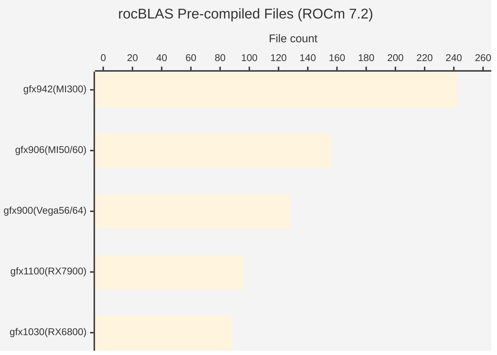
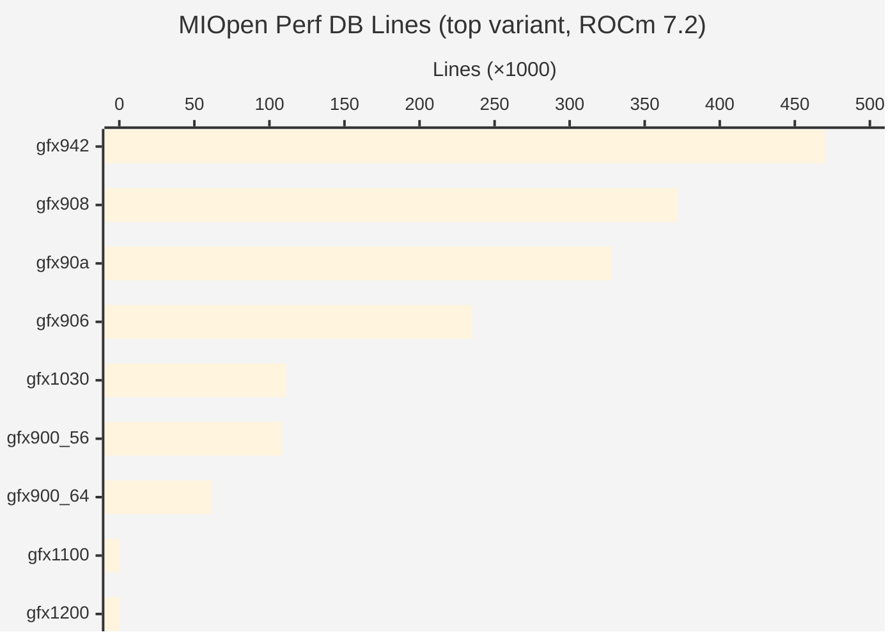

# gfx900 サポート境界層分析

> 本メモは、公開一次資料およびローカル clone から観測可能な範囲を整理したものであり、非公開 issue や社内意思決定の内容を断定するものではない。

作成日: 2026-03-15
関連: TODO.md §7（境界層調査）、provenance_map.md

---

## 目的

gfx900 (Vega) が ROCm スタック上で動作し続ける条件を、**出荷成果物・ソース・ビルドシステム・ハードウェア制約**の4軸で層別に整理し、「コミュニティがどこまで保守可能か」「どこにハードな境界があるか」を構造的に把握する。

---

## 4層観察モデル概観

## コミュニティ修正可能性の境界

---

## 1. 出荷成果物の実態（shipped_artifact_verified）

ROCm 7.2 パッケージ（`/opt/rocm`）に含まれる gfx900 向け成果物の実数を確認した。

### 1.1 MIOpen Performance Database

`/opt/rocm/share/miopen/db/` に以下が存在。Perf DB は solver ごとのチューニングパラメータ集合であり、architecture-specific なビルド工程を経て生成される。

| ファイル | 行数 |
|---|---|
| `gfx900_56.HIP.fdb.txt` | 64,583 |
| `gfx900_56.db.txt` | 41,835 |
| `gfx900_56.OpenCL.fdb.txt` | 1,711 |
| `gfx900_64.HIP.fdb.txt` | 59,336 |
| `gfx900_64.OpenCL.fdb.txt` | 1,717 |
| **合計** | **169,182** |

#### アーキテクチャ横断比較

| アーキテクチャ | HIP fdb | db | OpenCL fdb | 合計 | 備考 |
|---|---|---|---|---|---|
| gfx942_130 (MI300X) | 239,398 | 230,682 | 0 | 470,080 | 最大 |
| gfx90a_68 (MI200) | 193,473 | 134,041 | 0 | 327,514 | |
| gfx908_78 (MI100) | 183,494 | 124,077 | 64,062 | 371,633 | |
| gfx906_60 (MI50) | 120,454 | 99,522 | 15,318 | 235,294 | |
| gfx803_36 (Fiji 36CU) | 59,336 | 0 | 53,431 | 112,767 | gfx900 より古い |
| gfx1030_36 (RDNA2) | 106,105 | 5,191 | 0 | 111,296 | |
| **gfx900_56 (Vega56)** | **64,583** | **41,835** | **1,711** | **108,129** | |
| gfx906_64 | 64,047 | 0 | 10,872 | 74,919 | |
| gfx900_64 (Vega64) | 59,336 | 0 | 1,717 | 61,053 | |
| **gfx1100 (RDNA3)** | — | — | — | **なし** | Perf DB 出荷なし |
| **gfx1200 (RDNA4)** | — | — | — | **なし** | Perf DB 出荷なし |

**Fact**: gfx900_56 の Perf DB 行数（108,129）は gfx1030（111,296）と同規模であり、gfx1100/gfx1200 には Perf DB 自体が存在しない。

**Interpretation**: MIOpen Perf DB は solver ごとのチューニングパラメータを持つため、その存在は「そのアーキテクチャ向けのチューニング実行がビルド工程に含まれている」ことを示唆する。gfx1100/1200 に Perf DB がないのは、MIOpen がこれらの世代で別のチューニング制御方式を採用しているか、あるいは MIOpen 自体がこれらの世代を主要ターゲットとしていない可能性がある。

**Limitation**: Perf DB のビルド工程詳細（自動生成か手動チューニングか、いつ最終更新されたか）は未確認。gfx1100 向け Perf DB 不在の正確な理由は調査範囲外。

### 1.2 rocBLAS プリコンパイル済みカーネル

`/opt/rocm/lib/rocblas/library/` に gfx900 向けプリコンパイル済みファイルが存在。

| アーキテクチャ | .hsaco | .co | .dat | 合計 |
|---|---|---|---|---|
| gfx942 (MI300X) | 55 | 93 | 94 | 242 |
| gfx906 (MI50) | 71 | 42 | 43 | 156 |
| **gfx900 (Vega)** | **71** | **28** | **29** | **128** |
| gfx1100 (RDNA3) | 55 | 20 | 21 | 96 |
| gfx1030 (RDNA2) | 55 | 16 | 17 | 88 |

gfx900 のデータ型カバレッジ: HH(28), ZZ(17), CC(17), SS(16), HS(16), DD(16), I8I(4), BS(4), BB(4), 4xi8I(4)

うち `fallback` 名を含むファイル: 54/128（42%）

**Fact**: gfx900 の rocBLAS カーネル数（128）は gfx1100（96）および gfx1030（88）を上回る。

**Interpretation**: `.hsaco` / `.co` ファイルは `--offload-arch=gfx900` を指定してコンパイルした成果物であり、ビルドシステムの `GPU_TARGETS` リストに gfx900 が含まれている直接的証拠として読める。gfx900 の .hsaco 数（71）が gfx1100/gfx1030 の .hsaco 数（各55）を上回るのは、legacy .hsaco 形式が gfx900 世代で多く使われていることを反映している可能性がある。

### アーキテクチャ間 出荷成果物比較

### 1.3 Firmware

`/lib/firmware/amdgpu/vega10_*.bin.zst`: 16 ファイル
- compute engine: ce, me, mec, mec2, pfp, rlc
- DMA: sdma, sdma1
- power management: smc, acg_smc
- security: asd, sos
- media: uvd, vce
- device info: gpu_info, ip_discovery

**Fact**: vega10 firmware は Linux カーネルの `linux-firmware` パッケージ経由で出荷されており、ROCm パッケージとは独立した配布チャネルである。

### 1.4 ランタイム認識

| 項目 | 結果 |
|---|---|
| `rocminfo` GPU agent | `gfx900`, Marketing Name: `AMD Radeon RX Vega` |
| `rocm-smi --showproductname` | `AMD Radeon RX Vega` |
| `/dev/kfd` | 存在 |
| libhsa-runtime64.so | 1.18.0 |

---

## 2. ソースレベルの保守可能性

### 2.1 コミュニティが修正可能な層

| 層 | コンポーネント例 | アクセス性 | 修正難度 | 備考 |
|---|---|---|---|---|
| ビルドターゲット | `GPU_TARGETS` / `AMDGPU_TARGETS` CMake 変数 | 完全公開 | 低 | 再ビルドにより gfx900 を含めることが可能 |
| Solver レジストリ | `solver.cpp`, `SolverRegistrar` | 完全公開 | 中 | 新 solver の追加・既存 solver の条件変更 |
| Solver 実装 | ASM (.s), HIP (.cpp), OpenCL (.cl) | 完全公開 | 中-高 | ASM は architecture-specific 知識が必要 |
| Capability テーブル | `target_properties.cpp` | 完全公開 | 低 | テキストベースの device→arch マッピング |
| Perf DB | SQLite 形式、`/opt/rocm/share/miopen/db/` | 公開（バイナリ） | 高（労力） | 再チューニングに実機 + 時間が必要 |
| Tensile logic | Python コード、`.yaml` カタログ | 完全公開 | 中 | Python レベルで改変可能 |
| LLVM backend | `GCNProcessors.td`, `SISchedule.td` 等 | 完全公開 | 高 | gfx900 は `FeatureGFX900` として定義済み |
| rocMLIR | `rocmlir-lib.cpp`, `convGenerator.cpp` | 完全公開 | 高 | ビルドに数時間〜数日 |

### 2.2 コミュニティが修正困難な層

| 層 | 理由 | 備考 |
|---|---|---|
| GPU firmware | バイナリブロブ。ソース非公開 | `linux-firmware` 経由で配布 |
| ハードウェア命令セット | MFMA 不在は物理的制約 | gfx900 は wave64, no-MFMA, no-dot4 |
| private backend issue | `llvm-project-private` は非公開 | issue #389 の根本原因は外部到達不可 |
| 公式 QA / リリース判定 | AMD 社内プロセス | コミュニティの影響範囲外 |
| Perf DB チューニング | 実機環境 + 大量の計算時間が必要 | 理論上可能だが現実的コスト大 |

### 2.3 ハードウェア制約（物理的境界）

gfx900 が物理的に持たない能力:

| 能力 | gfx906 | gfx908 | gfx900 | 影響 |
|---|---|---|---|---|
| dot4 (v_dot4_i32_i8) | あり | あり | **なし** | INT8 積和が要素単位。CK iGEMM 不可 |
| MFMA | なし | あり | **なし** | XDLops 系 solver 全滅 |
| SRAM ECC | あり | あり | **なし** | sramecc 誤報 workaround が必要 |
| HBM2 bandwidth | — | — | 483 GB/s | MI50 (1TB/s) の約半分 |

---

## 2b. ビルドシステム / CI の保守可能性

### 2b.1 ビルドターゲット管理

gfx900 のビルドターゲット包含はコンポーネントごとに異なる。

| コンポーネント | gfx900 デフォルト包含 | 手動包含可否 | 備考 |
|---|---|---|---|
| ollama CMakeLists | **非包含**（regex で除外） | `AMDGPU_TARGETS=gfx900` で可能 | CMakeLists.txt:127 |
| rocBLAS CMakeLists | 包含（TARGET_LIST に残存） | — | ROCm 5.6〜7.1 で継続 |
| rocSOLVER | 包含（ROCm 6.2 で追加） | — | |
| hipCUB | **除外**（ROCm 7.0 で削除） | 手動追加で可能 | |
| MIOpen | ビルドは可能（Perf DB 出荷あり） | — | |

**Fact**: gfx900 のビルド包含は全コンポーネントで統一されておらず、コンポーネントごとに追加・除外が独立して行われている。

**Interpretation**: これは「一括サポート終了」ではなく「component ごとの layered retreat」として確認できる。コミュニティが source-build を行う場合、`AMDGPU_TARGETS=gfx900` の明示が必要なコンポーネントがある。

### 2b.2 CI について

| 観点 | 状態 | 備考 |
|---|---|---|
| gfx900 の CI テスト対象 | **未確認** | 公開 CI ログでは gfx900 テストの痕跡は確認できていない |
| source-build 可否 | 可能 | MIOpen (MLIR=Off), rocBLAS, Tensile で確認済み |
| Community CI | 各ディストリビューション（Gentoo, Arch 等）で個別に実施 | 非公式 |

**Limitation**: AMD の内部 CI で gfx900 がテスト対象に含まれているかどうかは、外部からは確認できない。

### 2b.3 コミュニティ ソースビルドの課題

source-build で gfx900 環境を維持する場合の主な課題:

1. **ビルド時間**: MIOpen のフルビルドは数時間〜十数時間（MLIR 有効時はさらに長い）
2. **依存関係**: ROCm 各コンポーネント間のバージョン整合性の確保
3. **Perf DB 再生成**: チューニングデータの再生成には実機上での長時間実行が必要
4. **ISA カーネル**: ASM カーネルは architecture-specific 知識が前提
5. **half ライブラリ**: half 2.2.x で `half_float::detail::expr` 型削除に伴うパッチが必要

---

## 2c. QA / リリース判定の境界

### 2c.1 公式 QA プロセス

AMD の ROCm リリースプロセスにおける gfx900 の位置づけ:

| 観点 | 観測可能な事実 | 外部から確認不可 |
|---|---|---|
| サポートマトリクス | gfx900 は ROCm 7.2 のサポート表に非掲載 | 非掲載の判断理由 |
| 出荷成果物 | gfx900 向け Perf DB / rocBLAS / firmware が出荷されている | 出荷判定プロセス |
| テスト | gfx900 対象の公開 CI テストは未確認 | 内部 CI / QA テストの有無 |
| バグ受付 | gfx900 固有のバグ報告の扱いは不明 | triaging 方針 |

**Fact**: サポートマトリクスから非掲載であること（Tier 1 の判断）と、出荷成果物に含まれていること（Tier 4 の事実）は矛盾しない。これらは異なる判定基準による異なる層の結果である。

**Interpretation**: 「公式 QA / リリース判定」はコミュニティの影響範囲外であり、これが gfx900 の「修正困難な層」の一つである理由は、技術的制約ではなく組織的境界にある。

### 2c.2 コミュニティの QA 代替

コミュニティが実質的に担っている QA 的活動:

- **動作検証**: HSA_OVERRIDE_GFX_VERSION 等を用いた runtime テスト
- **solver 選択確認**: `-S` オプションによる個別 solver テスト
- **回帰テスト**: ROCm バージョンアップ時の gfx900 動作確認
- **知見共有**: GitHub issue / Reddit / Arch Wiki 等での情報蓄積

**Limitation**: コミュニティの QA は体系的ではなく、カバレッジが限定的である。また、regression を発見しても公式パッチに至る経路は不確実である。

---

## 3. 「配布上のサポート」という新しい観察層

### 3.1 従来の3層モデル

これまでの調査では、gfx900 の生存を以下の3層で説明していた:
- **維持 (build)**: CMake ターゲットリストへの残存
- **管理 (selection)**: IsApplicable / capability-based solver 選択
- **補充 (fallback)**: multi-stage runtime fallback

### 3.2 新しい4層モデル

出荷成果物の調査により、第4の層が確認された:

- **配布 (shipped artifacts)**: プリコンパイル済みカーネル、チューニング済み Perf DB、firmware の出荷

この層は「ビルドシステムにターゲットが残っている」こと以上の意味を持つ。チューニングデータは architecture-specific な実行と測定を必要とし、パッケージングは意識的なビルドパイプライン管理を必要とする。

### 3.3 含意

| 観点 | 3層モデルでの説明 | 4層モデルでの説明 |
|---|---|---|
| 「コードが残っている」 | はい（ソース上の残存） | はい（ソース + 出荷バイナリ） |
| 「ビルドできる」 | はい（CMake ターゲット） | はい（実際にビルドされ出荷されている） |
| 「チューニングされている」 | 未確認だった | **はい**（Perf DB 169K行が出荷） |
| 「RDNA3/4 より手厚いか」 | 比較なし | **Perf DB・rocBLAS ともに gfx900 > gfx1100/gfx1030** |

---

## 4. Open Questions

- Perf DB の最終更新タイミング: 既存の DB が ROCm リリースごとに再生成されているのか、過去のスナップショットがそのまま引き継がれているのかは未確認
- gfx1100/1200 に Perf DB がない理由: MIOpen がこれらの世代で別のチューニング方式を使っているのか、そもそも MIOpen ターゲットでないのか
- gfx803 にも Perf DB が存在する事実: gfx900 だけでなく、さらに古い世代もビルドパイプラインに含まれている
- 「ビルドパイプラインに含まれている」ことが「サポート意図」を示すのか、「ターゲットリスト慣性」なのか: 意図と慣性の区別は外部からは困難

---

## 5. 本文書が主張しないこと

- 出荷成果物の存在が AMD による「公式サポート」を意味するとは主張しない
- gfx1100/gfx1200 の Perf DB 不在の理由を断定しない
- 出荷成果物の存在から AMD の意図を推定しない
- Perf DB のチューニング品質や最新性を保証しない
- AMD または特定個人への批判を意図するものではない
