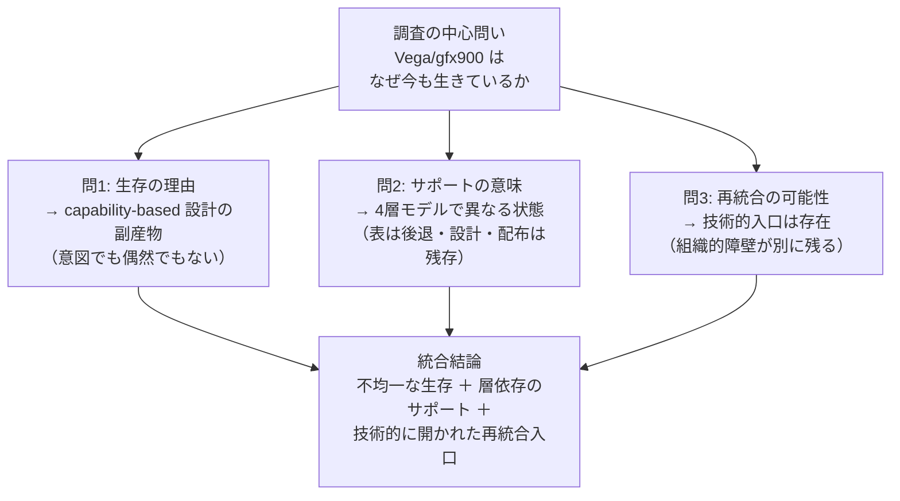

# 調査結論：「サポート」とは何か、gfx900 はなぜ生きているか

作成日: 2026-03-17
本文書の位置づけ: 本調査（Vega/gfx900 ROCm サポート調査）の**結論ページ**。
各問いへの一文回答と、根拠文書への参照を提供する。

関連文書（根拠層）:
`final_hypothesis.md`, `support_boundary.md`, `why_rocm_is_flexible.md`,
`future_support_paths.md`, `natural_maintenance_scenarios.md`,
`what_can_be_extended.md`, `what_cannot_be_extended.md`,
`community_vs_vendor_matrix.md`, `provenance_map.md`

> 本メモは、公開一次資料およびローカル clone から観測可能な範囲を整理したものであり、非公開 issue や社内意思決定の内容を断定するものではない。

---

## 問 1: gfx900 の生存は「偶然」か「副産物」か

### Answer（一文）

> gfx900 の生存は、capability-based 設計の**構造的副産物**として読むのが観測と最も整合する。意図的な維持でも純粋な偶然でもない。

### 展開

MIOpen の solver finder は「全候補列挙 → `IsApplicable()` フィルタ」方式をとる。
このフィルタは gfx900 専用コードではなく、**arch を capability として扱う汎用設計**である。
結果として、「gfx900 で成立できる solver」が自然に残り、「成立しない solver」が自然に落ちる。

| 経路の種別 | 残る理由 | 観測根拠 |
|---|---|---|
| Naive solver（ConvDirectNaiveConvFwd） | IsApplicable() が arch/dtype 問わず true を返す設計 | runtime_verified、15+ ケース全件 |
| ASM v4r1 dynamic / Winograd（FP32） | gfx900/gfx906 向けとして投入。削除されていない | code_verified + runtime_verified |
| rocBLAS プリコンパイル済み成果物 | ビルドパイプラインに gfx900 が残っている | shipped_artifact_verified（128ファイル） |
| firmware | linux-firmware 経由で独立配布。ROCm 方針と独立 | shipped_artifact_verified（16ファイル） |

**「偶然」ではない根拠**: capability-based 設計は「gfx900 に使える solver が残る」という結果を**構造上必然的に生む**。

**「意図的な維持」ではないと読む根拠**: 積極的な gfx900 向け機能追加は観測されない。MLIR iGEMM は AMD 社員による計画的な除外（`2407d2f`, 2021）であり、現行 ROCm の公式リストにも gfx900 は非掲載。

**「副産物」と読む根拠**: fallback 設計と artifact ビルドパイプラインの慣性が、gfx900 を「生かしておく」方向に作用している。これは設計の意図ではなく設計の帰結として読める。

→ 詳細: `final_hypothesis.md §2.2`（仮説 B）、`why_rocm_is_flexible.md §1-§5`

### Limitation

「副産物」という解釈は観測と整合するが、AMD の内部意図は非公開 issue を含め外部から確認できない。
出荷成果物の存在が「意図的な維持」を示す可能性も排除できない。

---

## 問 2: 「表のサポート」と「本当の意味でのサポート」の違い

### Answer（一文）

> 「サポート」という語は**少なくとも 4 つの層を指しうる**単語であり、gfx900 では層ごとに状態が異なる。「サポート終了」の宣言は表の層についてであり、他の層を直ちに意味しない。

### 展開

```
「サポート終了」が意味する層          ← gfx900 では弱い・後退している
  └─ 表のサポート: QA 対象・公式推奨・優先修正・リリースノート掲載

「サポート終了」が直ちに意味しない層  ← gfx900 では残存を確認
  ├─ 設計上のサポート: capability 判定・fallback 経路の存在
  ├─ 配布上のサポート: Perf DB / rocBLAS / firmware の出荷継続
  └─ 運用上のサポート: CI・バグ受付・保証（←これは確認できていない）
```

| 層 | 定義 | gfx900 の現状（2026-03-17） |
|---|---|---|
| **表のサポート** | 公式推奨・QA・優先修正 | 後退（ROCm リリースノートから非掲載） |
| **設計上のサポート** | capability 判定・fallback 経路 | 残存（ソース確認済み） |
| **配布上のサポート** | Perf DB・rocBLAS・firmware 出荷 | 残存（出荷成果物確認済み） |
| **運用上のサポート** | CI・バグ報告受付・保証 | 未確認（公式保証外と読める） |

「本当の意味でのサポート」が何を指すかは、**用途によって異なる**。

- 「本番 ML 推論サービスで AMD 保証付きで動かしたい」→ 表のサポートが必要 → gfx900 は外れている
- 「ソースビルドして動作確認できればいい」→ 設計上のサポートで十分 → gfx900 はまだ成立する
- 「パッケージをインストールして使いたい」→ 配布上のサポートが必要 → gfx900 は当面成立している

→ 詳細: `final_hypothesis.md §2.1`（仮説 A）、`support_boundary.md §3`、`natural_maintenance_scenarios.md §2`

### Limitation

「配布上のサポート」の継続性（Perf DB が再生成され続けているか等）は未確認。
「運用上のサポート」（CI 対象・バグ受付）は外部から確認できない。
したがって「配布上のサポートが長期に続く」とは言えない。

---

## 問 3: 抽象化の筋は再統合に有利か

### Answer（一文）

> capability-based 設計と solver 分離の構造は、**層単位の再統合を技術的に可能にする**。ただし「技術的に可能」と「現実に成立する」の間には、QA・CI・組織的合意という別の障壁がある。

### 展開

`why_rocm_is_flexible.md` で整理した通り、ROCm / MIOpen の設計は以下の分離を持つ:

- **登録と判定の分離**: solver を追加・除外しても他 solver に影響しない
- **capability の共通化**: `IsXdlopsSupport()` 等の判定が一箇所に集約
- **solver 単位の個別撤退**: dtype・arch 単位でフィルタを変更できる
- **backend の疎結合**: rocMLIR / rocBLAS / CK の接続点が局所化
- **shipped artifact の独立**: コードとビルド成果物が独立して存在できる

これらは Layered Retreat を可能にした設計であるが、**逆から見ると Layered Reintegration も可能な設計**である。

| 再統合が技術的に成立しやすい層 | 対応する設計特性 |
|---|---|
| solver `IsApplicable()` 条件の緩和 | solver 分離 → 他への影響なし |
| CMake AMDGPU_TARGETS への gfx900 追加 | ビルド目標の独立管理 |
| Tensile fallback / catalog 拡張 | Python ロジックの公開性 |
| Perf DB の再チューニング | artifact と code の分離 |

| 再統合が困難な層 | 障壁の種別 |
|---|---|
| MLIR iGEMM の gfx900 復元 | 非公開 issue（ソフト制約・非公開境界） |
| INT8 高速積和の実現 | dot4 / MFMA 不在（物理制約） |
| 公式 QA / CI への組み込み | 組織的境界 |

**結論**: 抽象化の筋は再統合の「技術的入口」を多く残している。
しかし「技術的に入れる」ことと「upstream に採用され品質保証される」は別問題であり、
後者は組織的境界が決定する。

→ 詳細: `future_support_paths.md §4`、`what_can_be_extended.md`、`what_cannot_be_extended.md`

### Limitation

再統合の技術的入口の存在は観測できるが、それが実際に使われるかは外部から予測できない。
AMD の方針変更・コミュニティの活動・private issue の公開・世代交代等が影響しうる。

---

## 横断的結論

3問を統合すると、次の一文が得られる:

> **gfx900 は capability-based 設計の副産物として「設計上の生存」を維持しているが、「表のサポート」は後退しており、「本当の意味でのサポート」が何を指すかは用途依存である。再統合の技術的入口は設計上存在するが、成立するかは組織的障壁に依存する。**



---

## 本文書が主張しないこと

- gfx900 の将来的なサポート継続を保証するものではない
- AMD の内部意図や方針を断定するものではない
- コミュニティによる再統合の成功を保証するものではない
- 「副産物として残っている」を「意図的に維持されている」に読み替えるものではない
- 「技術的に可能」を「AMD が採用する」と同一視するものではない
- 特定組織や個人への評価を目的とするものではない
