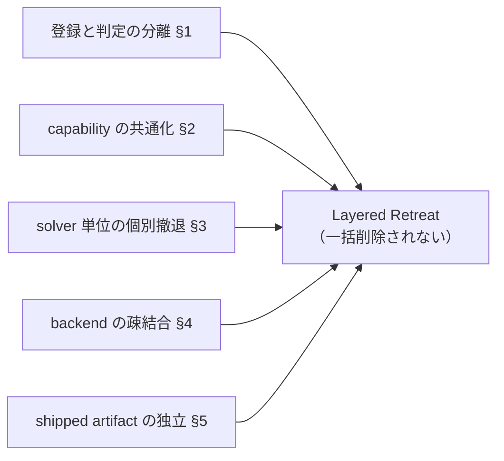

# なぜ ROCm / MIOpen は一括削除されにくいのか

作成日: 2026-03-17
関連文書: `class_map.md`（責務アンカー）、`final_hypothesis.md` §2.2 / §5.1、`community_vs_vendor_matrix.md`, `provenance_map.md`, `gfx900_history_timeline.md`

> 本メモは、公開一次資料およびローカル clone から観測可能な範囲を整理したものであり、非公開 issue や社内意思決定の内容を断定するものではない。

---

## この文書の目的

`class_map.md` が「どこで何が起きるか」を固定したのに対し、
この文書は「**なぜその構造が柔軟性を生むのか**」を説明する。

対象読者:
- `final_hypothesis.md` の §2.2（capability-based 設計）/ §5.1（層単位の後退）を補強したい読者
- ROCm / MIOpen に保守参加を検討しているメンテナー候補

---

## 1. 登録と適用判定が分離されている

MIOpen の solver 選択は「if-else フォールバックチェーン」ではなく、
**「全候補列挙 → 各 solver が自己判定」** という二段構成をとる。

```
SolverContainer（find_solution.hpp:137）
  └─ 全 solver を列挙
        ↓
  各 SolverBase::IsApplicable()
        ↓
  通過した solver だけが候補になる
```

**構造上の含意:**

- ある solver を除外しても（例: `ConvMlirIgemmFwd` が gfx900 を reject しても）、
  他の solver（`ConvAsmImplicitGemmV4R1DynamicFwd` 等）の動作に影響しない
- 新しい solver を追加しても、既存 solver の判定ロジックを変更する必要がない
- 「この arch では使えない」という判定を、各 solver が局所的に持てる

**gfx900 への影響:**
MLIR iGEMM が `IsApplicable()` で reject されても、ASM v4r1 dynamic や Winograd が
独立して「自分は通れる」と判定する構造になっている。これが「部分的に生きている」状態の構造的根拠。

---

## 2. capability 判定が共通化されている

arch ごとの能力差は、共通の capability チェック関数として抽象化されている。

**代表的な共通 capability チェック（code_verified）:**

| 関数 / マクロ | 意味 | gfx900 での値 |
|---|---|---|
| `IsXdlopsSupport()` | xdlops / MFMA 命令が使えるか | `false`（gfx908 未満） |
| `IsMlirSupportedHardware()` | MLIR 対応ハードか | `true`（リストに含まれる） |
| `TargetProperties::GetDeviceName()` | arch 名の正規化 | `"gfx900"`（sramecc workaround 適用後） |
| `Tensile AsmCaps ISA(9,0,0)` | dot4 / v_dot4 系命令が使えるか | `False` |

**構造上の含意:**

- 「xdlops 不可」という判定は `IsXdlopsSupport()` 一箇所に集約されており、
  それを参照する solver 群は自動的に gfx900 を除外する
- 新 arch のサポートは、capability 関数の更新と各 solver の `IsApplicable()` 更新で対応でき、
  全体アーキテクチャの変更を要しない

**注意:**
`IsMlirSupportedHardware()` が gfx900 を「対応」と表明しながら、
`ConvMlirIgemmFwd::IsApplicable()` が後段で個別除外するという二重構造は、
この共通化の例外として観測される（→ `final_hypothesis.md` §5.3 参照）。

---

## 3. solver ごとに個別撤退できる

`IsApplicable()` の判定は **solver 単位・dtype 単位・layout 単位** で独立している。

**gfx900 での観測例（runtime_verified）:**

| solver | FP32 | FP16 | INT8 | 備考 |
|---|---|---|---|---|
| `ConvAsmImplicitGemmV4R1DynamicFwd` | 通過 | 非対応 | 非対応 | gfx900/gfx906 専用 |
| `ConvBinWinograd3x3U` | 通過 | 非対応 | 非対応 | FP32 のみ |
| `ConvMlirIgemmFwd` | reject | reject | reject | gfx900 明示除外 |
| `ConvHipImplicitGemmFwdXdlops` | reject | reject | reject | xdlops 不可 |
| `ConvDirectNaiveConvFwd` | 通過 | 通過 | 通過 | 常に適用可能（最終手段） |

**構造上の含意:**

- 「FP32 は通るが INT8 は通らない」という dtype 単位の撤退が、
  全 solver を書き換えることなく成立する
- 「gfx900 は除外するが gfx906 は許可する」という arch 単位の微調整も局所的
- これが Layered Retreat の粒度を細かくする構造的理由（§6 参照）

---

## 4. backend 接続が疎結合になっている

MIOpen は複数の外部 backend（rocMLIR / rocBLAS / Tensile / CK）と接続するが、
各接続点は **局所化されたモジュール** として分離されている。

**接続点の一覧（→ `class_map.md §他層との接続点` 参照）:**

| 接続先 | 接続モジュール | 接続の形 |
|---|---|---|
| rocMLIR | `mlir_build.cpp` | `miirCreateHandle` / `MiirIsConfigApplicable` |
| rocBLAS / Tensile | `gemm_v2.cpp` | `CallHipBlas` → 失敗時 Tensile fallback |
| CK | `conv_ck_igemm_*.cpp` | solver ファイル単位で CK kernel を呼ぶ |
| HIP runtime | `hipoc_program.cpp` | kernel compile / load |

**構造上の含意:**

- rocMLIR 側の変更（gfx900 gating の追加・解除）は `mlir_build.cpp` 周辺に局所化される
- Tensile fallback の有無は `gemm_v2.cpp` の分岐一点に集約されている
- backend 全体を入れ替えても、solver 選択ロジック（`SolverContainer` / `IsApplicable()`）は変わらない

---

## 5. shipped artifact と code path が分離している

ROCm の「gfx900 へのサポート」は、コードベース上の実行経路とは独立した
**出荷成果物の層** を持っている。

**観測された出荷成果物（shipped_artifact_verified, ROCm 7.2）:**

| 成果物 | gfx900 向け実測値 |
|---|---|
| MIOpen Perf DB | 169,182 行（gfx900_56 + gfx900_64） |
| rocBLAS プリコンパイル済みカーネル | 128 ファイル |
| amdgpu firmware | vega10 × 16 blob |

**構造上の含意:**

- `IsApplicable()` で solver が reject されても、Perf DB に記録されたチューニングデータは残る
- コードを変更せずに「出荷成果物から外す」こともでき、逆に「コードに残したまま出荷物を止める」こともできる
- current `TheRock` でも、`gfx900` は global target として登録されたまま、
  `hipBLASLt` / `hipSPARSELt` / `composable_kernel` / `rocWMMA` / `rocprofiler-compute`
  など一部 sub-project からだけ `EXCLUDE_TARGET_PROJECTS` で filter される
- この分離が「表のサポート終了」と「配布上のサポート残存」を同時に観測できる理由

**留保:**
MIOpen Perf DB の世代間比較（gfx900 > gfx1100/gfx1200）は、
RDNA3/4 が別のチューニング方式を採用している可能性があるため、
「gfx900 の方が手厚い」という直接比較は参考値として扱う（→ `final_hypothesis.md` §3.4 参照）。

---

## 6. その結果として起きる Layered Retreat

§1〜5 で示した設計上の分離が重なることで、
gfx900 の「後退」は「一括削除」ではなく
**component ごと・solver ごと・dtype ごとの時間差後退** として観測される。



**current clone / legacy clone / runtime から再確認できた主要観測点:**

- 2021-12: MLIR iGEMM が gfx900 を除外（solver 単位の撤退）
- 2023: Winograd の perf workaround が投入（FP32 path は継続）
- 2024: Tensile fallback libraries 方針が外部 contributor により再投入される（`#1862` → revert `#1879` → `#1897`）
- 2026-03: rocBLAS / Perf DB / firmware は出荷継続を確認（shipped artifact 層は残存）

**補助情報:**

- 以前に回収した release-note 断片では、`hipCUB` が `gfx900` を default build から外した記述がある。
  ただし current mirror ではこの release note 本文を再確認できていないため、
  この文書では supplemental observation にとどめる。

**Interpretation:**
この Layered Retreat が「意図された設計方針」であるかは観測できないが、
少なくとも §1〜5 の設計上の分離が**結果として**この挙動を可能にしていると読める。

---

## 本文書が主張しないこと

- この設計が「gfx900 のサポートを維持するために作られた」と断定するものではない
- 上記の柔軟性が「意図された設計方針」であると断定するものではない
- ROCm 全コンポーネントに同様の構造が存在すると一般化するものではない
- 特定組織や個人への評価を目的とするものではない
